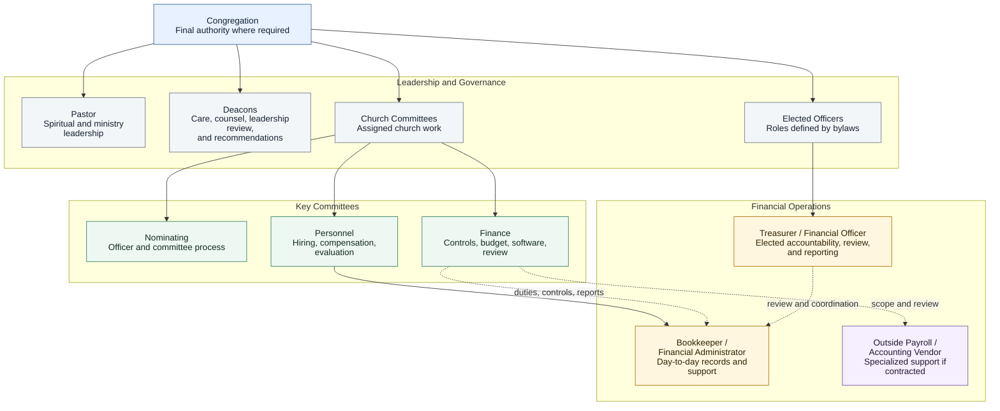
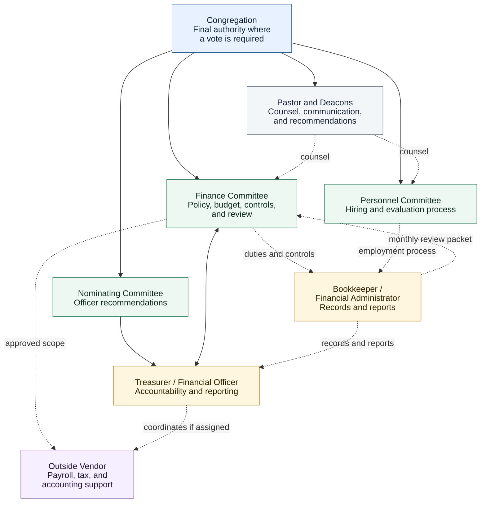

# KBC Financial Operations Complete Document

Generated: 2026-07-12

> **Sensitive Information Warning:** Do not include donor records, payroll details, bank account numbers, passwords, Social Security numbers, confidential personnel issues, actual applications, reference checks, background-check results, or private financial data in this file.

This compiled document gathers the current handbook, current-work records, and safe historical references in the same general order as the handbook site. The repository Markdown files remain the source of truth.

## Included Documents

### Start Here

- Handbook And Workspace Home: `docs/index.md`
- How To Use The Handbook: `docs/start-here/why-this-exists.md`
- Treasurer And Finance Chair Quick Start: `docs/start-here/treasurer-finance-chair-quick-start.md`
- Handbook And Workspace Stewardship: `docs/document-stewardship.md`
### Handbook - Governance

- Constitution and Bylaws Reference: `docs/governance/constitution-and-bylaws-reference.md`
- Church Organization Chart: `docs/governance/church-organization-chart.md`
- Financial Operations View: `docs/governance/financial-operations-view.md`
- Responsibility Matrix: `docs/governance/responsibility-matrix.md`
- Finance Committee Charter: `docs/governance/finance-committee-charter.md`
- Personnel Committee Role: `docs/governance/personnel-committee-role.md`
### Handbook - Roles

- Treasurer Governance Role: `docs/roles/treasurer-governance-role.md`
- Bookkeeper Job Description: `docs/roles/bookkeeper-financial-administrator-job-description.md`
### Handbook - Finance Operations

- Spending Authority Policy: `docs/policies/spending-authority-policy.md`
- Reimbursement Policy: `docs/policies/reimbursement-policy.md`
- Reimbursement Process: `docs/procedures/reimbursement-process.md`
- Credit Card Policy: `docs/policies/credit-card-policy.md`
- Offering Counting and Deposit Policy: `docs/policies/offering-counting-and-deposit-policy.md`
- Monthly Financial Review Policy: `docs/policies/monthly-financial-review-policy.md`
- Monthly Finance Committee Checklist: `docs/procedures/monthly-finance-committee-meeting-checklist.md`
- Contribution Entry Process: `docs/procedures/contribution-entry-process.md`
- Weekly Bookkeeping Checklist: `docs/procedures/weekly-bookkeeping-checklist.md`
- Monthly Close Checklist: `docs/procedures/monthly-close-checklist.md`
- Business Meeting Report Process: `docs/procedures/business-meeting-report-process.md`
- Payroll Process: `docs/procedures/payroll-process.md`
- Audit and Review Policy: `docs/policies/audit-and-review-policy.md`
### Current Work - 2026 Transition

- Current Work Dashboard: `docs/start-here/project-dashboard.md`
- Transition Project Brief: `docs/00-project-brief.md`
- Transition Current-State Assessment: `docs/01-current-state-assessment.md`
- Transition Roadmap: `docs/implementation-roadmap.md`
- Decision Log: `docs/02-decision-log.md`
- Issue Register: `docs/03-open-questions.md`
- Leadership Review Overview: `docs/leadership-review/index.md`
- Leadership Review Packet: `docs/communications/leadership-review-packet.md`
- Personnel Committee Packet: `docs/communications/personnel-committee-packet.md`
- Finance Committee Packet: `docs/communications/finance-committee-packet.md`
- Personnel Committee Recommendation: `docs/communications/personnel-committee-recommendation.md`
- Finance Committee Recommendation: `docs/communications/finance-committee-recommendation.md`
- Deacon Update: `docs/communications/deacon-update.md`
- Treasurer vs. Bookkeeper Duty Analysis: `docs/roles/treasurer-vs-bookkeeper-duty-split.md`
- Interim Treasurer Role: `docs/roles/interim-treasurer-role.md`
- Bookkeeper Application: `docs/roles/bookkeeper-job-application.md`
- Bookkeeper Hiring Process: `docs/roles/bookkeeper-hiring-process.md`
- Job Description Consistency Check: `docs/roles/job-description-consistency-check.md`
### Current Work - Policy Review

- Financial Authority Review Package: `docs/policies/financial-authority-policy-package.md`
### Current Work - Governance

- Future Governance Expansion: `docs/governance/future-governance-expansion.md`
### Current Work - Software

- Software Requirements: `docs/software-evaluation/software-requirements.md`
- Demo Scorecard: `docs/software-evaluation/demo-scorecard.md`
- IconCMO vs. ChurchTrac Comparison: `docs/software-evaluation/icon-vs-churchtrac-comparison.md`
- Implementation Plan: `docs/software-evaluation/implementation-plan.md`
### Communications

- Church Business Meeting Summary: `docs/communications/church-business-meeting-summary.md`
- One-Page Congregational Summary: `docs/communications/one-page-congregational-summary.md`
- Congregational Slide Outline: `docs/communications/congregational-slide-outline.md`
### Administration And Archive

- Superseded Project Dashboard: `docs/project-dashboard.md`
- Document Inventory: `docs/document-inventory.md`
- Export Process: `docs/export-process.md`
- Finance Committee Review Workflow: `docs/finance-committee-review-workflow.md`
- Exported Files and Release Bundles: `docs/exports-and-releases.md`
- Document Workflow Notes: `docs/document-workflow-upgrade-notes.md`

---

# Start Here

## Handbook And Workspace Home

- Source file path: `docs/index.md`
- Status: Needs Leadership Review
- Last updated: 2026-07-12

### KBC Financial Operations Handbook

Status: Needs Leadership Review

This handbook brings together KBC's financial governance, responsibilities, policies, procedures, and active review work. It is intended to help members and leaders find current guidance, understand who is responsible, and see what still needs a decision.

#### Start Here

- **Church members:** begin with the governing references and responsibility documents below.
- **Church leadership:** use the [Current Work Dashboard](start-here/project-dashboard.md) for active decisions, owners, and next steps.
- **Committee members and financial workers:** choose the audience view that matches your responsibilities, then use the applicable workspace, policies, and procedures.
- **Anyone reviewing a document:** check its status before relying on it or suggesting a change.

#### Core References

- [Constitution and Bylaws Reference](governance/constitution-and-bylaws-reference.md)
- [Church Organization Chart](governance/church-organization-chart.md)
- [Financial Operations View](governance/financial-operations-view.md)
- [Responsibility Matrix](governance/responsibility-matrix.md)

These pages provide orientation. The Constitution and Bylaws, recorded congregational action, approved budgets, and adopted policies remain the controlling authorities.

#### Status And Authority

A page's status distinguishes approved guidance from material that is still being developed or reviewed.

- **Approved** material has a recorded approval and may be used within its adopted scope and effective date.
- **Current** material is maintained for present use, but the label does not by itself mean that the congregation adopted it.
- **Reference** material points to an authoritative source or established record.
- **Draft**, **Needs Review**, and **Working Record** material is not adopted policy.
- **Superseded** material is retained for history and should not guide current work.

This handbook does not create authority. Committees, officers, leaders, and the congregation continue to act within the Constitution and Bylaws, adopted policy, approved budgets, and church practice. The congregation remains the final authority wherever congregational approval is required.

#### Handbook And Current Work

The **Handbook** contains guidance intended to remain useful as people and assignments change:

- Governing references and responsibility documents.
- Committee charters and role descriptions.
- Approved financial policies.
- Practical procedures and recurring checklists.

The **Current Workroom** contains time-limited work:

- Decisions and questions awaiting review.
- Committee packets and recommendations.
- Implementation plans, evaluations, and assigned actions.
- Dated transition records and project history.

When current work is completed, lasting results should move into the handbook and working material should be archived or marked superseded.

#### Feedback And Stewardship

Readers may submit feedback on a document or a specific section. Feedback does not change guidance by itself; it is reviewed by the document owner and routed through the appropriate committee or approval process.

Each maintained document should identify an owner, status, intended audience, and approval path. The [Handbook and Workspace Stewardship Guide](document-stewardship.md) explains how that information is maintained.

#### Sensitive Information

Do not place donor records, giving details, payroll details, bank account numbers, Social Security numbers, passwords, candidate applications, reference-check notes, background-check results, confidential personnel matters, or private pastoral-care information in the handbook.

!!! warning "Public Access Caution"
    Treat published handbook content as publicly accessible. Audience views reduce clutter; they are not confidentiality controls.

## How To Use The Handbook

- Source file path: `docs/start-here/why-this-exists.md`
- Status: Needs Leadership Review
- Last updated: 2026-07-12

### How To Use This Handbook

Status: Needs Leadership Review

This guide explains how to find the right information, tell what is current, and participate in review without confusing working material with adopted guidance.

#### Choose The Right Starting Point

- **Church Member Library:** governing references, organization, responsibilities, approved policies, and congregational communications.
- **Leadership View:** current decisions, governance questions, recommendations, and roadmaps.
- **Treasurer / Finance Chair View:** a focused set of governing references, role boundaries, recurring procedures, and current financial decisions.
- **Finance Committee View:** committee oversight of policy, budget review, spending controls, software decisions, and financial reports.
- **Personnel Committee View:** role descriptions, hiring materials, and personnel review items.
- **Financial Operations View:** hands-on recurring work such as contributions, deposits, reimbursements, payroll steps, reconciliations, monthly close, and reporting.
- **Current Workroom:** issue registers, review packets, evaluations, implementation notes, and dated project records.

The **All Documents** view is useful for research, but it is not the best starting point for routine use.

The Finance Committee View and Financial Operations View are intentionally different. The Finance Committee sets direction and reviews whether the system is working. Authorized financial workers carry out the approved procedures shown in Financial Operations. Some documents appear in both views when both groups need them.

#### Check The Status

| Status | Meaning |
| --- | --- |
| Approved | Formally adopted guidance. Check the approval record and effective date where applicable. |
| Current | Maintained for present use. Check the owner and approval path; this label alone does not mean congregational adoption. |
| Reference | A governing source or established record used for context. |
| Ready for Church Consideration | Committee review is complete and congregational action is expected. |
| Needs Review | The named committee, leadership body, bylaw reviewer, or professional still needs to review it. |
| Draft | Content is being developed and has not been approved. |
| Working Record | An active list, log, dashboard, or project-management record rather than standing guidance. |
| Superseded / Parking Lot | Retained for history or possible later work; not current guidance. |

Publishing a draft does not make it policy.

#### Understand Ownership And Approval

- The **owner** is responsible for the document's subject and accuracy.
- A **reviewer** checks the document from the perspective of the people affected by it.
- The **approval body** is the committee, leadership body, or congregation authorized to approve it.
- A **documentation steward** maintains formatting, links, status labels, navigation, and archives without changing policy independently.

The congregation remains the final authority wherever the Constitution and Bylaws, budget, policy, officer election, major spending decision, or church practice require congregational approval.

#### Follow Current Work

Use the [Current Work Dashboard](project-dashboard.md) to see active priorities, owners, and review needs. Assigned tasks and due dates should be tracked as work items, while unresolved questions belong in the Issue Register and completed decisions belong in the Decision Log.

Time-limited project material should not become permanent handbook language unless the proper owner and approval body adopt a lasting change.

#### Submit Feedback

Authenticated readers may leave feedback on a whole document or a specific section. Include enough detail to explain the concern or suggestion, but do not include confidential personal, financial, donor, personnel, or pastoral information.

The document owner may accept, plan, resolve, or decline feedback. Substantive changes still follow the normal review and approval process.

## Treasurer And Finance Chair Quick Start

- Source file path: `docs/start-here/treasurer-finance-chair-quick-start.md`
- Status: Needs Finance Review
- Last updated: 2026-07-12

### Treasurer / Finance Chair Quick Start

Status: Needs Finance Review

This page is a concise starting point for a person carrying Treasurer or Finance Committee chair responsibilities. It brings together the documents most relevant to financial continuity, oversight, and current decisions without requiring an initial review of the full library.

!!! note "In Progress"
    These materials are working drafts unless a page is clearly marked Approved, Current, or Reference. This view is intended to support review and correction; it does not change the authority of the Treasurer, Finance Committee, or congregation.

#### Begin With These Five Items

1. [Constitution and Bylaws Reference](../governance/constitution-and-bylaws-reference.md) - confirm the governing source and officer/committee questions.
2. [Responsibility Matrix](../governance/responsibility-matrix.md) - review who prepares, reviews, recommends, and approves.
3. [Treasurer / Financial Officer Governance Role](../roles/treasurer-governance-role.md) - review the proposed durable role.
4. [Finance Committee Charter](../governance/finance-committee-charter.md) - review the committee's proposed oversight rhythm.
5. [Bookkeeper Job Description](../roles/bookkeeper-financial-administrator-job-description.md) - confirm which operational duties may be assigned to paid support.

#### Recurring Operating Rhythm

##### Weekly

- [Weekly Bookkeeping Checklist](../procedures/weekly-bookkeeping-checklist.md)
- [Contribution Entry Process](../procedures/contribution-entry-process.md)

The weekly focus is to keep deposits, online giving, expenses, documentation, payroll preparation, and exceptions current without allowing one person to prepare and approve everything.

##### Monthly

- [Monthly Close Checklist](../procedures/monthly-close-checklist.md)
- [Monthly Finance Committee Meeting Checklist](../procedures/monthly-finance-committee-meeting-checklist.md)
- [Business Meeting Report Process](../procedures/business-meeting-report-process.md)

The monthly focus is to reconcile every active account, review outstanding items and recurring payments, verify designated funds and approved mission allocations, prepare reports, and record decisions or follow-up.

##### Payroll And Restricted Records

- [Payroll Process](../procedures/payroll-process.md)

Private compensation, donor, banking, tax, and personnel records do not belong in this public handbook. The process belongs here; the underlying records belong in the approved restricted system.

#### Finance Input Needed

The most useful initial feedback from the Treasurer / Finance Chair is:

- Which recurring tasks, accounts, reports, and deadlines are missing or inaccurate?
- Which tasks should be prepared by the Bookkeeper and reviewed by the Treasurer?
- Which report should be treated as the authoritative monthly financial report?
- What correction and mismatch process should be required?
- Which recurring payments, mission allocations, and internal transfers are currently authorized?
- What should the Finance Committee review each month?
- Which spending, reimbursement, card, memorial-gift, payroll, or reporting practices need a policy decision?

Two draft control documents are especially relevant to this operational review:

- [Offering Counting And Deposit Policy](../policies/offering-counting-and-deposit-policy.md)
- [Monthly Financial Review Policy](../policies/monthly-financial-review-policy.md)

Use the [Current Work Dashboard](project-dashboard.md) for active priorities and the [Issue Register](../03-open-questions.md) for unresolved questions. Specific comments may also be submitted directly on the relevant document section.

#### Not Required For Initial Review

The first review does not require reading:

- Personnel Committee hiring forms and candidate materials.
- Detailed software demo scorecards.
- Old communication packets or congregational presentation drafts.
- Document inventory, export instructions, or technical administration notes.
- Superseded drafts or archived project material.

Those materials remain available through other audience views or **All Documents** when needed.

Needs Finance Review: Confirm whether this is the right starting set for the Treasurer / Finance Chair and which links should be added, removed, or reordered.

## Handbook And Workspace Stewardship

- Source file path: `docs/document-stewardship.md`
- Status: Needs Leadership Review
- Last updated: 2026-07-12

### Handbook And Workspace Stewardship Guide

Status: Needs Leadership Review

#### Purpose

This guide keeps the financial operations handbook, current workroom, and church record maintainable as officers, committee members, volunteers, and staff change. The system should be church-owned work, not a private project that depends on one person.

#### What Belongs Where

| Information | Proper Home | Why |
| --- | --- | --- |
| Durable governance, policy, role, or procedure | Handbook | It should remain useful after current people and projects change. |
| Assigned task, due date, or recurring work | Portal checklist, current dashboard, or approved task tracker | Work should have a visible owner and next action rather than being buried in narrative. |
| Question awaiting a decision | Issue register or committee workspace | It is working material, not settled guidance. |
| Committee or congregational decision | Decision log and authoritative minutes where applicable | Future leaders need the decision, date, owner, and approval source. |
| Review packet, implementation note, or evaluation | Current Workroom | It supports a time-limited project and should be archived when complete. |
| Approved or superseded release | Church record / archive | The history remains available without competing with current guidance. |

An appropriately restricted records system remains the proper home for editable working files and confidential records. The public handbook should link to safe source material only when useful.

#### Shared Responsibilities

| Responsibility | Assigned To | Meaning |
| --- | --- | --- |
| Document owner | Committee, officer, or church body responsible for the subject | Decides what the document should say and requests review or approval. |
| Documentation steward | One or more trusted helpers | Maintains formatting, links, metadata, status labels, navigation, and archives without changing policy on their own. |
| Reviewer | People affected by or knowledgeable about the document | Tests clarity, accuracy, practicality, and alignment with other documents. |
| Approval body | Committee, leadership body, or congregation with authority | Approves the document when required and establishes its effective date. |
| Church Clerk / records steward | As assigned by church practice | Preserves authoritative minutes, motions, and approved versions. |

#### Document Lifecycle

1. **Working Draft:** an owner is developing the content.
2. **Needs Review:** the appropriate committee, leadership body, bylaw reviewer, or professional is reviewing it.
3. **Ready for Church Consideration:** committee review is complete and congregational action is required.
4. **Approved / Current:** the authorized body approved it and the effective date is recorded.
5. **Superseded:** a newer approved version replaced it; the old version remains in the archive.
6. **Parking Lot:** useful future work that is not an active priority.

Review packets, issue registers, implementation roadmaps, and evaluation notes are current-work records. They should not be labeled as approved policies simply because they contain useful analysis.

#### Minimum Metadata

Every document in the portal catalog should identify:

- Document type.
- Status.
- Owner.
- Intended audiences.
- Lifecycle category.
- Approval body and effective date once approved.
- Next review date for policies, procedures, charters, and role descriptions.

Audience labels organize the reading experience. They do not make public repository content confidential.

#### Change Process

1. A reader submits feedback or contacts the document owner.
2. A documentation steward records or routes the request.
3. The owner decides whether the change is editorial, operational, policy-related, or governance-related.
4. Editorial corrections may be prepared directly; substantive changes return to the proper reviewer or approval body.
5. The decision and resulting status are recorded.
6. Approved changes are published, and any replaced version is marked superseded.

#### Review Rhythm

- Review active project records as work changes.
- Review procedures with the people who perform them at least annually and after major software or staffing changes.
- Review financial policies and committee charters at least annually or on the cadence adopted by the church.
- Review role descriptions before hiring, nomination, or evaluation cycles.
- Verify governing references whenever the Constitution and Bylaws are amended.
- Archive completed communication packets rather than leaving them in the main reading path indefinitely.

#### Guardrails

- Committees own substance within their assigned lanes.
- Documentation stewards do not create authority by editing a document.
- Draft language never overrides bylaws, congregational action, approved budgets, or adopted policy.
- Confidential candidate, donor, payroll, banking, personnel, pastoral, or background-check information stays outside the public repository.
- Important decisions should not live only in email, chat, or one person's memory.

#### Immediate Ownership Needs

- Leadership should name at least two documentation stewards so continuity does not depend on one person.
- Finance Committee should name owners for financial policies and procedures.
- Personnel Committee should name owners for job descriptions and hiring procedures.
- The Church Clerk or another designated records steward should confirm authoritative minutes and governing documents.
- Each active document should have one clear next reviewer rather than a broad list with no person responsible for moving it forward.


---

# Handbook - Governance

## Constitution and Bylaws Reference

- Source file path: `docs/governance/constitution-and-bylaws-reference.md`
- Status: Reference
- Last updated: 2026-07-10

### Constitution and Bylaws Reference

Status: Reference

This page gives leaders a single place to find the current KBC Constitution, Bylaws, and Covenant reference while reviewing financial operations documents.

!!! note "Congregation Final Authority"
    Use the Constitution and Bylaws to confirm when the congregation must approve budgets, officers, policies, major non-budgeted spending, contracts, role changes, or other church decisions. Committee recommendations should not be treated as final when church approval is required.

#### Primary Reference

[Open KBC Constitution, Bylaws, and Covenant 2018 PDF](../generated/source-materials/bylaws/Constitution-Bylaws-and-Covenant-2018.pdf){ target="_blank" rel="noopener" }

Source file:

- `source-materials/bylaws/Constitution, Bylaws, and Covenant 2018.pdf`

Archived editable conversion:

- `source-materials/bylaws/archived/KBC_Constitution_ByLaws_Converted to Editable form.docx`

#### How To Use This Reference

- Treat the PDF as a governance reference, not as a new policy draft.
- Confirm with the Church Clerk, Pastor, Deacons, or church leadership that this is the current authoritative version before relying on it for a final decision.
- Use this page when reviewing Treasurer duties, committee authority, business meeting votes, staff roles, budget decisions, spending authority, and annual financial review requirements.
- Do not treat summaries in this repository as a substitute for the bylaws themselves.

#### Financial Operations Areas To Check

These are the main areas in the current project that should be checked against the Constitution and Bylaws:

| Area | Why It Matters | Related Working Documents |
| --- | --- | --- |
| Church authority and congregational votes | Some decisions may require church action rather than committee action alone. | [Responsibility Matrix](responsibility-matrix.md), [Spending Authority Policy](../policies/spending-authority-policy.md) |
| Treasurer role | Treasurer duties, election, reporting, bonding, and annual review may be defined or constrained by bylaws. | [Treasurer Governance Role](../roles/treasurer-governance-role.md), [Treasurer vs. Bookkeeper Duty Split](../roles/treasurer-vs-bookkeeper-duty-split.md) |
| Nonministerial staff | Hiring, supervision, compensation, and termination should fit the authority assigned for nonministerial staff. Situation-specific congregational motions remain controlling records for the action they authorized. | [Bookkeeper Job Description](../roles/bookkeeper-financial-administrator-job-description.md), [Bookkeeper Hiring Process](../roles/bookkeeper-hiring-process.md) |
| Personnel Committee authority | Personnel Committee responsibilities for employment matters, salaries, benefits, policies, and job descriptions should be confirmed. | [Personnel Committee Role](personnel-committee-role.md), [Personnel Committee Packet](../communications/personnel-committee-packet.md) |
| Finance / stewardship responsibilities | Budget preparation, approval, funds handling, reporting, and accounting procedures may affect Finance Committee recommendations. | [Finance Committee Charter](finance-committee-charter.md), [Monthly Financial Review Policy](../policies/monthly-financial-review-policy.md) |
| Annual budget and major non-budgeted expenses | Congregational authority should remain clear where the annual budget, major projects, or large outside-budget spending require a vote. | [Spending Authority Policy](../policies/spending-authority-policy.md), [Responsibility Matrix](responsibility-matrix.md) |
| Deacon counsel and escalation | Deacons may have a meaningful review or counsel role, but final authority and committee lanes should be confirmed before assigning decision power. | [Church Organization Chart](church-organization-chart.md), [Future Governance Expansion](future-governance-expansion.md) |
| Benevolence and other committee spending | Confidential care and committee spending may need future review to balance privacy, oversight, reporting, and approval authority. | [Future Governance Expansion](future-governance-expansion.md), [Open Questions](../03-open-questions.md) |
| Annual audit or review | Treasurer and Finance Committee responsibilities should align with any bylaw language about annual audit or account review. | [Audit and Review Policy](../policies/audit-and-review-policy.md), [Monthly Finance Committee Checklist](../procedures/monthly-finance-committee-meeting-checklist.md) |

#### Practical Review Questions

1. Is the 2018 Constitution, Bylaws, and Covenant PDF the current governing version?
2. What exact bylaw language controls Treasurer duties, election, replacement, bonding, and monthly reporting?
3. What exact bylaw language controls nonministerial staff hiring and termination?
4. What exact bylaw language controls Personnel Committee responsibility for job descriptions, salaries, benefits, policies, and employment matters?
5. What exact bylaw language controls budget approval, accounting procedures, funds handling, and annual audit or review?
6. Which financial operations decisions can be made by committee, and which must come back to the congregation?
7. What bylaw or church-practice language applies to annual budget approval and major non-budgeted expenses?
8. What role, if any, do Deacons have in raising concerns, reviewing recommendations, or bringing unresolved items to the congregation?

#### Review Note

Needs Bylaw Review: This page is a reference aid only. Final approval paths should be confirmed against the current authoritative Constitution and Bylaws, church minutes, and church practice before action is taken.

## Church Organization Chart

- Source file path: `docs/governance/church-organization-chart.md`
- Status: Needs Bylaw Review
- Last updated: 2026-07-10

### KBC Organization Chart

Status: Needs Bylaw Review

#### Purpose

This document provides a working organization chart for Kingsville Baptist Church and shows how financial governance, ministry leadership, committees, elected officers, and operational support relate to one another.

It is intended to help leaders see the difference between:

- Congregational authority.
- Elected officers and committees.
- Ministry leadership.
- Financial operations support.
- Committee recommendations and coordination.

Needs Bylaw Review: This chart should be checked against the KBC Constitution and Bylaws, committee charters, and current church practice before being treated as authoritative.

!!! note "Congregation Final Authority"
    The congregation remains the final authority where KBC bylaws, budget, policy, officer election, major non-budgeted spending, or church practice require a vote.

#### Simple Governance View



#### Financial Operations View

The detailed financial reporting and coordination diagram now has its own navigation entry:

[Open the Financial Operations View](financial-operations-view.md)

#### Practical Role Summary

| Body / Role | Primary Accountability | Ongoing Role |
| --- | --- | --- |
| Congregation | Final church authority where bylaws, budget, policy, officer election, or church practice require a vote. | Approves the annual budget and other matters reserved for congregational action; receives clear reports and recommendations. |
| Pastor | Spiritual and ministry leadership, communication, and counsel. | Helps church bodies coordinate their work while preserving the authority assigned to each body. |
| Deacons | Servant leadership, care, counsel, and leadership review where church practice requires. | May raise concerns, offer counsel, and recommend matters to the appropriate committee or congregation without becoming a unilateral financial authority. |
| Nominating Committee | Officer and committee nomination process where assigned by bylaws. | Recommends officers and committee members through the process assigned by the bylaws and church practice. |
| Finance Committee | Financial governance, controls, budget oversight, software, monthly review, and financial policies. | Defines financial controls, recommends policies and budgets, reviews financial activity, and brings matters to the congregation where approval is required. |
| Personnel Committee | Job descriptions, hiring, compensation recommendations, and evaluation process. | Manages personnel processes while receiving operational requirements from the committee responsible for the work. |
| Treasurer / Financial Officer | Elected financial accountability, reporting, review, and coordination with Finance Committee. | Reviews reports, helps present financial information, helps carry out approved Finance Committee direction, confirms policies are followed, and coordinates with the Bookkeeper and Finance Committee without becoming the sole point of financial control. |
| Bookkeeper / Financial Administrator | Day-to-day financial operations under assigned supervision and approved financial controls. | Maintains records, enters transactions, supports deposits, processes reimbursements after approval, prepares report packets, and supports monthly close. |
| Outside Payroll / Accounting Vendor | Professional processing and compliance support if contracted. | Handles payroll, tax forms, accounting setup, review, or other specialized services assigned by church-approved process. |

#### Recommended Reporting And Coordination Lines

These lines should be confirmed through the Constitution and Bylaws, committee charters, adopted policies, and church practice:

- The Bookkeeper / Financial Administrator should have one clear day-to-day supervisor.
- The Finance Committee should define the Bookkeeper's financial duties, access, reports, and controls.
- The Treasurer should review and coordinate with the Bookkeeper but should not become the sole source of operational knowledge.
- The Treasurer should help carry out approved Finance Committee direction, but financial controls should not depend on one person's knowledge or approval alone.
- Deacons may counsel, raise concerns, and recommend items back to committees or the congregation through proper process, but should not become a unilateral financial authority.
- Personnel Committee should manage hiring, personnel records, evaluation process, and compensation recommendations.
- Finance Committee should not run the hiring process.
- Personnel Committee should not decide financial controls, software, reimbursement rules, card policy, or spending authority.
- Other committees, including Benevolence, may need a later governance review, but that should be treated as future expansion unless an urgent issue requires action now.

#### Open Questions

- Who is the day-to-day supervisor for the Bookkeeper / Financial Administrator?
- Do bylaws assign Treasurer nomination to the Nominating Committee, Deacons, or another process?
- Which financial decisions require Finance Committee recommendation only, and which require church vote?
- Which recommendations should go to Deacons or broader leadership before coming to the congregation?
- What reports should go monthly to Finance Committee, Deacons, church leadership, and the congregation?
- What later governance review is needed for Benevolence or other committees with spending authority?

Final approval path to be confirmed by church leadership, bylaws, and church practice.

## Financial Operations View

- Source file path: `docs/governance/financial-operations-view.md`
- Status: Needs Bylaw Review
- Last updated: 2026-07-10

### Financial Operations View

Status: Needs Bylaw Review

#### Purpose

This diagram gives a quick, durable view of how KBC financial accountability, day-to-day recordkeeping, committee oversight, personnel work, and congregational authority should relate to one another.

It describes functions rather than a particular person. Names, temporary assignments, and transition-specific decisions belong in project records rather than this governance view.

!!! note "Congregation Final Authority"
    The congregation remains the final authority where KBC bylaws, the annual budget, policy, officer election, major non-budgeted spending, or church practice require a vote.

#### Financial Governance And Operations



#### Control Principles

- No one person should prepare, approve, record, reconcile, and report the same financial activity without review.
- Finance Committee defines financial controls and reviews the results.
- The Treasurer coordinates accountability and reporting as an elected officer.
- The Bookkeeper maintains day-to-day records within approved duties and controls.
- Personnel Committee manages employment matters but does not set financial-control policy.
- Pastor and Deacons may counsel and raise concerns through the proper church process.
- Matters reserved for the congregation return to the congregation with a clear recommendation.

See the [Responsibility Matrix](responsibility-matrix.md) for the detailed division of responsibilities.

Needs review against the KBC Constitution and Bylaws before final approval.

## Responsibility Matrix

- Source file path: `docs/governance/responsibility-matrix.md`
- Status: Needs Bylaw Review
- Last updated: 2026-07-10

### Responsibility Matrix

Status: Needs Bylaw Review

This matrix separates governance, operations, recommendations, and approvals. It should be reviewed against KBC bylaws and actual committee practice before use.

!!! note "Congregation Final Authority"
    The congregation remains the final authority where KBC bylaws, budget, policy, officer election, major non-budgeted spending, or church practice require a vote.

#### Responsibility Matrix

| Responsibility Area | Treasurer | Bookkeeper / Financial Administrator | Finance Committee | Personnel Committee | Nominating Committee | Pastor | Deacons | Congregation |
| --- | --- | --- | --- | --- | --- | --- | --- | --- |
| Software selection | Provides finance requirements; reviews reporting and control needs. | Provides workflow input; tests usability; supports setup if assigned. | Leads evaluation, recommendation, implementation direction, and control requirements. | Consults on staffing, training, and job-impact questions. | No primary role. | Consults on ministry and administrative needs. | Reviews if cost, policy, or leadership impact requires. | Votes if required by budget, contract, or church policy. |
| Treasurer candidate / officer recommendation | Provides transition input if currently serving or interim. | No role. | Consults on needed finance skills and role expectations. | Consults only if personnel policy or job-description language is involved. | Leads nomination if bylaws assign this role. | Consults and supports transition communication. | Reviews or counsels if church practice requires. | Votes if bylaws require election or confirmation. |
| Bookkeeper / Financial Administrator hiring | Provides role and workflow input; may participate in interviews if assigned. | Applicant or role holder; no approval role. | Defines finance duties, controls, budget impact, and reporting needs. | Leads job-description, application, interview, reference, compensation-recommendation, and evaluation processes within the authority granted by the church. | Coordinates only when bylaws, a congregational motion, or church practice assign a role; does not select the candidate unless specifically authorized. | Consults on supervision, office workflow, and ministry fit. | Reviews if leadership practice or budget impact requires. | Authorizes the role, compensation, or budget when bylaws, budget, policy, or church practice require congregational action. |
| Treasurer job description approval | Provides input on practicality and transition needs. | No role. | Defines financial governance, controls, reporting, and committee relationship. | Helps format and maintain role description if assigned. | Reviews if tied to elected officer nomination. | Consults. | Reviews if church practice requires. | Approves if bylaws or church policy require. |
| Bookkeeper job description approval | Provides workflow and reporting input. | Provides practical feedback if role is already filled. | Approves or recommends finance duties, access, controls, and reporting requirements. | Leads drafting and recommends final job description, qualifications, compensation, and evaluation process. | No primary role unless governing documents assign one. | Consults on supervision and office workflow. | Reviews if leadership practice requires. | Votes when creation of the role, compensation, budget change, or church policy requires congregational approval. |
| Reimbursement approval | Reviews documentation and policy compliance; approves if assigned by policy. | Processes requests after documentation and approval are complete; tracks missing receipts. | Owns reimbursement policy, approval thresholds, exceptions, and monthly review. | Consults only if staff or volunteer-role accountability is affected. | No role. | May approve ministry expenses if assigned by policy. | Reviews exceptions if leadership practice requires. | Votes only if reimbursement policy or budget impact requires. |
| Budget oversight | Reviews reports and helps explain variances. | Records transactions and prepares reports if assigned. | Owns budget monitoring, variance review, budget exceptions, and recommendations. | Reviews staffing and compensation budget implications. | No primary role. | Consults on ministry priorities and operational needs. | Reviews major budget matters if church practice requires. | Approves annual budget and major budget changes if required. |
| Annual budget approval | Helps review and present financial information. | Prepares supporting reports if assigned. | Leads budget development, review, and recommendation. | Reviews staffing and compensation budget implications. | No primary role unless bylaws assign. | Consults on ministry priorities. | Reviews and counsels if church practice requires. | Approves the annual budget where bylaws or church practice require. |
| Monthly reporting | Presents or helps present financial reports; reviews reconciliations and exceptions. | Prepares report packet, reconciliations, and supporting documentation if assigned. | Owns monthly financial review and follow-up. | Receives personnel-related financial information only as appropriate. | No role. | Receives or reviews reports as needed for leadership. | Receives updates if church practice requires. | Receives business meeting reports as appropriate. |
| Annual audit / financial review | Coordinates records and responds to reviewer questions. | Provides records, reports, and documentation if assigned. | Owns recommendation, scope, timing, reviewer selection, and follow-up. | Consults if review affects staff roles or accountability. | No role. | Consults and supports leadership communication. | Reviews findings if church practice requires. | Votes if bylaws, budget, or policy require outside review approval. |
| Credit card / controlled payment policy | Reviews card activity and helps enforce policy. | Maintains receipts, coding, and transaction records if assigned; may hold a card only if approved. | Owns card/payment policy, limits, cardholder approval, review, suspension, and revocation process. | Consults on employee/volunteer accountability and role expectations. | No role. | May hold card or approve ministry purchases if policy allows. | Reviews policy or exceptions if church practice requires. | Votes if policy, budget, or liability concern requires. |
| Spending outside budget | Flags concern and seeks approval before payment when practical. | Does not process payment until approval path is documented, except emergency process if policy allows. | Leads review and recommendation; determines funding source and budget impact. | Consults if staffing or compensation is involved. | No role. | Consults on ministry urgency or operational need. | Reviews if leadership practice or amount requires. | Votes if bylaws, budget, amount, or church policy require. |
| Large non-budgeted expense / major project | Flags the issue and helps explain financial impact. | Provides records or supporting reports if assigned. | Reviews funding source, budget impact, timing, and control requirements before recommendation. | Consults only if staffing or compensation is involved. | No primary role unless bylaws or church practice assign. | Consults on ministry need and timing. | May counsel, raise concerns, or recommend church consideration through proper process; does not approve alone unless church policy says so. | Votes when bylaws, budget, amount, policy, or church practice require. |
| Emergency spending | Helps confirm need, documentation, and after-the-fact review. | Processes only after emergency approval is documented. | Defines emergency authority and reviews after the fact. | No primary role unless staff accountability is involved. | No role. | May authorize within policy if delay would create harm or prevent urgent ministry need. | May authorize or review within policy if assigned. | Receives report or votes afterward if required. |
| Business meeting financial report | Presents or helps present report and answer questions. | Prepares supporting packet if assigned. | Reviews report before presentation. | No primary role. | No role. | Supports communication and framing. | Reviews if church practice requires. | Receives, discusses, and votes on items requiring action. |

#### General Guidance

- Finance Committee should own financial policy, controls, software direction, budget oversight, monthly review, audit/review process, reimbursement rules, card policy, and outside-budget spending recommendations.
- The Treasurer / Financial Officer is an elected officer who should coordinate with Finance Committee, review reports, help carry out approved financial direction, and keep the church informed without becoming the sole point of financial control.
- The Bookkeeper / Financial Administrator should support day-to-day records and reports under clear supervision, approved duties, controlled access, and regular Finance Committee review.
- Personnel Committee should own job descriptions, hiring process, applications, interviews, compensation recommendations, and evaluation process for paid non-ministerial roles authorized by the church.
- Nominating Committee should be involved where bylaws, a congregational motion, or church practice assign responsibility, including elected-officer recommendations.
- Congregation should vote where bylaws, budget, policy, or church practice require.
- Deacons may counsel, raise concerns, and recommend that issues go back to committees or to the congregation through the proper process, but should not become a unilateral financial authority.
- No one person should have too much control over church money; responsibilities should be documented, reviewed, and transferable.

Needs Bylaw Review: Confirm each ownership area with KBC Constitution and Bylaws, committee charters, and church practice before treating this matrix as authoritative.

Final approval paths for elected officers, compensation, software contracts, spending authority, policies, and church votes must be confirmed by church leadership, bylaws, and church practice.

Time-limited authorizations, interim assignments, and implementation decisions belong in the [Current Workroom](../start-here/project-dashboard.md) and [Decision Log](../02-decision-log.md). They do not change this durable responsibility model unless the proper church body adopts a lasting change.

## Finance Committee Charter

- Source file path: `docs/governance/finance-committee-charter.md`
- Status: Needs Bylaw Review
- Last updated: 2026-07-10

### Finance Committee Charter

Status: Needs Bylaw Review

#### Purpose

The Finance Committee supports the church's stewardship by providing oversight, policy direction, budget monitoring, financial controls, software direction, and regular financial review.

The committee's role is governance and accountability. It should not depend on one person carrying all financial knowledge or all routine financial work.

!!! note "Congregation Final Authority"
    The Finance Committee should prepare clear recommendations, but the congregation remains the final authority where KBC bylaws, budget, policy, major non-budgeted spending, or church practice require a vote.

#### Core Responsibilities

- Recommend and maintain financial policies.
- Oversee budget development, budget monitoring, and budget exceptions.
- Prepare annual budget and major non-budgeted spending recommendations for congregational approval where required.
- Define spending authority and reimbursement requirements.
- Own credit/debit card or controlled payment policy.
- Own accounting and church finance software evaluation and recommendation.
- Review monthly financial reports, reconciliations, restricted funds, and unusual transactions.
- Coordinate with the Treasurer / Financial Officer.
- Define how the Treasurer / Financial Officer carries out Finance Committee direction without becoming the sole point of financial control.
- Clarify which tasks may be assigned to a Bookkeeper / Financial Administrator.
- Recommend audit, review, or outside accounting support.
- Report financial matters to church leadership and congregation as required.

#### Meeting Cadence

- Regular meetings: TBD.
- Monthly financial review: recommended monthly, even if brief.
- Special meetings: as needed for budget exceptions, software decisions, policy changes, or urgent financial questions.

#### Monthly Review Duties

The monthly review packet should include, as applicable:

- Bank reconciliation summary.
- Income and expense report.
- Budget-to-actual report.
- Balance sheet or fund balance summary.
- Restricted/designated fund activity.
- Credit card or payment account activity.
- Reimbursement summary.
- Payroll summary without confidential personal detail.
- Unusual transactions, over-budget items, or exceptions.
- Open follow-up items.

#### Software Ownership

The Finance Committee should lead evaluation and recommendation of financial software because software affects financial controls, reporting, contributions, budget tracking, and committee review.

The Personnel Committee may provide input where software affects a staff or paid bookkeeping role.

#### Expense Policy Ownership

The Finance Committee should own policies for:

- Spending authority.
- Reimbursements.
- Credit/debit card or controlled payment methods.
- Documentation and receipt retention.
- Monthly review.
- Audit or financial review.

The committee should also define which routine expenses can move quickly within approved budgets, which expenses require Finance Committee approval, and which major or outside-budget expenses should come to the congregation.

#### Reporting Expectations

The Finance Committee should define:

- What reports go to the committee monthly.
- What reports go to Deacons or church leadership.
- What summary is presented at church business meetings.
- Which items require formal motion or church vote.

#### Deacon And Congregational Communication

Deacons may provide counsel, raise concerns, and recommend that matters return to Finance Committee or move toward congregational consideration through the proper process.

The Finance Committee should not treat Deacon counsel as a substitute for committee action, bylaw requirements, or congregational approval where a vote is required.

Needs Bylaw Review: Final committee authority, reporting lines, policy authority, software contract authority, budget authority, and voting requirements should be checked against KBC Constitution and Bylaws and church practice before adoption.

## Personnel Committee Role

- Source file path: `docs/governance/personnel-committee-role.md`
- Status: Needs Personnel Review
- Last updated: 2026-07-10

### Personnel Committee Role

Status: Needs Personnel Review

#### Purpose

Clarify how the personnel committee participates in finance-related staffing, role design, accountability, and job descriptions.

#### Responsibilities

- Maintain job descriptions for finance-related roles.
- Lead the hiring process for paid non-ministerial roles when authorized by the church.
- Coordinate with Nominating Committee when bylaws, a congregational motion, or church practice assigns a shared responsibility.
- Coordinate with Finance Committee on financial-role duties, controls, budget impact, and accountability.

#### Open Items

- Confirm the governing authorization, approved budget, compensation boundaries, and participating church bodies before beginning a hiring process.
- Clarify whether treasurer accountability is governed by bylaws, personnel policy, or committee practice.

Needs Personnel Review: Personnel Committee should confirm its role in job descriptions, applications, hiring process, compensation recommendations, and evaluation before use.

Needs Bylaw Review: Hiring authority, compensation, changes to elected-officer responsibilities, and church-vote requirements should be checked against KBC Constitution and Bylaws and church practice.

The specific 2026 Bookkeeper authorization remains documented in the [Decision Log](../02-decision-log.md) and hiring workspace rather than in this durable committee-role description.


---

# Handbook - Roles

## Treasurer Governance Role

- Source file path: `docs/roles/treasurer-governance-role.md`
- Status: Needs Bylaw Review
- Last updated: 2026-07-10

### Treasurer / Financial Officer Governance Role

Status: Needs Bylaw Review

#### Purpose

The Treasurer / Financial Officer is an elected church officer who helps ensure that KBC's financial records, reports, controls, and accountability practices are maintained faithfully and transparently.

This role should be focused on governance, accountability, reporting, and coordination with the Finance Committee. Day-to-day bookkeeping may be performed by the Treasurer only if the church chooses that model; otherwise those tasks may be assigned to a Bookkeeper / Financial Administrator.

The Treasurer should help carry out approved Finance Committee direction and keep the church informed, but the role should not become the only place financial knowledge, approval, or control lives.

#### Core Responsibilities

- Work with the Finance Committee to maintain financial accountability and stewardship.
- Review financial reports, reconciliations, and supporting documentation.
- Help ensure that spending, reimbursements, deposits, payroll coordination, and reporting follow approved policies.
- Help carry out Finance Committee direction after proper approval.
- Present or support financial reporting to the church as required.
- Help prepare for audits, financial reviews, or outside accounting support.
- Ensure that financial records are organized and transferable.
- Coordinate with the Bookkeeper / Financial Administrator if that role exists.
- Communicate exceptions, concerns, or needed decisions to the Finance Committee.

#### Governance Duties

- Confirm that monthly financial review is completed.
- Review budget-to-actual reports and significant variances.
- Review bank reconciliations and restricted/designated fund balances.
- Confirm that documentation exists for expenses and reimbursements.
- Confirm that financial policies are being followed.
- Support clear reporting to church leadership and business meetings.

#### Optional Operational Duties

The Treasurer may perform some or all routine bookkeeping tasks only if KBC intentionally assigns those duties to the role.

Possible operational duties, if assigned:

- Transaction entry.
- Deposit records.
- Bill payment preparation.
- Reimbursement processing.
- Payroll coordination.
- Monthly report preparation.

Needs Bylaw Review: KBC should decide whether the Treasurer role is primarily a governance role, an operational bookkeeping role, or a combined role during an interim period only after checking KBC Constitution and Bylaws, elected officer requirements, and church practice.

#### Qualifications

- Trustworthy and committed to the church's stewardship.
- Able to handle confidential financial information with care.
- Comfortable reviewing financial reports and asking clarifying questions.
- Willing to work with the Finance Committee and follow approved policies.
- Able to communicate financial matters clearly and calmly.

#### Accountability

- Accountable to the church according to bylaws and church practice.
- Works closely with the Finance Committee.
- Coordinates with Pastor, Deacons, Personnel Committee, and Bookkeeper / Financial Administrator as appropriate.
- Should be supported by written procedures, monthly review, and shared knowledge so KBC does not depend on one person alone.

Final approval path to be confirmed by church leadership, bylaws, and church practice before changing elected Treasurer duties, election process, term, bonding, or reporting expectations.

## Bookkeeper Job Description

- Source file path: `docs/roles/bookkeeper-financial-administrator-job-description.md`
- Status: Needs Personnel Review
- Last updated: 2026-07-10

### Kingsville Baptist Church

### Bookkeeper / Financial Administrator - Job Description

Status: Needs Personnel Review

Rev. July 2026

#### Position Summary

The Bookkeeper / Financial Administrator is a part-time, non-ministerial staff role that supports the day-to-day financial operations of Kingsville Baptist Church.

This role helps maintain accurate financial records, process routine transactions, support financial reporting, and keep documentation organized according to approved church policy and financial controls.

This role is both a job and a ministry of service. The Bookkeeper / Financial Administrator is expected to serve with a Christ-like attitude, recognizing that accurate, confidential, and orderly financial work supports the mission and health of the church.

This role is operational. It does not replace the governance responsibilities of the Treasurer or Finance Committee.

Success in this role means KBC's routine financial records are accurate, timely, confidential, well organized, and ready for review by the Treasurer, Finance Committee, and other authorized reviewers.

#### Core Responsibilities

##### 1. Bookkeeping & Records

- Enter income, expenses, transfers, and other financial activity into the approved system.
- Maintain supporting documentation for transactions.
- Keep financial records organized and accessible to authorized reviewers.
- Assist with monthly close tasks.
- Prepare routine financial reports for Treasurer and Finance Committee review.

##### 2. Contributions & Deposits

- Enter contributions according to approved procedures.
- Confirm contribution totals match count sheets and deposit records.
- Maintain donor confidentiality.
- Assist with year-end giving statements if assigned.

##### 3. Bills, Reimbursements & Payments

- Process bills and reimbursement requests according to approved policy.
- Confirm required documentation and approvals are present.
- Prepare checks, electronic payments, or payment batches as assigned.
- Track missing receipts or incomplete reimbursement requests.
- Flag unusual, outside-budget, over-budget, or unclear expenses before payment when required by policy.

##### 4. Payroll Coordination

- Coordinate payroll inputs, approvals, and records if assigned.
- Work with payroll provider or software if applicable.
- Maintain payroll documentation without sharing confidential details unnecessarily.
- Flag payroll questions for the appropriate supervisor, Finance Committee, or outside professional.

##### 5. Software & Reporting

- Use the church's approved finance or church management software.
- Maintain accurate vendor, fund, account, and budget coding.
- Assist with bank reconciliation and report preparation.
- Support software migration, cleanup, and process documentation as needed.

##### 6. Confidentiality, Controls & Records

- Protect donor records, payroll information, bank information, personnel information, and other confidential financial records.
- Follow approved access controls, documentation standards, and retention practices.
- Keep digital and physical records organized for continuity, review, and audit support.
- Ask clarifying questions when information is incomplete, inconsistent, or outside normal practice.

##### 7. Coordination

- Work with the Treasurer / Financial Officer on reports, reconciliations, and exceptions.
- Support the Finance Committee's monthly review process.
- Communicate process gaps, missing documentation, or unusual transactions promptly.
- Coordinate with Personnel Committee only on employment, evaluation, and role matters.

#### Required Qualifications

The Bookkeeper / Financial Administrator should:

- Have demonstrated bookkeeping, accounting, office administration, or equivalent financial recordkeeping experience.
- Ability to maintain confidentiality.
- Careful attention to detail.
- Basic comfort with spreadsheets and financial software.
- Ability to follow written procedures and ask questions when something is unclear.
- Willingness to work within KBC policies, bylaws, and committee direction.
- Ability to work cooperatively with the Treasurer, Finance Committee, Personnel Committee, Pastor, and assigned supervisor.
- Willingness to complete any required background check, confidentiality agreement, or onboarding process.

#### Preferred Qualifications

The following are helpful but not required unless Personnel Committee decides otherwise:

- Experience with church, nonprofit, or fund accounting.
- Experience with contribution records and donor confidentiality.
- Experience with ChurchTrac, IconCMO, QuickBooks, or similar systems.
- Familiarity with payroll coordination.
- Ability to help document repeatable procedures.

#### Accountability & Support

- Reports to: TBD.
- Day-to-day supervision: TBD.
- Financial workflow direction and review: Finance Committee and Treasurer / Financial Officer.
- Employment oversight: Personnel Committee or assigned supervisor, according to church practice.
- Evaluation process: TBD by Personnel Committee with input from Finance Committee on financial duties and controls.

The Bookkeeper / Financial Administrator should receive clear written procedures, regular support, and timely feedback. The goal of supervision and review is clarity, encouragement, accountability, and healthy continuity for the church rather than surprise criticism.

#### Expectations for Character & Work Ethic

- Demonstrate honesty, discretion, and care in handling church financial information.
- Maintain confidentiality in all financial, donor, payroll, personnel, and committee-related matters.
- Be dependable, consistent, accurate, and timely in completing assigned work.
- Communicate clearly and respectfully with church leadership and committee members.
- Take initiative to identify missing documentation, unclear transactions, or process gaps.
- Serve with a cooperative and Christ-like attitude, recognizing this work as a ministry of service to the church.

#### Compensation & Schedule

- Paid, part-time position funded through the approved church budget and authorization process.
- Employment classification: TBD.
- Expected weekly hours: documented in the current employment terms and approved budget.
- Compensation: documented in the current employment terms and kept within the authority and budget approved by the church.
- Work schedule and reporting deadlines should be defined by Personnel Committee after Finance Committee confirms financial workflow needs.

#### Terms of Service

The Bookkeeper / Financial Administrator is employed as needed by Kingsville Baptist Church. Employment and continuation in this role are overseen by Personnel Committee or the assigned supervisor, in coordination with the Finance Committee for financial duties and controls, and in accordance with KBC Constitution and Bylaws, church practice, and approved policies.

#### Review Notes

Needs Personnel Review: Final title, reporting line, employment classification, compensation, time expectations, application process, supervision, evaluation process, and hiring timeline must be confirmed by Personnel Committee before use.

Needs Finance Review: Finance Committee should confirm financial duties, access, controls, software responsibilities, and budget impact before this role is finalized.

Needs Bylaw Review: The final approval path should be checked against KBC Constitution and Bylaws and church practice before hiring is completed.

The specific 2026 authorization, initial compensation limit, and recruitment steps are preserved in the [Decision Log](../02-decision-log.md) and [Bookkeeper Hiring Process](bookkeeper-hiring-process.md). They are implementation records rather than permanent duties in this job description.


---

# Handbook - Finance Operations

## Spending Authority Policy

- Source file path: `docs/policies/spending-authority-policy.md`
- Status: Needs Finance Review
- Last updated: 2026-07-10

### Spending Authority Policy

Status: Needs Finance Review

#### Purpose

This policy defines who may approve spending and when additional review, committee approval, or church vote may be required.

Dollar amounts are placeholders until reviewed by the Finance Committee.

This document is part of the [Financial Authority Policy Package](financial-authority-policy-package.md). Terms and thresholds should be approved across the package so the policies do not conflict.

!!! note "Congregation Final Authority"
    The congregation should approve the annual budget and major non-budgeted expenses where KBC bylaws, budget, policy, amount, or church practice require a vote.

#### Spending Authority Matrix

| Spending Type | Suggested Threshold | Approval Needed | Notes |
| --- | ---: | --- | --- |
| Routine ministry spending within approved budget | Up to `$TBD` per purchase | Ministry leader or assigned budget owner | Receipt required; reviewed monthly. |
| Routine operating expense within approved budget | Up to `$TBD` per purchase | Treasurer, Bookkeeper if delegated, or assigned approver | Examples: utilities, supplies, subscriptions already approved. |
| Outside-budget expense | Any amount | Finance Committee review before purchase | May require Deacon or church review depending on amount and purpose. |
| Over-budget expense | Any amount that exceeds approved budget line | Finance Committee review before purchase | Determine whether budget transfer or church approval is required. |
| Large purchase | Over `$TBD` | Finance Committee recommendation | May require Deacon review or church vote. |
| Capital item / equipment | Over `$TBD` | Finance Committee recommendation | Include funding source, maintenance, and stewardship impact. |
| Recurring commitment or contract | Any recurring obligation over `$TBD` per month or `$TBD` per year | Finance Committee review | May require church vote if it affects budget or long-term obligation. |
| Major non-budgeted project | Over `$TBD` or otherwise significant to church stewardship | Finance Committee recommendation, with Deacon counsel if church practice expects it | Should come to the congregation when bylaws, budget practice, amount, or church expectation require a vote. |
| Emergency purchase | Up to `$TBD` if delay would create harm or prevent urgent need | Pastor, Treasurer, Deacon chair, or Finance chair, with after-the-fact review | Document reason and report to Finance Committee. |
| Church vote item | TBD by bylaws, budget, or church policy | Congregational approval | Examples may include budget adoption, major purchases, debt, staff compensation, or role creation. |

#### General Rules

- All spending must have a church purpose.
- All spending must have documentation.
- The person benefiting from a payment should not be the only approver.
- Budgeted does not mean undocumented.
- Unbudgeted or over-budget spending should be reviewed before purchase whenever practical.
- Exceptions should be reported to the Finance Committee.
- No one person should have too much control over church money.
- Deacon counsel may be helpful for major or sensitive matters, but it should not replace Finance Committee review or congregational approval where required.

#### Review And Revision

The Finance Committee should review this policy at least annually or when budget practice changes.

Needs Finance Review: Dollar thresholds, approval roles, emergency authority, contract authority, and review cadence must be confirmed by Finance Committee before adoption.

Needs Bylaw Review: Church vote triggers and final approval path must be checked against KBC Constitution and Bylaws, budget requirements, and church practice.

## Reimbursement Policy

- Source file path: `docs/policies/reimbursement-policy.md`
- Status: Needs Finance Review
- Last updated: 2026-07-10

### Reimbursement Policy

Status: Needs Finance Review

#### Purpose

This policy defines how church-related expenses are reimbursed in a way that supports ministry work while maintaining documentation, accountability, and review.

The guiding principle is that routine expenses within approved ministry budgets should not require excessive pre-approval, but they must be documented and reviewed.

This document is part of the [Financial Authority Policy Package](financial-authority-policy-package.md). Spending thresholds and approval roles should match the Spending Authority Policy.

#### Scope

This policy applies to reimbursement requests from staff, volunteers, ministry leaders, committee members, and others who purchase approved items for KBC ministry or operations.

#### General Policy

- Reimbursements must be for a valid church purpose.
- Requests must include a receipt, invoice, or other acceptable documentation.
- Requests must identify the ministry, budget category, or fund.
- Requests should be submitted within TBD days of the expense.
- The person requesting reimbursement should not be the only approver.
- Reimbursements are subject to Finance Committee review.

#### Routine Expenses Within Approved Budget

Routine ministry expenses that are within an approved budget may be reimbursed without special pre-approval when:

- The expense is ordinary for that ministry or committee.
- The amount is within the approved budget.
- The purchase does not create an ongoing obligation.
- Required receipts and documentation are provided.
- The request is reviewed by the appropriate ministry leader, committee chair, Treasurer, or assigned approver.

#### Expenses Requiring Pre-Approval

Pre-approval is required for:

- Expenses outside the approved budget.
- Expenses that would cause a ministry or category to exceed budget.
- Large purchases above `$TBD`.
- Equipment, technology, furniture, or capital items above `$TBD`.
- Recurring subscriptions, contracts, or commitments.
- Travel, mileage, lodging, or conference expenses, unless already approved.
- Emergency purchases above `$TBD`, unless delay would create harm or prevent urgent ministry need.
- Any expense that may require church vote under bylaws or church policy.

#### Documentation Required

Each reimbursement request should include:

- Requester name.
- Date of purchase.
- Vendor.
- Amount.
- Ministry or account/category.
- Explanation of church purpose.
- Receipt or invoice.
- Approval signature or documented approval.

#### Review Process

1. Requester submits the reimbursement form and documentation.
2. Approver confirms ministry purpose and budget/category.
3. Bookkeeper / Financial Administrator prepares reimbursement if assigned.
4. Treasurer or assigned reviewer checks documentation and policy compliance.
5. Finance Committee reviews reimbursement activity as part of monthly financial review.

Needs Finance Review: Finance Committee should set dollar thresholds, approval roles, timing, documentation requirements, and any exceptions before adoption.

Needs Bylaw Review: Reimbursement thresholds, spending authority, and church vote triggers should be checked against KBC Constitution and Bylaws, budget requirements, and church practice.

## Reimbursement Process

- Source file path: `docs/procedures/reimbursement-process.md`
- Status: Needs Finance Review
- Last updated: 2026-07-10

### Reimbursement Process

Status: Needs Finance Review

#### Guiding Principle

Routine expenses within approved ministry budgets should be easy to submit and reimbursed promptly, with monthly Finance Committee review.

Expenses outside budget, over budget, unusual, recurring, or above a `$TBD` threshold require pre-approval before purchase whenever possible.

#### Routine Reimbursement Process

Use this process for ordinary ministry expenses that are within an approved budget and below the pre-approval threshold.

##### Ministry Leader / Requester Steps

1. Confirm the expense is for an approved church or ministry purpose.
2. Confirm the expense is within the approved ministry budget.
3. Make the purchase and keep the receipt or invoice.
4. Submit the reimbursement request within `TBD` days.
5. Include:
   - Requester name.
   - Date of purchase.
   - Vendor.
   - Amount.
   - Ministry, fund, or budget category.
   - Brief explanation of church purpose.
   - Receipt or invoice.
6. If the requester is also the ministry leader, obtain review from another authorized approver when required by policy.

##### Bookkeeper / Financial Administrator Steps

1. Receive the reimbursement request and documentation.
2. Confirm the request includes the required information.
3. Confirm a receipt or approved missing-receipt explanation is included.
4. Confirm the ministry, fund, or budget category is identified.
5. Check whether the expense appears routine, within budget, and below the pre-approval threshold.
6. If complete and routine, prepare the reimbursement for payment according to the approved payment process.
7. Record the transaction in the financial system.
8. Attach or file supporting documentation with the transaction record.
9. Add the reimbursement to the monthly Finance Committee review packet.
10. Flag any unclear, incomplete, unusual, outside-budget, or over-budget request for Treasurer or Finance Committee review before payment.

##### Finance Committee Steps

1. Review reimbursement activity monthly.
2. Confirm reimbursements are documented and coded properly.
3. Review any missing receipt explanations.
4. Review unusual, over-budget, outside-budget, recurring, or above-threshold reimbursements.
5. Identify policy exceptions or repeated documentation problems.
6. Decide whether any follow-up, policy change, ministry leader communication, or budget adjustment is needed.

#### Expenses Requiring Pre-Approval

Pre-approval is required before purchase whenever practical for:

- Expenses outside the approved budget.
- Expenses that would cause a ministry or category to exceed budget.
- Expenses above `$TBD`.
- Unusual or non-routine expenses.
- Recurring subscriptions, contracts, or commitments.
- Equipment, technology, furniture, or capital items above `$TBD`.
- Travel, lodging, mileage, conference, or training expenses unless already approved.
- Emergency purchases above `$TBD`, unless delay would create harm or prevent urgent ministry need.
- Any expense that may require Deacon review, Finance Committee recommendation, or church vote.

#### Exception Process

Use this process for outside-budget, over-budget, unusual, recurring, emergency, or above-threshold expenses.

1. Requester or ministry leader identifies the need before purchase whenever possible.
2. Requester submits an explanation with:
   - Purpose.
   - Estimated amount.
   - Budget category or proposed funding source.
   - Reason the expense is needed.
   - Timing or urgency.
3. Finance Committee, Treasurer, Finance Chair, Pastor, or another authorized approver reviews according to the spending authority policy.
4. Approval or denial is documented before purchase when possible.
5. If approved, requester completes the purchase and submits receipt/documentation.
6. Bookkeeper processes the reimbursement only after approval and documentation are complete.
7. Finance Committee reviews the exception at the next monthly review.

Emergency exception:

- If delay would create harm or prevent urgent ministry need, the authorized emergency approver may approve the purchase within policy.
- The requester must submit documentation as soon as practical.
- The Finance Committee should review the emergency expense at the next meeting.

#### Missing Receipt Process

Receipts should be required whenever possible. Missing receipts should be exceptions, not normal practice.

1. Requester notifies the Bookkeeper that the receipt is missing.
2. Requester provides a written explanation including:
   - Date of purchase.
   - Vendor.
   - Amount.
   - Ministry or budget category.
   - Church purpose.
   - Reason the receipt is unavailable.
3. Bookkeeper checks whether other documentation is available, such as invoice, email confirmation, packing slip, bank/card record, or vendor reprint.
4. Treasurer or assigned approver reviews the missing-receipt explanation before payment.
5. If approved, Bookkeeper records the reimbursement and files the explanation with the transaction.
6. Missing-receipt reimbursements are listed for monthly Finance Committee review.
7. Repeated missing receipts by the same person or ministry should be addressed by Finance Committee or the appropriate supervisor/committee.

#### Monthly Review Packet Items

The reimbursement section of the monthly Finance Committee packet should include:

- Total reimbursements paid during the month.
- Reimbursements by ministry or budget category.
- Any outside-budget or over-budget reimbursements.
- Any above-threshold reimbursements.
- Missing receipt explanations.
- Unusual or recurring reimbursements.
- Requests pending approval or documentation.
- Recommended follow-up items.

Needs Finance Review: Finance Committee should set the `TBD` thresholds, approved approver roles, submission deadline, emergency authority, and missing-receipt approval standard.

## Credit Card Policy

- Source file path: `docs/policies/credit-card-policy.md`
- Status: Needs Finance Review
- Last updated: 2026-07-10

### Credit Card And Controlled Payment Policy

Status: Needs Finance Review

#### Purpose

This policy provides a safer, more accountable approach to church purchases by replacing shared debit cards, where practical, with individually assigned church credit cards or another controlled payment method.

This document is part of the [Financial Authority Policy Package](financial-authority-policy-package.md). Card limits do not create spending authority beyond the approved budget and Spending Authority Policy.

#### Policy Goals

- Reduce risk from shared payment cards.
- Connect each purchase to an authorized cardholder or purchaser.
- Require receipts and ministry purpose for each transaction.
- Allow routine ministry work to continue without unnecessary delays.
- Make monthly review easier for Treasurer and Finance Committee.

#### Authorized Cardholders

Church credit cards or controlled payment access may be assigned only to approved individuals.

Potential cardholders:

- Pastor: TBD.
- Treasurer / Financial Officer: TBD.
- Bookkeeper / Financial Administrator: TBD.
- Ministry leaders: TBD.
- Other approved staff or volunteers: TBD.

Needs Finance Review: Finance Committee should decide who may receive cards and whether cards are credit cards, controlled debit cards, prepaid cards, software-based virtual cards, or another method.

#### Spending Limits

| Cardholder / Role | Suggested Limit | Notes |
| --- | ---: | --- |
| Pastor | `$TBD` | TBD |
| Treasurer / Financial Officer | `$TBD` | TBD |
| Bookkeeper / Financial Administrator | `$TBD` | TBD |
| Ministry leader | `$TBD` | TBD |
| Other approved cardholder | `$TBD` | TBD |

#### Cardholder Responsibilities

Cardholders must:

- Use the card only for approved church purposes.
- Stay within approved budget and spending authority.
- Keep and submit receipts promptly.
- Identify the ministry, category, or fund for each purchase.
- Report lost, stolen, or compromised cards immediately.
- Not share the card with another person.
- Not use the card for personal purchases.
- Cooperate with monthly review.

#### Receipt And Documentation Requirements

Each card transaction should include:

- Date.
- Vendor.
- Amount.
- Church purpose.
- Ministry or budget category.
- Receipt or invoice.
- Any required pre-approval.

Missing receipts should be documented and reviewed. Repeated missing receipts may lead to card suspension or revocation.

#### Monthly Review

The Bookkeeper / Financial Administrator or assigned staff may collect receipts and prepare transaction coding.

The Treasurer and Finance Committee should review card activity monthly, including:

- Missing receipts.
- Unusual purchases.
- Over-budget items.
- Personal or unclear charges.
- Spending limit concerns.
- Policy exceptions.

#### Revocation Or Suspension

Card access may be suspended or revoked if:

- Receipts are repeatedly missing.
- The card is used outside approved purpose.
- Spending limits or approval rules are ignored.
- The cardholder leaves the role requiring access.
- The Finance Committee, Treasurer, Pastor, or assigned supervisor identifies a control concern.

Needs Finance Review: Finance Committee should recommend cardholder eligibility, issuance, suspension, revocation, review process, and controls before adoption.

Needs Bylaw Review: Cardholder authority, spending limits, reimbursement interaction, and church vote triggers should be checked against KBC Constitution and Bylaws, budget requirements, and church practice.

## Offering Counting and Deposit Policy

- Source file path: `docs/policies/offering-counting-and-deposit-policy.md`
- Status: Needs Finance Review
- Last updated: 2026-07-12

### Offering Counting And Deposit Policy

Status: Needs Finance Review

#### Purpose

Define controls for counting, recording, depositing, reconciling, and correcting physical and online contributions.

#### Policy

- At least `$TBD` authorized counters should participate in each physical count. No counter should work alone.
- Counters should complete and sign a count sheet showing the date, payment types, totals, and fund designations.
- The deposit should be prepared from the completed count and made on the approved schedule by authorized people.
- The person entering contributions should receive the count sheet and deposit record but should not silently alter either source record.
- The contribution batch, signed count sheet, deposit record, and posted bank deposit should agree.
- Online-giving payouts should be reconciled to underlying gifts, fees, refunds, dates, and fund designations.
- Differences should be investigated, documented, and corrected through an approved adjustment process that preserves the original records.
- Material differences, overrides, or closed-batch corrections require Treasurer review and should be reported to the Finance Committee.
- Donor information should be accessible only to authorized roles and should not appear in general financial reports.
- Designated and restricted gifts should be handled according to the donor's written designation and approved church policy.
- Aggregate physical and online contribution totals should be included in the monthly financial review as approved.
- Count sheets, deposit evidence, batch reports, payout detail, corrections, and reviews should be retained in the approved restricted records system.

#### Separation Of Duties

Where staffing allows, different people should perform counting, deposit delivery, contribution entry, reconciliation, and review. When full separation is not practical, the Finance Committee should approve compensating review controls.

Needs Finance Review: Confirm counter minimums, eligibility, deposit timing, authorized depositors, contribution-entry roles, online-giving reconciliation, discrepancy thresholds, correction authority, retention, and compensating controls before adoption.

Needs Bylaw Review: Confirm the final approval path and any Treasurer, committee, or congregational responsibilities against the KBC Constitution and Bylaws and church practice.

## Monthly Financial Review Policy

- Source file path: `docs/policies/monthly-financial-review-policy.md`
- Status: Needs Finance Review
- Last updated: 2026-07-12

### Monthly Financial Review Policy

Status: Needs Finance Review

#### Purpose

Define the monthly review of reconciliations, reports, fund activity, recurring payments, payroll summaries, and exceptions before financial information is presented to the church.

#### Required Review

The Bookkeeper / Financial Administrator or assigned preparer should complete the monthly close and prepare a review packet. The Treasurer should review it before or with the Finance Committee. The person who prepares a reconciliation should not be its only reviewer.

The monthly packet should include:

- Reconciliation summary for every active bank, card, and payment-processor account.
- Outstanding checks, deposits in transit, pending payments, and old reconciling items.
- Income-and-expense report and year-to-date budget comparison.
- Balance sheet or account and fund balance summary.
- Designated/restricted fund activity and internal transfers.
- Aggregate physical and online contribution totals and payout reconciliation.
- Approved mission allocation calculation, if applicable.
- Recurring-payment, automatic-draft, subscription, and contract exceptions.
- Card activity, reimbursements, and missing-documentation exceptions.
- Payroll totals, liabilities, and filing confirmation without unnecessary individual compensation detail.
- Material corrections, unusual activity, outside-budget spending, and significant variances.

#### Review Rules

- Reports should be tied to reconciled records, with timing differences and outstanding items explained.
- Transactions should not be added, deleted, or changed merely to force unrelated reports to show the same total.
- Corrections should preserve the original record, supporting evidence, preparer, reviewer, and approval.
- The Finance Committee should assign an owner and due date for unresolved items.
- Items outside committee authority should be referred to the proper leadership body or congregation.
- The approved monthly packet and review record should be retained in the restricted records system.

#### Reporting

The Treasurer and Finance Committee should determine which aggregate information is appropriate for leadership and church business meetings. Donor identities, individual giving, private payroll detail, bank account information, credentials, and confidential personnel information should not appear in general reports.

Needs Finance Review: Confirm the monthly close deadline, packet format, preparer, reviewer, meeting cadence, mission-allocation review, materiality thresholds, correction method, report recipients, and business-meeting expectations before adoption.

Needs Bylaw Review: Confirm reporting duties and final approval requirements against the KBC Constitution and Bylaws and church practice.

## Monthly Finance Committee Checklist

- Source file path: `docs/procedures/monthly-finance-committee-meeting-checklist.md`
- Status: Needs Finance Review
- Last updated: 2026-07-12

### Monthly Finance Committee Meeting Checklist

Status: Needs Finance Review

#### Purpose

Use this checklist for the monthly Finance Committee review meeting. The goal is to review the prior month, identify exceptions early, approve or escalate items that need action, and prepare any report needed for the church business meeting.

#### Before The Meeting

- [ ] Bookkeeper / Financial Administrator prepares the monthly packet.
- [ ] Treasurer / Financial Officer reviews the packet before the meeting.
- [ ] Missing receipts, unclear transactions, and unusual items are flagged.
- [ ] Agenda includes any items needing Finance Committee approval, Deacon review, church vote, or follow-up.

#### Monthly Review Packet

The packet should include:

- [ ] Prior month income and expense report.
- [ ] Budget vs. actual report.
- [ ] Balance sheet or fund balance summary.
- [ ] Designated/restricted fund activity.
- [ ] Bank reconciliation summary.
- [ ] Online-giving payout and processing-fee reconciliation summary.
- [ ] Credit card or controlled payment activity.
- [ ] Recurring-payment and automatic-draft exception summary.
- [ ] Mission allocation and internal transfer calculation, if applicable.
- [ ] Payroll liability and filing confirmation without individual compensation detail.
- [ ] Reimbursement summary.
- [ ] Missing receipt list or documentation exceptions.
- [ ] Unusual, over-budget, or outside-budget spending.
- [ ] Prior month action items and unresolved questions.

#### Meeting Checklist

##### 1. Opening And Prior Action Items

- [ ] Confirm meeting date and attendees.
- [ ] Review prior meeting action items.
- [ ] Confirm which items were completed.
- [ ] Carry forward unresolved items with owner and due date.

##### 2. Review Prior Month Income And Expenses

- [ ] Review total income for the prior month.
- [ ] Review total expenses for the prior month.
- [ ] Identify unusual changes from normal monthly activity.
- [ ] Confirm income and expenses are coded to the correct ministry, fund, or category.
- [ ] Confirm aggregate physical deposits and online-giving payouts reconcile to the recorded contribution totals.
- [ ] Note any corrections needed.

##### 3. Review Budget Vs. Actuals

- [ ] Review year-to-date budget vs. actual report.
- [ ] Identify categories over budget.
- [ ] Identify categories trending over budget.
- [ ] Identify categories significantly under budget, if relevant.
- [ ] Decide whether any budget adjustments, transfers, or church approvals may be needed.

##### 4. Review Designated Funds

- [ ] Review beginning balance, income, expenses, and ending balance for designated/restricted funds.
- [ ] Confirm designated fund expenses match donor or church-approved purpose.
- [ ] Identify restricted funds with unclear purpose or stale balances.
- [ ] Note any designated fund questions needing follow-up.
- [ ] Confirm mission allocations or internal transfers use the currently approved basis and have independent review.

##### 5. Review Credit Card / Controlled Payment Activity

- [ ] Review all card or controlled payment transactions.
- [ ] Confirm each transaction has a church purpose.
- [ ] Confirm receipts or documentation are present.
- [ ] Confirm transactions are coded correctly.
- [ ] Identify any personal, unclear, over-budget, or outside-policy charges.
- [ ] Decide whether any cardholder follow-up, limit change, suspension, or policy update is needed.

##### 6. Review Reimbursements

- [ ] Review reimbursements paid during the prior month.
- [ ] Confirm routine reimbursements were within approved ministry budgets.
- [ ] Confirm required receipts or missing-receipt explanations are present.
- [ ] Review reimbursements by ministry or budget category.
- [ ] Identify late, incomplete, unusual, over-budget, or above-threshold reimbursements.
- [ ] Decide whether any follow-up or policy clarification is needed.

##### 7. Review Unusual Or Outside-Budget Spending

- [ ] Review expenses outside the approved budget.
- [ ] Review expenses that caused a budget category to go over budget.
- [ ] Review unusual or non-routine expenses.
- [ ] Review recurring commitments, subscriptions, contracts, or large purchases.
- [ ] Confirm expected automatic drafts and recurring payments agree with the current approved register.
- [ ] Confirm approval path was documented.
- [ ] Decide whether additional review, Deacon input, or church vote is required.

##### 8. Approve Exceptions

- [ ] Review any exception requests presented for approval.
- [ ] Confirm the reason, amount, funding source, and urgency.
- [ ] Approve, deny, table, or escalate each exception.
- [ ] Record the decision, owner, and follow-up action.
- [ ] Add approved exceptions to the decision log if appropriate.

##### 9. Identify Items Needing Church Vote

- [ ] Identify budget changes requiring congregational approval.
- [ ] Identify role, compensation, software, contract, debt, or major purchase items requiring church vote.
- [ ] Confirm whether Deacon review or Pastor/leadership review should happen first.
- [ ] Draft or assign preparation of any motion needed.
- [ ] Confirm who will present the item at the business meeting.

##### 10. Prepare Report For Business Meeting

- [ ] Decide what financial summary should be presented.
- [ ] Confirm whether detailed reports, summary reports, or motion language are needed.
- [ ] Identify key explanations for unusual activity or decisions.
- [ ] Keep the report clear, calm, and appropriate for the congregation.
- [ ] Assign report preparation.
- [ ] Assign presenter.

#### After The Meeting

- [ ] Update decision log with Finance Committee decisions.
- [ ] Update open questions with unresolved items.
- [ ] Send follow-up requests for missing receipts or documentation.
- [ ] Communicate approved exceptions to Bookkeeper / Financial Administrator.
- [ ] Prepare any Deacon review, church vote, or business meeting materials.
- [ ] File monthly packet and meeting notes in the approved location.

#### Standing Questions

- Are financial records clear, complete, and current?
- Are reimbursement and spending policies being followed?
- Are any duties depending too much on one person?
- Are any controls weak, unclear, or difficult to follow?
- Are there any budget concerns that need early attention?
- Are there any issues that should be communicated to Pastor, Deacons, Personnel Committee, or Congregation?

Needs Finance Review: Finance Committee should confirm the monthly packet format, meeting cadence, approval authority, business meeting reporting expectations, and who maintains this checklist.

## Contribution Entry Process

- Source file path: `docs/procedures/contribution-entry-process.md`
- Status: Needs Finance Review
- Last updated: 2026-07-12

### Contribution Entry Process

Status: Needs Finance Review

#### Purpose

Document how physical and online contributions are entered, matched, corrected, and reported while protecting donor confidentiality.

#### Physical Contributions

1. Receive the signed count sheet and deposit record from the authorized counting/deposit process.
2. Enter contributions into the approved contribution system by donor, date, giving method, and fund designation.
3. Confirm the contribution-system batch total agrees with the count sheet and deposit record.
4. After the deposit posts, match the bank activity to the deposit record.
5. File the count sheet, deposit evidence, and batch report in the approved restricted location.

#### Online Contributions

1. Review the payment processor's payout detail.
2. Confirm the gifts, dates, fees, refunds, and fund designations included in the payout.
3. Record the contributions and processing fees according to the approved accounting method.
4. Match the net bank payout to the processor detail and the related contribution batch.
5. Retain the payout report without including donor identities in general financial reports.

#### Donor Record Updates

- Update address, phone, or email information only from a verified source and only if authorized for the role.
- Keep donor notes limited to information needed for contribution records and acknowledgments.
- Do not place donor contact information or giving history in public reports, committee packets, or the documentation repository.

#### Differences And Corrections

1. Compare the count sheet, deposit record, processor detail, bank activity, and contribution batch.
2. If totals differ, pause the match and identify the source of the difference.
3. Preserve the original source records and entry history.
4. Record a correction or adjustment using the approved method, including the reason, preparer, reviewer, and supporting evidence.
5. Obtain Treasurer approval for material differences, overrides, or corrections after a batch has been closed.
6. Report unresolved differences to the Finance Committee.

Do not overwrite a count sheet, deposit record, or closed contribution batch merely to force agreement.

#### Designated And Memorial Gifts

- Follow the donor's written designation and the church's approved designated-fund policy.
- Do not promise that KBC will redirect or pass through a gift until Finance Committee confirms the church can accept and administer the restriction.
- Memorial acknowledgments, church-funded memorial gifts, and payments to outside organizations should follow an approved policy and authorization path.
- Contribution acknowledgments and tax statements should describe only gifts that KBC is authorized to acknowledge. Refer uncertain treatment to a qualified tax or accounting professional.

#### Reporting

- Provide authorized donor-level reports only to roles permitted to see them.
- Provide aggregate physical giving, online giving, fees, refunds, undesignated giving, and designated-fund totals for monthly review as requested.
- Confirm any bulletin or congregational figure is aggregate, reconciled, and approved for public reporting.

Needs Finance Review: Confirm entry roles, batch cutoff, online-giving accounting, correction thresholds, donor-update authority, memorial/designated-gift handling, and aggregate reporting expectations.

Needs Professional Review: Confirm contribution acknowledgment, restricted-gift, pass-through-gift, refund, and tax-statement treatment.

## Weekly Bookkeeping Checklist

- Source file path: `docs/procedures/weekly-bookkeeping-checklist.md`
- Status: Needs Finance Review
- Last updated: 2026-07-12

### Weekly Bookkeeping Checklist

Status: Needs Finance Review

#### Purpose

Use this checklist to keep weekly contribution, banking, payment, and documentation work current. The Bookkeeper / Financial Administrator or assigned worker prepares the records; the Treasurer reviews exceptions and the Finance Committee reviews the overall process.

#### Contributions And Deposits

- [ ] Receive the completed count sheet, deposit record, and any approved contribution-entry documentation.
- [ ] Confirm each physical deposit agrees with the signed count sheet and contribution-system total.
- [ ] Match the deposit to the bank activity after it posts.
- [ ] Review online-giving processor payouts and match each payout to its underlying gifts, dates, fees, and fund designations.
- [ ] Record physical and online contributions in the correct funds without exposing donor detail in general reports.
- [ ] Route verified donor contact changes to the authorized recordkeeper.

#### Transactions And Documentation

- [ ] Review newly imported or posted bank, card, and payment-processor transactions.
- [ ] Match receipts, invoices, approvals, and other supporting documents to each transaction.
- [ ] Identify issued, pending, and cleared payments so the same expense is not entered twice.
- [ ] Review upcoming recurring payments and confirm the vendor, purpose, coding, and approval remain current.
- [ ] Enter bills and expenses using the approved account, fund, ministry, and budget categories.
- [ ] Prepare checks or electronic payments for the required approval; do not approve a payment prepared for oneself.
- [ ] Review outstanding reimbursement requests and follow up on missing information.
- [ ] Complete assigned payroll-preparation steps using the approved payroll schedule and private compensation records.

#### Exceptions And Handoff

- [ ] Investigate any difference among a count sheet, deposit record, processor payout, bank activity, and ledger entry.
- [ ] Preserve the original source records. Do not simply change an entry to force a match.
- [ ] Document the reason, correction, reviewer, and approval for any adjustment.
- [ ] Flag missing receipts, unusual activity, outside-budget spending, duplicate transactions, or unresolved differences for Treasurer review.
- [ ] File the week's records in the approved restricted location.
- [ ] Note incomplete items, owner, and due date for the next weekly review.

Needs Finance Review: Confirm the weekly cutoff, who performs each step, required Treasurer review, correction authority, recurring-payment review, and where confidential records are maintained.

## Monthly Close Checklist

- Source file path: `docs/procedures/monthly-close-checklist.md`
- Status: Needs Finance Review
- Last updated: 2026-07-12

### Monthly Close Checklist

Status: Needs Finance Review

#### Purpose

Use this checklist after month end to reconcile all active accounts, complete the reporting period, and prepare a review packet for the Treasurer and Finance Committee.

#### Reconcile Accounts

- [ ] Confirm all weekly contribution batches, deposits, online-giving payouts, bills, reimbursements, payroll entries, and approved adjustments for the month are recorded.
- [ ] Obtain statements for every active bank, card, and payment-processor account.
- [ ] Reconcile each account to the ledger.
- [ ] Review outstanding checks, pending electronic payments, deposits in transit, processor fees, and uncleared transactions.
- [ ] Investigate old or unusual reconciling items and assign follow-up.
- [ ] Confirm every cleared expense has supporting documentation or an approved exception.
- [ ] Have a person other than the preparer review the reconciliation summary.

!!! warning "Do Not Force A Match"
    A bank balance and an income-and-expense report measure different things and may differ because of outstanding checks, timing, liabilities, or other reconciling items. Do not add, delete, or change transactions merely to make two reports show the same total. Document and resolve the underlying difference.

#### Review Funds, Payments, And Payroll

- [ ] Verify beginning activity, current-month activity, and ending balances for designated or restricted funds.
- [ ] Confirm internal transfers have an approved purpose and are recorded separately from external disbursements.
- [ ] Calculate any budget-approved mission allocations from the reconciled contribution base and retain the calculation.
- [ ] Obtain independent review of mission allocation calculations before payment or transfer.
- [ ] Review recurring payments, automatic drafts, subscriptions, and contracts against the current approved schedule.
- [ ] Review payroll totals, liabilities, benefit or housing classifications, provider confirmations, and required tax deposits or filings using restricted records.
- [ ] Refer payroll-tax timing or classification questions to the approved payroll provider or qualified professional.

#### Prepare Reports

- [ ] Prepare the monthly income-and-expense report.
- [ ] Prepare budget-to-actual results for the month and year to date.
- [ ] Prepare a balance sheet or account and fund balance summary.
- [ ] Prepare the bank-reconciliation summary and list of material outstanding items.
- [ ] Prepare designated/restricted fund activity.
- [ ] Prepare aggregate physical and online contribution totals without donor identities.
- [ ] Prepare a recurring-payment, reimbursement, card-activity, and documentation-exception summary.
- [ ] Explain significant variances, unusual activity, corrections, and outside-budget spending.
- [ ] If maintained for budgeting, update the multi-year aggregate undesignated-giving trend without donor detail.

#### Complete Review And Archive

- [ ] Confirm report dates, period labels, beginning balances, and carried-forward totals are correct.
- [ ] Save a dated, read-only copy of the completed monthly packet before rolling any working report forward.
- [ ] Treasurer reviews the packet and records questions or approval.
- [ ] Submit the packet to the Finance Committee on the approved schedule.
- [ ] Record corrections, decisions, owners, and due dates.
- [ ] Close or lock the period when the approved system supports it; later corrections should preserve an audit trail.
- [ ] File statements, reconciliations, reports, approvals, and supporting records in the approved restricted location.

Needs Finance Review: Confirm the close deadline, active account list, reconciliation reviewer, mission-allocation basis, report packet, materiality thresholds, correction method, and period-locking practice.

Needs Professional Review: Confirm payroll-tax, accounting-basis, liability, and financial-statement practices with the approved payroll/accounting provider or another qualified professional.

## Business Meeting Report Process

- Source file path: `docs/procedures/business-meeting-report-process.md`
- Status: Needs Finance Review
- Last updated: 2026-07-12

### Business Meeting Report Process

Status: Needs Finance Review

#### Purpose

Define how reconciled financial information is reviewed and communicated for a church business meeting without exposing donor, payroll, banking, or other confidential detail.

#### Prepare The Report

1. Complete the monthly close and reconciliation process.
2. Prepare the Finance Committee review packet.
3. Treasurer and Finance Committee review the packet, corrections, and exceptions.
4. Resolve material questions before preparing the congregational version when practical.
5. Prepare a concise business-meeting report using approved aggregate information.

The congregational report may include:

- Total receipts and expenses for the reporting period.
- Year-to-date budget-to-actual results.
- Aggregate undesignated and designated giving totals when useful.
- Approved mission distributions or internal transfers in aggregate.
- Account or fund balance summaries appropriate for congregational reporting.
- Significant budget variances, unusual activity, and decisions requiring action.
- Motions or recommendations requiring a church vote.

#### Confidentiality And Presentation

- Do not include donor identities, individual giving history, bank account information, credentials, or private payroll detail.
- Explain timing differences, outstanding payments, or material corrections plainly rather than forcing reports to appear identical.
- Clearly distinguish information being reported from recommendations or motions requiring action.
- Identify the reporting period, preparer, reviewer, and report status.
- Keep the presentation calm, factual, and understandable without assuming accounting expertise.

#### After The Meeting

1. Record motions, approvals, referrals, and follow-up items in the authoritative minutes.
2. Update the Decision Log or Current Work Dashboard when helpful.
3. Assign each follow-up item an owner and due date.
4. File the approved congregational report with the related monthly packet in the proper records location.

Needs Finance Review: Confirm the required report format, reporting cadence, aggregate giving information, mission-distribution reporting, presenter, review deadline, and which items require congregational action.

Needs Bylaw Review: Confirm the Treasurer's reporting duties and any financial-report or church-vote requirements in the Constitution and Bylaws and church practice.

## Payroll Process

- Source file path: `docs/procedures/payroll-process.md`
- Status: Needs Professional Review
- Last updated: 2026-07-12

### Payroll Process

Status: Needs Professional Review

#### Purpose

Document payroll responsibilities, approval flow, timing, records, and review without placing private compensation or tax information in the public handbook.

#### Authoritative Records

- Maintain a restricted compensation schedule showing the approved employee, rate or salary, pay frequency, effective date, benefit classifications, and approval source.
- Personnel Committee or another authorized body confirms employment and compensation changes.
- Finance Committee confirms budget funding and financial controls.
- The Bookkeeper or assigned payroll preparer should not change compensation from an informal request.

#### Each Payroll Cycle

1. Confirm the approved pay-period and service dates.
2. Verify time records, salary inputs, reimbursements, allowances, benefits, housing-related entries, and approved changes.
3. Separate compensation, accountable reimbursements, benefits, and other classifications according to approved written instructions and professional guidance.
4. Have an authorized reviewer approve the payroll input before submission or payment.
5. Submit payroll through the approved provider or system.
6. Record the payroll entry, payment reference, service period, and appropriate account/fund coding in the ledger.
7. Confirm the ledger entry agrees with the provider confirmation and bank activity.
8. Distribute checks or payment information securely.
9. File payroll reports, approvals, and confirmations in the approved restricted location.

#### Monthly And Periodic Review

- Reconcile payroll expense, liabilities, tax deposits, benefit payments, and bank activity.
- Review recurring benefit and retirement payments against the approved private schedule.
- Confirm required payroll reports and tax filings are completed on the cadence established by the provider and applicable law.
- Do not treat a quarterly filing as a monthly filing merely because its expense is tracked monthly.
- Review unusual payments, honoraria, staff gifts, bonuses, or supplemental compensation before payment for budget authority, approval, reporting, and tax treatment.
- Report payroll totals and exceptions to authorized reviewers without disclosing individual compensation unnecessarily.

#### Separation And Exceptions

- The person receiving a payment should not be its only preparer or approver.
- Payroll changes require a documented effective date and approval source.
- Any manual check, off-cycle payment, void, correction, or returned payment should preserve the original record and approval history.
- Questions about employee classification, minister tax treatment, housing allowance, benefits, gifts, reimbursements, payroll tax, or reporting should be referred to the approved provider or qualified professional.

Needs Personnel Review: Confirm who authorizes employment and compensation changes and who may see private compensation records.

Needs Finance Review: Confirm payroll preparer, approver, funding review, ledger coding, reconciliation, and exception reporting.

Needs Professional Review: Confirm payroll schedule, tax deposits and filings, minister compensation treatment, benefits, housing allowance, gifts, reimbursements, and year-end reporting.

## Audit and Review Policy

- Source file path: `docs/policies/audit-and-review-policy.md`
- Status: Needs Professional Review
- Last updated: 2026-07-10

### Audit And Review Policy

Status: Needs Professional Review

#### Purpose

Define periodic review, audit, or external accounting expectations for church financial records.

#### Policy

- Review frequency:
- Reviewer qualifications:
- Records included:
- Report recipients:
- Follow-up process:

Needs Finance Review: Finance Committee should recommend the review scope, reviewer type, timing, report recipients, and follow-up process before adoption.

Needs Professional Review: Audit, tax, payroll, and accounting review requirements should be checked with a qualified CPA or accounting advisor where appropriate.

Needs Bylaw Review: Final approval path should be confirmed against KBC Constitution and Bylaws, budget requirements, and church practice before adoption.


---

# Current Work - 2026 Transition

## Current Work Dashboard

- Source file path: `docs/start-here/project-dashboard.md`
- Status: Needs Leadership Review
- Last updated: 2026-07-10

### Current Work Dashboard

Status: Needs Leadership Review

This page is the quick starting point for active financial operations work. It shows what needs attention now, what documents are ready to review, and which committee or body should review each item. It is a work-management page, not part of the permanent handbook.

!!! tip "How Work Moves"
    Put assigned actions and due dates in a portal checklist or approved task tracker. Put unresolved questions in the Issue Register. Record completed decisions in the Decision Log. Move lasting results into the Handbook, and archive the working packet when the project is complete.

Status labels used on this page:

- Draft
- Needs Personnel Review
- Needs Finance Review
- Needs Leadership Review
- Needs Bylaw Review
- Ready to Share
- Approved
- Parking Lot

#### 1. Current Status

KBC is in a Treasurer transition, and interim coverage is helping the church maintain continuity while leaders clarify the longer-term financial operations structure.

On June 28, 2026, the congregation approved adding a paid, part-time Bookkeeper position. The motion tasked Personnel and Nominating Committees to work together to add the position, gave Personnel Committee authority to hire the right candidate, gave Finance Committee responsibility for adjusting the budget to fund this specific operational need, and set a limit of `$150` per week, described as `$18.75` per hour for approximately 8 hours.

The main work now is to move carefully from authorization to implementation: clarify duties, confirm controls, finalize hiring materials, coordinate the committees named in the motion, and document decisions.

!!! note "Congregation Final Authority"
    The congregation remains the final authority where KBC bylaws, budget, policy, officer election, major non-budgeted spending, or church practice require a vote. The current committee work should prepare clear recommendations and preserve that authority.

#### 2. Most Important Next Step

Confirm the official minutes for the June 28, 2026 motion and make sure the job description, hiring process, supervision plan, compensation, and budget adjustment stay within the authorization already granted.

At the same time, Finance Committee should confirm the financial duties, controls, access, software responsibilities, monthly reporting expectations, and budget impact before Personnel Committee uses final hiring materials.

!!! tip "Immediate Next Step"
    Personnel Committee should prepare candidate outreach and an application window, while Finance Committee confirms the financial duties, controls, reporting line, and interim supervision expectations.

#### 3. Top Decisions Needed

1. Do the job description, hours, compensation, and budget adjustment stay within the June 28, 2026 motion?
2. Which duties stay with the elected Treasurer / Financial Officer?
3. Which duties should be assigned to the Bookkeeper / Financial Administrator?
4. What Finance Committee direction is needed before the job is posted, interviews begin, or an offer is made?
5. Which items still need Deacon review, bylaw review, professional review, church vote, or later congregational updates?

#### 4. Documents Ready For Review

| Document | Purpose | Owner | Status | Review Needed By | Priority | Link |
| --- | --- | --- | --- | --- | --- | --- |
| Leadership Review Packet | Align leaders around the situation, proposed structure, decisions, roadmap, and risks. | Pastor / leadership team | Needs Leadership Review | Pastor, Deacons, Finance Committee, Personnel Committee | High | [Open](../communications/leadership-review-packet.md) |
| Project Brief | Provide a short orientation to the project purpose and current situation. | Project lead TBD | Needs Leadership Review | Pastor, Deacons, Finance Committee, Personnel Committee | High | [Open](../00-project-brief.md) |
| Personnel Committee Packet | Help Personnel review the authorized Bookkeeper role and hiring materials. | Personnel Committee | Needs Personnel Review | Personnel Committee | High | [Open](../communications/personnel-committee-packet.md) |
| Finance Committee Packet | Help Finance review software, financial controls, reimbursement, spending, cards, and budget questions. | Finance Committee | Needs Finance Review | Finance Committee | High | [Open](../communications/finance-committee-packet.md) |
| Monthly Finance Committee Checklist | Provide a practical recurring checklist for monthly financial review. | Finance Committee | Draft | Finance Committee, Treasurer, Bookkeeper | High | [Open](../procedures/monthly-finance-committee-meeting-checklist.md) |
| Documentation Stewardship Guide | Establish shared ownership so the library does not depend on one person. | Leadership Team / Documentation Stewards | Needs Leadership Review | Pastor, Deacons, committee chairs, Church Clerk | High | [Open](../document-stewardship.md) |

#### 5. Documents Needing Finance Committee Input

| Document | Purpose | Owner | Status | Review Needed By | Priority | Link |
| --- | --- | --- | --- | --- | --- | --- |
| Responsibility Matrix | Clarify ownership among Treasurer, Bookkeeper, committees, Pastor, Deacons, and Congregation. | Finance Committee | Needs Bylaw Review | Finance Committee, Personnel Committee, Pastor, Deacons, Nominating Committee | High | [Open](../governance/responsibility-matrix.md) |
| Financial Authority Policy Package | Coordinate spending, reimbursement, cards, exceptions, and church-vote triggers using one Finance decision worksheet. | Finance Committee | Needs Finance Review | Finance Committee, Treasurer, Pastor, Deacons as appropriate | High | [Open](../policies/financial-authority-policy-package.md) |
| Treasurer vs. Bookkeeper Duty Split | Define which duties belong to Treasurer, Bookkeeper, Finance, Personnel, and outside vendors. | Finance Committee | Needs Finance Review | Finance Committee, Personnel Committee, Nominating Committee | High | [Open](../roles/treasurer-vs-bookkeeper-duty-split.md) |
| Bookkeeper Job Description | Define the authorized paid Bookkeeper / Financial Administrator role. | Personnel Committee | Needs Finance Review | Personnel Committee, Finance Committee | High | [Open](../roles/bookkeeper-financial-administrator-job-description.md) |
| Reimbursement Policy | Define routine reimbursements, documentation, exceptions, and pre-approval triggers. | Finance Committee | Needs Finance Review | Finance Committee | High | [Open](../policies/reimbursement-policy.md) |
| Spending Authority Policy | Define thresholds and approval paths for budgeted, over-budget, outside-budget, emergency, and major spending. | Finance Committee | Needs Bylaw Review | Finance Committee, Pastor, Deacons | High | [Open](../policies/spending-authority-policy.md) |
| Credit Card Policy | Define cardholder eligibility, limits, receipt rules, and monthly review. | Finance Committee | Needs Finance Review | Finance Committee, Treasurer, Pastor | High | [Open](../policies/credit-card-policy.md) |
| Software Requirements | Define requirements before demos or purchase. | Finance Committee | Needs Finance Review | Finance Committee, Treasurer, Bookkeeper | High | [Open](../software-evaluation/software-requirements.md) |
| IconCMO vs. ChurchTrac Comparison | Compare candidate systems after vendor claims are confirmed. | Finance Committee | Needs Finance Review | Finance Committee | High | [Open](../software-evaluation/icon-vs-churchtrac-comparison.md) |

#### 6. Documents Needing Personnel Committee Input

| Document | Purpose | Owner | Status | Review Needed By | Priority | Link |
| --- | --- | --- | --- | --- | --- | --- |
| Bookkeeper Hiring Process | Provide hiring checklist, interview guide, reference questions, and candidate rubric. | Personnel Committee | Needs Personnel Review | Personnel Committee, Finance Committee, Pastor | High | [Open](../roles/bookkeeper-hiring-process.md) |
| Bookkeeper Application | Provide draft application questions and applicant acknowledgment language. | Personnel Committee | Needs Personnel Review | Personnel Committee | High | [Open](../roles/bookkeeper-job-application.md) |
| Job Description Consistency Check | Compare the Bookkeeper job description with prior KBC job-description patterns. | Personnel Committee | Needs Personnel Review | Personnel Committee | Medium | [Open](../roles/job-description-consistency-check.md) |
| Personnel Committee Role | Clarify Personnel's responsibilities in finance-related staffing without taking over Finance decisions. | Personnel Committee | Needs Personnel Review | Personnel Committee, Finance Committee | Medium | [Open](../governance/personnel-committee-role.md) |
| Personnel Committee Recommendation | Draft request from Personnel to Finance for financial-duty direction. | Personnel Committee | Needs Personnel Review | Personnel Committee | High | [Open](../communications/personnel-committee-recommendation.md) |

#### 7. Documents Needing Bylaw Or Church Approval Review

| Document | Purpose | Owner | Status | Review Needed By | Priority | Link |
| --- | --- | --- | --- | --- | --- | --- |
| Constitution and Bylaws Reference | Provide quick access to the 2018 Constitution, Bylaws, and Covenant source and key review questions. | Church / Clerk TBD | Needs Bylaw Review | Pastor, Deacons, Finance Committee, Personnel Committee, Nominating Committee | High | [Open](../governance/constitution-and-bylaws-reference.md) |
| Decision Log | Record decisions, owners, status, and notes. | Project lead TBD | Draft | Finance Committee, Personnel Committee, Church Clerk | High | [Open](../02-decision-log.md) |
| Church Organization Chart | Show draft governance and financial-operations relationships. | Pastor / leadership team | Needs Bylaw Review | Pastor, Deacons, Finance Committee, Personnel Committee, Nominating Committee | High | [Open](../governance/church-organization-chart.md) |
| Treasurer Governance Role | Draft governance-focused Treasurer / Financial Officer role. | Finance Committee | Needs Bylaw Review | Finance Committee, Nominating Committee, Personnel Committee | High | [Open](../roles/treasurer-governance-role.md) |
| Interim Treasurer Role | Define temporary Treasurer coverage expectations. | Finance Committee | Needs Bylaw Review | Finance Committee, Nominating Committee, Pastor, Deacons | High | [Open](../roles/interim-treasurer-role.md) |
| Finance Committee Charter | Clarify Finance Committee purpose, review cadence, reporting, and policy/software ownership. | Finance Committee | Needs Bylaw Review | Finance Committee, Pastor, Deacons | High | [Open](../governance/finance-committee-charter.md) |

#### 8. Parking Lot / Later

| Document | Purpose | Owner | Status | Review Needed By | Priority | Link |
| --- | --- | --- | --- | --- | --- | --- |
| Software Implementation Plan | Outline software setup and transition after a system is selected. | Finance Committee | Parking Lot | Finance Committee | Medium | [Open](../software-evaluation/implementation-plan.md) |
| Deacon Update | Placeholder for Deacon update or counsel request. | Pastor / leadership team | Parking Lot | Deacons, Pastor | Low | [Open](../communications/deacon-update.md) |
| Audit and Review Policy | Draft annual financial review or audit expectations. | Finance Committee | Needs Finance Review | Finance Committee, CPA/accounting advisor if used | Medium | [Open](../policies/audit-and-review-policy.md) |
| Payroll Process | Draft payroll coordination process. | Finance Committee | Needs Finance Review | Finance Committee, Personnel Committee, payroll/accounting advisor | Medium | [Open](../procedures/payroll-process.md) |
| Future Governance Expansion | Preserve later questions about Benevolence, other committee spending, confidentiality, Deacon counsel, and congregational approval paths. | Pastor / Deacons / Finance Committee | Parking Lot | Pastor, Deacons, Finance Committee, Personnel Committee, Nominating Committee | Medium | [Open](../governance/future-governance-expansion.md) |

#### 9. Recent Decisions

| Date | Decision | Owner | Status | Link |
| --- | --- | --- | --- | --- |
| 2026-07-06 | Initial repository structure created for the KBC financial operations project. | Cory Davis | Approved | [Decision Log](../02-decision-log.md) |
| 2026-06-28 | Congregation approved adding a paid, part-time Bookkeeper position, not to exceed `$150` per week, and gave Personnel Committee authority to hire the right candidate. | Congregation / Personnel Committee / Nominating Committee / Finance Committee | Approved | [Decision Log](../02-decision-log.md) |

#### 10. Open Questions

- What duties must remain with the elected Treasurer under KBC bylaws?
- What financial controls must Finance Committee define before hiring materials are used?
- What employment classification, supervision, evaluation process, and start date should Personnel Committee recommend within the June 28, 2026 authorization?
- How should Personnel Committee and Nominating Committee coordinate under the motion?
- Which remaining items need Deacon review, church vote, CPA/accounting review, attorney/HR review, or software/vendor review?
- What future governance review is needed for Benevolence or other committee spending without slowing the immediate Bookkeeper hiring process?

See [Open Questions](../03-open-questions.md) for the full list.

#### Sensitive Information Reminder

Do not place donor records, payroll details, bank account numbers, passwords, Social Security numbers, confidential personnel issues, private financial data, candidate applications, reference-check notes, or background-check results in this repository or dashboard.

## Transition Project Brief

- Source file path: `docs/00-project-brief.md`
- Status: Needs Leadership Review
- Last updated: 2026-07-10

### 2026 Financial Operations Transition Project Brief

Status: Needs Leadership Review

#### Purpose

This dated project record explains the Treasurer and Bookkeeper transition work that led KBC to strengthen its financial operations handbook, responsibilities, controls, and recurring processes.

The goal is not simply to replace one Treasurer with another Treasurer. The goal is to build a financial operations structure that is clear, accountable, transferable, sustainable, and easier for future volunteers or paid staff to follow.

#### Current Situation

The Treasurer position is in transition, and interim coverage is helping KBC maintain continuity while the church reviews the longer-term structure.

This interim arrangement gives the church time to make a thoughtful plan rather than rushing into another person-dependent model.

On June 28, 2026, the congregation approved adding a paid, part-time Bookkeeper position. The motion tasked Personnel and Nominating Committees to work together to add the position, gave Personnel Committee authority to hire the right candidate, gave Finance Committee responsibility for adjusting the budget to fund this specific operational need, and set a limit of `$150` per week, described as `$18.75` per hour for approximately 8 hours.

This project should now help KBC finalize the job description, application, hiring process, financial duties, controls, and budget implications for that authorized role.

#### Deeper Issue

The vacancy has revealed that KBC's financial operations have historically depended too much on one person's knowledge, memory, and manual process.

Known concerns include:

- The Treasurer role has become too broad.
- Governance and day-to-day bookkeeping are mixed together.
- The Finance Committee needs clearer ownership of financial systems, controls, and monthly review.
- Written policies and procedures are incomplete or scattered.
- Software may help, but software will not fix unclear responsibilities.
- The system needs to be easier to hand off to future volunteers or paid staff.

#### Desired Future State

KBC should have a financial operations model where:

- The elected Treasurer / Financial Officer provides governance, accountability, reporting, and coordination with the Finance Committee.
- The authorized paid Bookkeeper / Financial Administrator handles routine transaction entry, deposits, reimbursements, payroll coordination, reconciliations, and monthly reports.
- The Finance Committee owns financial policies, software direction, budget oversight, monthly review, spending authority, reimbursement rules, and controls.
- The Personnel Committee owns job descriptions, applications, hiring process, compensation recommendations, and evaluations.
- The Nominating Committee and Congregation are involved where bylaws or church policy require.
- Procedures are documented clearly enough that the work can continue when people change roles.

Needs Committee Review: Any final recommendation should be reviewed against KBC bylaws, the June 28, 2026 congregational authorization, and the appropriate committee, leadership, and congregational process.

## Transition Current-State Assessment

- Source file path: `docs/01-current-state-assessment.md`
- Status: Needs Leadership Review
- Last updated: 2026-07-10

### 2026 Transition Current-State Assessment

Status: Needs Leadership Review

#### Summary

This assessment records the conditions observed during the 2026 Treasurer transition. The issue is not one person's performance. It is that the system had become too dependent on individual knowledge and too light on documented roles, controls, procedures, and committee ownership.

#### Role Clarity

Known concerns:

- The Treasurer role appears to include both governance responsibilities and day-to-day bookkeeping tasks.
- On June 28, 2026, the congregation authorized adding a paid, part-time Bookkeeper position, but the exact duty split still needs to be defined.
- The relationship between Treasurer, Finance Committee, Personnel Committee, Nominating Committee, Pastor, and church office support needs clearer definition.

Needed work:

- Define the elected Treasurer / Financial Officer role.
- Define the authorized paid Bookkeeper / Financial Administrator role.
- Build a responsibility matrix for committees, officers, staff, and congregation.

#### Finance Committee Ownership

Known concerns:

- The Finance Committee needs clearer ownership of financial controls and recurring review.
- Software selection, reimbursement policy, spending authority, and card/payment policy should be led by Finance rather than Personnel.
- Monthly financial review needs a documented rhythm and packet.

Needed work:

- Draft a Finance Committee charter.
- Define monthly review duties.
- Clarify which financial decisions require committee recommendation, leadership review, or church vote.

#### Manual Process Dependency

Known concerns:

- Current processes appear difficult to hand off.
- Too much knowledge may live with prior Treasurers rather than in written procedures.
- Continuity depends on individuals being available to explain recurring tasks.

Needed work:

- Document weekly bookkeeping, monthly close, reimbursement, contribution entry, payroll coordination, and business meeting report processes.
- Create checklists that a future volunteer or paid staff member can follow.

#### Software And Tooling

Known concerns:

- Software may be needed, but the church should not choose software before clarifying governance and requirements.
- Any system should support financial controls, reporting, contributions, fund accounting, and role-based access.

Needed work:

- Define software requirements.
- Compare IconCMO, ChurchTrac, and any other candidate systems using a consistent scorecard.
- Confirm migration, training, reporting, and ongoing support needs.

#### Spending Approval And Reimbursement

Known concerns:

- Routine ministry expenses should not be burdened with excessive pre-approval when they are within approved budgets.
- Documentation and review still need to be consistent.
- Larger, unusual, over-budget, emergency, or unbudgeted expenses need a clearer approval path.

Needed work:

- Draft reimbursement policy.
- Draft spending authority matrix with `TBD` dollar thresholds.
- Draft credit card or controlled payment policy.

#### Budget And Compensation

Known concerns:

- Day-to-day bookkeeping has been authorized as a paid role not to exceed `$150` per week, described in the June 28, 2026 motion as `$18.75` per hour for approximately 8 hours.
- Employment classification, supervision, evaluation, financial duties, controls, and budget adjustment still need committee review.
- The approval path needs to be clear before hiring is completed, especially if proposed compensation, hours, or budget impact exceeds the June 28, 2026 authorization.

Needed work:

- Identify whether the paid Bookkeeper / Financial Administrator should be employee, contractor, stipend-based, or another approved classification.
- Confirm compensation and hours stay within the June 28, 2026 authorization unless additional approval is obtained.
- Determine whether any additional church vote is required for budget changes or compensation beyond the authorization.

#### Documentation Gaps

Known concerns:

- Policies, procedures, role descriptions, and committee responsibilities are scattered or incomplete.
- Existing source materials need to be reviewed for what is current and authoritative.

Needed work:

- Review `source-materials/`.
- Convert approved content into active Markdown drafts under `docs/`.
- Record decisions and open questions as they are resolved.

Needs Committee Review: This assessment is a working draft and should be reviewed by Finance Committee, Personnel Committee, Pastor, Deacons, and any other leadership body required by church practice.

## Transition Roadmap

- Source file path: `docs/implementation-roadmap.md`
- Status: Needs Leadership Review
- Last updated: 2026-07-10

### 2026 Financial Operations Transition Roadmap

Status: Needs Leadership Review

#### Purpose

This dated roadmap organizes the 2026 transition work into practical phases. It is intended to help KBC stabilize financial operations, clarify responsibilities, make committee decisions in the right order, and move durable results into a handbook that future volunteers or staff can follow.

Start date: TBD

#### Roadmap Summary

| Phase | Main Goal | Primary Owner | Main Output |
| --- | --- | --- | --- |
| Immediate stabilization | Keep financial work moving safely during Treasurer transition. | Interim Treasurer, Finance Committee | Continuity plan and immediate control checklist. |
| 30-day plan | Clarify responsibilities and prepare authorized hiring materials. | Finance Committee, Personnel Committee | Duty split, review packets, Bookkeeper job description/application/hiring process, and first-round committee decisions. |
| 60-day plan | Choose operating model and begin implementation materials. | Finance Committee, Personnel Committee | Software recommendation, policy drafts, hiring process, and budget impact review. |
| 90-day plan | Begin implementation and monthly operating rhythm. | Finance Committee, Treasurer, Bookkeeper / Financial Administrator | Software/setup plan, monthly review rhythm, Bookkeeper onboarding if hired, and reporting process. |
| Long-term handbook integration | Move approved results into the maintained Financial Operations Handbook. | Finance Committee, document owner TBD | Approved handbook sections, review schedule, and document control process. |

#### Immediate Stabilization

| Item | Details |
| --- | --- |
| Goal | Maintain continuity, protect financial records, and avoid urgent decisions being made without committee review. |
| Owner | Interim Treasurer with Finance Committee support. |
| Supporting bodies | Pastor, Deacons, Personnel Committee, Bookkeeper / financial support if assigned. |
| Deliverables | Interim Treasurer coverage plan; list of recurring financial tasks; access and records checklist; current software/account list without passwords; immediate monthly review packet; list of urgent risks or blocked tasks. |
| Dependencies | Interim Treasurer availability; access to current records and systems; current bank/card/payment workflow; current budget and reporting files. |
| Open questions | What tasks must be covered weekly? Who has access to bank, giving, payroll, and accounting systems? What records are missing or hard to find? What payments, reports, or filings are time-sensitive? |

##### Immediate Actions

- [ ] Confirm who is serving as interim Treasurer and what authority that role has.
- [ ] Identify weekly must-do tasks: deposits, bills, payroll coordination, reimbursements, reports, and account review.
- [ ] Locate current budget, bank records, giving records, payroll records, vendor records, and prior reports.
- [ ] Confirm who can approve and release payments during the transition.
- [ ] Begin monthly Finance Committee review using `docs/procedures/monthly-finance-committee-meeting-checklist.md`.
- [ ] Record urgent unresolved questions in `docs/03-open-questions.md`.

#### 30-Day Plan

| Item | Details |
| --- | --- |
| Goal | Clarify the future role structure and identify decisions Finance Committee and Personnel Committee must make before recommendations go to the church. |
| Owner | Finance Committee and Personnel Committee. |
| Supporting bodies | Interim Treasurer, Pastor, Deacons, Nominating Committee if bylaws require. |
| Deliverables | Reviewed responsibility matrix; Treasurer vs. Bookkeeper duty split; Personnel Committee packet; Finance Committee packet; updated open questions; initial decision log entries; draft Bookkeeper hiring process reviewed by Personnel Committee. |
| Dependencies | Review of current Treasurer job description; review of bylaws; committee meeting dates; agreement on Finance vs. Personnel decision boundaries. |
| Open questions | Which Treasurer duties are required by bylaws? How should Personnel Committee and Nominating Committee coordinate under the June 28, 2026 motion? What direction should Finance give Personnel before job materials are finalized? What items, if any, still need Deacon review or church vote? |

##### 30-Day Actions

- [ ] Review `docs/roles/treasurer-vs-bookkeeper-duty-split.md`.
- [ ] Review `docs/governance/responsibility-matrix.md`.
- [ ] Personnel Committee reviews `docs/communications/personnel-committee-packet.md`.
- [ ] Personnel Committee reviews `docs/roles/bookkeeper-hiring-process.md`.
- [ ] Finance Committee reviews `docs/communications/finance-committee-packet.md`.
- [ ] Confirm the official June 28, 2026 minutes and recorded motion authorizing the paid, part-time Bookkeeper position.
- [ ] Confirm how Personnel Committee and Nominating Committee should coordinate under the motion.
- [ ] Confirm the duty split between Treasurer / Financial Officer and the authorized Bookkeeper / Financial Administrator.
- [ ] Contact the three known interested Bookkeeper candidates and invite them to complete the approved application process.
- [ ] Prepare a bulletin or announcement request for additional candidates.
- [ ] Define the application collection window, submission method, and secure storage location.
- [ ] Confirm the interim supervision and financial-review line, while marking final supervisor as needing committee confirmation.
- [ ] Decide what items need Deacon review, Nominating Committee review, or church vote.
- [ ] Update `docs/02-decision-log.md` after committee direction is given.

#### 60-Day Plan

| Item | Details |
| --- | --- |
| Goal | Move from role clarity to recommended operating model, software direction, policy drafts, and budget impact review. |
| Owner | Finance Committee. |
| Supporting bodies | Personnel Committee, Treasurer / interim Treasurer, Pastor, Deacons, outside payroll/accounting advisor if needed. |
| Deliverables | Software requirements approved for demos; completed demo scorecards; recommended software direction; draft reimbursement, spending authority, credit card/payment, monthly review, and audit/review policies; finalized Bookkeeper role materials and budget impact estimate. |
| Dependencies | Finance Committee software requirements; demo availability; cost information; policy threshold decisions; Personnel Committee role/hiring input; budget review. |
| Open questions | Which software best supports KBC's monthly review and handoff needs? What spending and reimbursement thresholds should apply? Should payroll or accounting support be outsourced? What budget changes are needed? |

##### 60-Day Actions

- [ ] Approve software requirements in `docs/software-evaluation/software-requirements.md`.
- [ ] Schedule and complete IconCMO and ChurchTrac demos using `docs/software-evaluation/demo-scorecard.md`.
- [ ] Complete `docs/software-evaluation/icon-vs-churchtrac-comparison.md`.
- [ ] Draft Finance Committee recommendation for software and operating model.
- [ ] Set proposed `TBD` thresholds in spending and reimbursement drafts.
- [ ] Decide whether shared debit cards should be replaced with individual cards or another controlled payment method.
- [ ] Identify budget impact for software, bookkeeping support, outside payroll/accounting support, bonding, background checks, or audit/review.
- [ ] Personnel Committee finalizes Bookkeeper job description, application, and hiring process based on Finance direction.
- [ ] Coordinate interviews, reference checks, and candidate evaluation for the authorized Bookkeeper role.
- [ ] Decide whether other interested people could serve later through Finance Committee involvement, controlled volunteer helper roles, or another approved support path.

#### 90-Day Plan

| Item | Details |
| --- | --- |
| Goal | Begin implementation of approved role, policy, software, and monthly review changes. |
| Owner | Finance Committee with Treasurer / Financial Officer. |
| Supporting bodies | Personnel Committee, Bookkeeper / Financial Administrator, Pastor, Deacons, outside vendor. |
| Deliverables | Approved implementation plan; software setup or transition plan; first monthly review packet under the new rhythm; approved reimbursement and spending workflows; business meeting summary or motions if needed; training plan for Treasurer and Bookkeeper. |
| Dependencies | Committee approvals; church vote if required; software/vendor selection; assigned role owner; budget approval; access to records and data. |
| Open questions | What can be implemented immediately and what needs church approval first? Who owns software setup? What data must be migrated? What training is needed before go-live? |

##### 90-Day Actions

- [ ] Complete `docs/software-evaluation/implementation-plan.md`.
- [ ] Configure selected software or document the interim process if software is not yet selected.
- [ ] Begin using `docs/procedures/monthly-finance-committee-meeting-checklist.md` every month.
- [ ] Implement approved reimbursement process from `docs/procedures/reimbursement-process.md`.
- [ ] Prepare business meeting report or motion using `docs/communications/church-business-meeting-summary.md` and templates if needed.
- [ ] Launch or continue the authorized Bookkeeper / Financial Administrator hiring process.
- [ ] Train Treasurer, Bookkeeper, and committee reviewers on the monthly packet and documentation expectations.
- [ ] Move approved decisions from open questions into `docs/02-decision-log.md`.
- [ ] Move broader committee-spending questions, including Benevolence, into a future governance review only after the immediate hiring and control work is stable.

#### Long-Term Handbook Integration

| Item | Details |
| --- | --- |
| Goal | Convert approved drafts into a stable KBC Financial Operations Handbook that can be reviewed, updated, and handed off. |
| Owner | Finance Committee, with document owner TBD. |
| Supporting bodies | Personnel Committee, Treasurer, Bookkeeper, Pastor, Deacons, Congregation where approval is required. |
| Deliverables | Approved Handbook table of contents; approved governance, role, policy, procedure, software, and reporting sections; annual review schedule; document owner list; archive process for superseded drafts. |
| Dependencies | Approved policies and role definitions; software decision; monthly review rhythm; church vote outcomes; committee ownership decisions. |
| Open questions | Who maintains the manual? What sections require church vote to amend? How often should policies be reviewed? Where should approved versions live? |

##### Manual Sections To Build

- Governance:
  - Finance Committee charter.
  - Responsibility matrix.
  - Treasurer / Financial Officer role.
  - Finance-related Personnel Committee role.
- Roles:
  - Treasurer / Financial Officer.
  - Bookkeeper / Financial Administrator.
  - Interim Treasurer coverage.
- Policies:
  - Spending authority.
  - Reimbursement.
  - Credit card / controlled payment.
  - Offering counting and deposit.
  - Monthly financial review.
  - Audit and review.
- Procedures:
  - Weekly bookkeeping.
  - Monthly close.
  - Contribution entry.
  - Reimbursement process.
  - Payroll coordination.
  - Business meeting report.
  - Monthly Finance Committee meeting checklist.
- Software:
  - Selected system overview.
  - User roles and permissions.
  - Monthly reporting workflow.
  - Backup/export process.
- Communications:
  - Business meeting report template.
  - Committee recommendation template.
  - Motion template.

#### Cross-Phase Open Questions

- Which current bylaws provisions control Treasurer duties, election, bonding, and replacement?
- Which recommendations require Deacon review before church presentation?
- Which decisions require a church vote?
- What employment classification, supervision plan, evaluation process, and start date should be used for the authorized paid Bookkeeper / Financial Administrator role?
- Does any Bookkeeper recommendation exceed the June 28, 2026 authorization of a paid, part-time Bookkeeper position not to exceed `$150` per week, described as `$18.75` per hour for approximately 8 hours?
- What professional review is needed for payroll, tax, accounting, employment, or legal questions?
- What software best supports KBC's actual workflow and monthly review needs?
- Who will maintain the Handbook after initial adoption?
- What later governance review is needed for Benevolence or other committees with spending authority?

Needs Committee Review: This roadmap should be reviewed by Finance Committee, Personnel Committee, Pastor, Deacons, and any other body required by KBC bylaws or church practice.

## Decision Log

- Source file path: `docs/02-decision-log.md`
- Status: Working Record
- Last updated: 2026-07-10

### Decision Log

Status: Working Record

Use this log for meaningful project decisions, committee direction, approval steps, and superseded assumptions.

| Date | Decision | Owner | Status | Notes |
| --- | --- | --- | --- | --- |
| 2026-07-06 | Initial repository structure created for the KBC financial operations project. | Cory Davis | Complete | Created source-materials, docs, templates, and archive structure. |
| 2026-06-28 | Congregation approved adding a paid, part-time Bookkeeper position. | Congregation / Personnel Committee / Nominating Committee / Finance Committee | Complete - recorded | Motion tasked Personnel and Nominating Committees to work together to add a paid, part-time Bookkeeper position, not to exceed $150 per week, described as $18.75 per hour for approximately 8 hours. The congregation gave Personnel Committee authority to hire the right candidate and gave Finance Committee responsibility for adjusting the budget to fund this specific operational need. |
| 2026-07-08 | Leadership review feedback captured for the next phase. | Project lead / leadership reviewers | Review input captured | Keep congregational authority prominent; clarify Finance, Treasurer, Bookkeeper, Deacon, and committee lanes; preserve Benevolence and other committee-spending questions for future governance review. This is review input, not approved policy. |
| TBD | Confirm Treasurer and authorized Bookkeeper / Financial Administrator duty split. | Finance Committee | Needs Finance Review | Personnel Committee owns hiring, but Finance should define duties, access, controls, reporting expectations, and budget impact before hiring materials are finalized. |

#### Recorded Motion Summary

At the June 28, 2026 business meeting, the Pastor and Moderator moved that the congregation task the Personnel and Nominating Committees to work together to add a paid, part-time Bookkeeper position as soon as possible.

The motion stated that the position should not exceed `$150` per week, described as `$18.75` per hour for approximately 8 hours.

The congregation gave Personnel Committee authority to hire the right candidate and gave Finance Committee responsibility for adjusting the budget to fund this specific operational need.

This decision should be checked against the official meeting minutes before final publication or formal action.

Motion language provided for review:

> Therefore... I, the pastor and moderator, move that the congregation task the Personnel and Nominating Committees to work together to add a paid, part-time bookkeeper position, not to exceed $150 per week ($18.75 per hour for approximately 8 hours), as soon as possible. The congregation hereby gives the Personnel Committee authority to hire the right candidate, and gives the Finance Committee responsibility for adjusting the budget to fund this specific operational need.

## Issue Register

- Source file path: `docs/03-open-questions.md`
- Status: Working Record
- Last updated: 2026-07-12

### 2026 Financial Operations Issue Register

Status: Working Record

This is a current-work record for committees and documentation stewards. It is not an adopted policy or part of the permanent Handbook. Questions should be removed or converted into decision-log entries when the responsible church body resolves them.

#### Personnel Committee

- What qualifications should be required for bookkeeping or financial administration work?
- Should the paid Bookkeeper / Financial Administrator be employee, contractor, stipend-based, or another approved classification?
- Who should supervise or evaluate the paid Bookkeeper / Financial Administrator?
- What application, interview, reference, and background-check process should apply?
- What start date should be recommended?
- How should Personnel Committee coordinate with Nominating Committee under the June 28, 2026 motion to add the position?

#### Finance Committee

- What responsibilities must remain with the elected Treasurer?
- Which day-to-day tasks can be assigned to a Bookkeeper / Financial Administrator?
- What financial software should KBC use going forward?
- What reimbursement process should be adopted?
- What spending authority thresholds should apply?
- What annual budget approval process should be documented so the congregation remains clearly involved where required?
- What threshold or type of major non-budgeted expense should require congregational approval?
- Should shared debit cards be replaced with individual church credit cards or another controlled payment method?
- What should be included in the monthly financial review packet?
- What audit, review, or outside accounting support is needed?
- How should confidential committee spending, including Benevolence, be reviewed without exposing private details?

##### Operational Practices Requiring Confirmation

- Which bank, card, and payment-processor accounts are currently active, and who prepares and independently reviews each reconciliation?
- What is the approved recurring-payment register, including vendor, purpose, expected timing, budget authority, and contract owner?
- What mission-allocation percentages and internal transfers are currently authorized, and where is the congregational or budget approval recorded?
- Which contribution and financial report is authoritative when the accounting system, contribution system, spreadsheet, bank record, or check register differ?
- How should online-giving payouts, processing fees, refunds, and fund designations be reconciled?
- What written policy should govern memorial acknowledgments, church-funded memorial gifts, donor-restricted memorial gifts, and proposed payments to outside organizations?
- What approval and tax-review process should apply to supply-minister payments, staff appreciation gifts, Christmas gifts, bonuses, honoraria, or other supplemental compensation?
- What payroll schedule, service-period documentation, benefit classifications, housing treatment, tax-deposit cadence, and filing cadence have been confirmed with the approved payroll provider or qualified professional?
- Which historical spreadsheet reports should be retained, replaced, or converted into system-generated reports?
- What aggregate giving and mission-distribution information should be reported in the bulletin, monthly Finance packet, and church business meeting?

#### Nominating Committee

- What do the bylaws require for recommending or filling the Treasurer / Financial Officer role?
- Should the Nominating Committee recommend an interim or permanent Treasurer candidate?

#### Deacons

- What leadership review or counsel should Deacons provide before recommendations go to the church?
- How should this transition be communicated to avoid alarm or blame?
- How can Deacons raise concerns or recommend matters back to committees or the congregation without becoming a unilateral financial authority?

#### Pastor

- What pastoral or administrative support is needed during the Treasurer transition?
- Should the Pastor help frame the change as stewardship, clarity, and support?

#### Congregation

- Which decisions require a church vote?
- How should annual budget approval and major non-budgeted expenses be handled so congregational authority remains clear?
- Does any proposed Bookkeeper compensation, hours, budget impact, or classification exceed the June 28, 2026 authorization of a paid, part-time Bookkeeper position not to exceed `$150` per week, described as `$18.75` per hour for approximately 8 hours?
- Do any policies require adoption at a business meeting?

#### Future Governance Expansion / Parking Lot

- What written guidance is needed for Benevolence Committee spending authority, documentation, and reporting?
- How can Benevolence confidentiality be protected while still avoiding secrecy or lack of financial oversight?
- What other committees or ministries currently spend money, recommend projects, manage designated funds, or create recurring commitments?
- Should the organization chart and responsibility matrix eventually include additional committees beyond Finance, Personnel, and Nominating?
- Which future governance questions should wait until the immediate Bookkeeper hiring and Treasurer transition work is stable?

#### Professional Review

- What items need review by a CPA, attorney, payroll provider, or insurance provider?
- Are there legal, tax, employment, or accounting constraints before final approval?

## Leadership Review Overview

- Source file path: `docs/leadership-review/index.md`
- Status: Draft
- Last updated: 2026-07-10

### Leadership Review

Status: Draft

This section gathers the time-limited review materials leaders can use to align around the 2026 Treasurer and Bookkeeper transition. These packets belong in the Current Workroom and should be archived when their decisions and actions are complete.

#### Recommended Review Order

1. Read the [Leadership Review Packet](../communications/leadership-review-packet.md).
2. Check the [Current Work Dashboard](../start-here/project-dashboard.md) for document status and review needs.
3. Review the [Implementation Roadmap](../implementation-roadmap.md) for sequencing.
4. Add confirmed decisions to the [Decision Log](../02-decision-log.md).
5. Keep unresolved items in [Open Questions](../03-open-questions.md).

#### Review Reminder

These documents are working drafts unless marked approved. They are intended to help committees and leaders review the right questions in the right order.

Needs Bylaw Review: Treasurer duties, officer responsibilities, committee authority, compensation, budget changes, and any remaining church-vote requirements should be checked against KBC Constitution and Bylaws and church practice before final approval.

## Leadership Review Packet

- Source file path: `docs/communications/leadership-review-packet.md`
- Status: Needs Leadership Review
- Last updated: 2026-07-10

### Leadership Review Packet

Status: Needs Leadership Review

#### 1. Executive Summary

KBC is in a Treasurer transition, and interim Treasurer coverage is helping the church maintain continuity while leadership reviews the longer-term structure.

The main issue is not one person or one committee. The issue is that financial operations have become too dependent on individual knowledge and too broad for one elected volunteer role to carry alone.

The recommended direction is to clarify responsibilities while moving toward implementation of the paid Bookkeeper / Financial Administrator role authorized by congregational vote on June 28, 2026. The Treasurer / Financial Officer should focus on accountability, reporting, review, and coordination with the Finance Committee. Personnel Committee should finalize the job description, application, hiring process, supervision/evaluation process, and employment details within the authority granted. Nominating Committee should coordinate with Personnel Committee as named in the motion. Finance Committee should own financial policies, controls, software, budget oversight, monthly review, audit/review process, budget adjustment, and the financial duties assigned to the Bookkeeper role.

No final recommendation should be treated as approved until the proper committee, bylaw, leadership, and church approval steps are complete.

!!! note "Congregation Final Authority"
    The congregation remains the final authority where KBC bylaws, budget, policy, officer election, major non-budgeted spending, or church practice require a vote.

#### 2. Current Situation

- The Treasurer position is in transition.
- Interim Treasurer coverage is helping maintain continuity.
- The current approved Treasurer role includes both church accountability and many day-to-day financial tasks.
- On June 28, 2026, the congregation authorized adding a paid, part-time Bookkeeper position not to exceed `$150` per week, described as `$18.75` per hour for approximately 8 hours.
- Several source materials, draft policies, role descriptions, committee packets, and procedures have been organized in this repository.
- Leadership now needs to confirm the official minutes and decide the right order for final job-description, application, hiring, financial-control, budget-adjustment, and implementation steps.

#### 3. Core Diagnosis

The Treasurer vacancy has revealed a broader systems issue:

- The Treasurer role has become too broad.
- Governance and routine bookkeeping are mixed together.
- Finance Committee ownership of financial controls and review needs to be clearer.
- Personnel Committee has authority to hire the right candidate, but still needs Finance direction before finalizing duties, access, controls, software responsibilities, and budget impact.
- Written procedures and policies are still drafts.
- Software may help, but software will not solve unclear responsibilities.
- KBC needs a financial system that is clear, accountable, transferable, and sustainable.

This should be framed as a maturity and stewardship issue, not a person failure.

#### 4. Recommended Structure

| Area | Recommended Structure |
| --- | --- |
| Treasurer / Financial Officer | Elected officer focused on financial accountability, report review, church reporting, Finance Committee coordination, and audit/review support. |
| Bookkeeper / Financial Administrator | Authorized paid operational role focused on transaction entry, deposits documentation, reimbursements, report packet preparation, records, software workflow, and monthly close support. |
| Finance Committee | Owner of financial controls, software selection, reimbursement policy, spending authority, card/payment policy, budget oversight, monthly review, audit/review process, outside-budget spending recommendations, and the budget adjustment assigned by the June 28 motion. |
| Personnel Committee | Owner of job description, application, hiring process, references/background checks, compensation recommendation, and evaluation process for the authorized paid Bookkeeper role; authorized to hire the right candidate. |
| Nominating Committee | Works with Personnel Committee to add the Bookkeeper position as named in the June 28 motion; involved where bylaws assign responsibility for elected officer recommendations. |
| Pastor and Deacons | Provide leadership review, communication support, counsel, and review where church practice requires; Deacons may raise concerns and recommend issues back to committees or the congregation through proper process, but should not become a unilateral financial authority. |
| Congregation | Authorized the paid, part-time Bookkeeper position on June 28, 2026, with a limit of `$150` per week; votes later where bylaws, budget, compensation beyond prior authorization, software contracts, policy changes, or church practice require. |

#### 5. Treasurer vs. Bookkeeper Distinction

The Treasurer should not lose accountability. The recommended distinction is that the Treasurer keeps governance and review responsibilities while routine operations are documented and assigned clearly.

Treasurer / Financial Officer should focus on:

- Accountability to the church.
- Monthly and annual financial report review.
- Confirming policies and controls are followed.
- Coordinating with Finance Committee.
- Presenting or supporting reports to the church.
- Coordinating audit/review records.
- Serving as liaison with outside accounting or payroll support if assigned.

Bookkeeper / Financial Administrator should focus on:

- Entering income, expenses, transfers, and reimbursements.
- Maintaining supporting documentation.
- Preparing deposit and contribution records.
- Preparing payments after approvals are documented.
- Preparing monthly report packets.
- Supporting bank reconciliation and monthly close.
- Tracking missing receipts, unclear transactions, and documentation issues.

Needs Bylaw Review: Bylaws should be checked before finalizing any change to Treasurer responsibilities.

#### 6. Responsibility Matrix Summary

The responsibility matrix points toward this leadership pattern:

- Finance Committee leads financial decisions.
- Personnel Committee leads people and role process.
- Treasurer provides officer accountability and financial review.
- Bookkeeper performs assigned operational tasks.
- Nominating Committee is involved for elected officers if bylaws require.
- Pastor and Deacons support review and communication where appropriate.
- Congregation votes when required.

The most important boundary is this: Personnel Committee should not make Finance Committee decisions about software, reimbursement, spending authority, card policy, monthly financial review, or audit/review process. Personnel can prepare role materials, but Finance should define the financial duties, controls, budget impact, and review expectations.

Another important boundary is that Deacon counsel should help keep the process faithful, orderly, and unified, but it should not replace Finance Committee ownership, Personnel Committee ownership, bylaw requirements, or congregational approval where a vote is required.

#### 7. Decisions Needed From Personnel Committee

Personnel Committee needs to decide or recommend:

- What final title should be used for the authorized paid Bookkeeper / Financial Administrator role.
- What qualifications should be required.
- What application, interview, reference, background-check, and candidate evaluation process should apply.
- Who should serve as hiring lead, interview coordinator, reference checker, and Finance workflow reviewer.
- Who should supervise and evaluate the role.
- What classification, supervision plan, evaluation process, and start date should be used within the authority granted by the congregation.
- How Personnel Committee should coordinate with Nominating Committee under the June 28, 2026 motion.
- What role/job-description language should be sent to Finance Committee for financial-duty review.

#### 8. Decisions Needed From Finance Committee

Finance Committee needs to decide or recommend:

- Which duties should remain with the elected Treasurer.
- Which duties should be assigned to a Bookkeeper / Financial Administrator.
- What software requirements should be approved before demos.
- Whether to evaluate IconCMO, ChurchTrac, QuickBooks, Miller Management, or other options.
- What reimbursement process should be adopted.
- What spending authority thresholds should apply.
- Whether shared debit cards should be replaced with individual cards or another controlled payment method.
- What monthly financial review packet should be required.
- What audit/review process is appropriate.
- Whether payroll or accounting work should be supported by an outside vendor.
- What budget impact should be recommended for software, bookkeeping support, or outside services.
- What annual budget and major non-budgeted spending approval path should be documented so congregational authority remains clear.

#### 9. Decisions Likely Requiring Church Approval

These items may require church approval depending on bylaws, budget, and church practice:

- Election or confirmation of a Treasurer / Financial Officer.
- Bookkeeper compensation, hours, or budget impact beyond the June 28, 2026 authorization.
- Budget changes needed for software, payroll/accounting vendor, or staffing.
- Annual budget approval and major non-budgeted expenses where bylaws, amount, policy, or church practice require a vote.
- Software contracts or recurring financial commitments above church-approved thresholds.
- Spending authority or policy changes that affect church approval rights.
- Major purchases, debt, or long-term commitments.
- Any bylaw-related change to officer responsibilities.

Needs Bylaw Review: Leadership should confirm the approval path before presenting recommendations.

#### 10. Recommended 30/60/90 Day Roadmap

##### First 30 Days

Goal: Stabilize the transition and clarify ownership.

- Confirm interim Treasurer coverage and authority.
- Confirm the official June 28, 2026 minutes and recorded motion authorizing the paid, part-time Bookkeeper position.
- Clarify how Personnel Committee and Nominating Committee should coordinate under the motion.
- Review the Treasurer vs. Bookkeeper duty split.
- Review the responsibility matrix.
- Have Personnel Committee review role, application, and hiring process materials.
- Have Finance Committee review financial decision areas.
- Begin practical Bookkeeper candidate outreach, bulletin/announcement preparation, and application-window planning after Personnel confirms the process.
- Identify which items need bylaw review, Deacon review, or church vote.

##### 60 Days

Goal: Move from role clarity to recommendations.

- Approve software requirements for demos.
- Complete software demos and scorecards.
- Set draft reimbursement and spending thresholds.
- Decide the preferred card/payment direction.
- Identify budget impact for software, bookkeeping support, and outside services.
- Finalize Bookkeeper job description, application, hiring process, and candidate review materials after Finance Committee input.

##### 90 Days

Goal: Begin implementation of approved direction.

- Prepare any needed business meeting summary or motion.
- Begin using the monthly Finance Committee checklist.
- Implement approved reimbursement and monthly review processes.
- Select or plan software implementation if software is approved.
- Launch or continue the authorized Bookkeeper hiring process after Finance Committee input is documented.
- Move approved decisions into the decision log.

#### 11. Top Risks If We Move Too Quickly

- Posting or filling the authorized Bookkeeper role before Finance Committee defines the financial duties and controls.
- Choosing software before requirements and monthly review needs are clear.
- Assigning payroll, tax, or accounting tasks without professional review.
- Changing Treasurer responsibilities without bylaw review.
- Presenting a church recommendation before committees agree on ownership.
- Creating budget commitments without confirming approval path.
- Moving sensitive financial or personnel information into the wrong location.
- Asking one new person to inherit a process that is still undocumented.

#### 12. Top Risks If We Do Nothing

- The Treasurer role remains too broad and hard to fill.
- Financial knowledge stays concentrated with a few individuals.
- Monthly review remains inconsistent or unclear.
- Reimbursement, spending, card use, and documentation expectations remain uneven.
- Software decisions get delayed or made without clear requirements.
- Future handoffs remain difficult.
- Volunteers or staff may become discouraged by unclear expectations.
- The church may continue reacting to vacancies instead of building a sustainable system.

#### Recommended Leadership Next Step

Leadership should review this packet, confirm the right committee review order, and decide which questions need to be answered before anything is presented to the church for action.

Needs Committee Review: This packet is a leadership summary only. It is not a final policy, job approval, budget approval, software recommendation, or church motion.

## Personnel Committee Packet

- Source file path: `docs/communications/personnel-committee-packet.md`
- Status: Needs Personnel Review
- Last updated: 2026-07-10

### Personnel Committee Review Packet

Status: Needs Personnel Review

#### Purpose

This packet is for Personnel Committee review of the Treasurer transition and the paid Bookkeeper / Financial Administrator role already authorized by congregational vote.

The goal is not to replace one person with another person. The goal is to help KBC build a financial operations structure that is clear, accountable, transferable, and sustainable.

#### Source Documents For Review

- `docs/00-project-brief.md`
- `docs/roles/treasurer-vs-bookkeeper-duty-split.md`
- `docs/roles/treasurer-governance-role.md`
- `docs/roles/bookkeeper-financial-administrator-job-description.md`
- `docs/roles/bookkeeper-job-application.md`
- `docs/roles/bookkeeper-hiring-process.md`
- `docs/communications/personnel-committee-recommendation.md`
- `source-materials/existing-job-descriptions/final-approved/KBC_Treasurer_Job_Description_Rev_Nov2025.pdf`

#### Current Situation Summary

The Treasurer position is in transition. Interim coverage is helping KBC maintain continuity while leadership reviews the longer-term structure.

This interim arrangement gives KBC time to review the role carefully instead of rushing into another person-dependent structure.

On June 28, 2026, the congregation approved adding a paid, part-time Bookkeeper position. The motion tasked Personnel and Nominating Committees to work together to add the position, gave Personnel Committee authority to hire the right candidate, gave Finance Committee responsibility for adjusting the budget to fund this specific operational need, and set a limit of `$150` per week, described as `$18.75` per hour for approximately 8 hours.

The remaining Personnel work is to finalize the job description, application, hiring process, supervision/evaluation process, employment classification, and hiring timeline, with Finance Committee input on duties, controls, access, software, and budget impact.

The larger issue is that KBC's financial operations have historically depended too much on one person's knowledge, memory, and manual process. The church needs clearer documentation, role boundaries, committee ownership, and repeatable procedures.

This should be framed as a systems maturity issue, not a person failure.

#### Why The Current Treasurer Role Is Too Broad

The current approved Treasurer job description includes both elected-officer accountability and many day-to-day operational duties.

Current Treasurer duties include:

- Receiving and depositing contributed funds.
- Disbursing funds.
- Issuing checks and electronic payments.
- Overseeing online giving.
- Overseeing church credit and debit cards.
- Maintaining itemized records of receipts and disbursements.
- Rendering monthly reports to the church.
- Preparing annual financial summaries.
- Managing payroll, W-2s, 1099s, payroll taxes, and tax reporting.
- Coordinating salaries and benefits with Finance Committee.
- Maintaining accounts, financial records, and backups.
- Providing records for annual audit or review.
- Working with Pastor, Deacons, Finance Committee, Personnel Committee, and outside auditors.

This combines several different kinds of work:

| Kind of work | Why it matters |
| --- | --- |
| Governance and accountability | Belongs with the elected Treasurer / Financial Officer and Finance Committee. |
| Routine bookkeeping | Can be documented and assigned to a Bookkeeper / Financial Administrator. |
| Financial policy and controls | Should be owned by the Finance Committee. |
| Hiring, compensation, and evaluation | Should be owned by the Personnel Committee. |
| Payroll and tax compliance | May be best handled by an outside payroll/accounting vendor. |

When all of these duties sit on one person, the role becomes hard to recruit for, hard to train, hard to hand off, and risky if that person becomes unavailable.

#### Proposed Treasurer vs. Bookkeeper Distinction

##### Elected Treasurer / Financial Officer

The Treasurer / Financial Officer should remain an elected church officer focused on governance, accountability, reporting, and coordination with the Finance Committee.

Recommended Treasurer focus:

- Remain accountable to the church body as the elected financial officer.
- Review and help present monthly and annual financial reports.
- Confirm that financial policies, controls, and documentation are being followed.
- Work with the Finance Committee on budget, reports, exceptions, and controls.
- Coordinate annual audit/review records and response.
- Serve as liaison with outside payroll/accounting vendor unless delegated with oversight.
- Communicate financial concerns, exceptions, or unresolved questions to the Finance Committee and church leadership.

##### Bookkeeper / Financial Administrator

The Bookkeeper / Financial Administrator should be a paid operational role focused on routine financial work.

Recommended Bookkeeper focus:

- Enter receipts, disbursements, transfers, reimbursements, and other transactions.
- Maintain itemized transaction records and supporting documentation.
- Prepare deposit documentation and contribution records according to policy.
- Prepare checks, electronic payments, and reimbursement payments after approvals are documented.
- Prepare monthly report packets for Treasurer and Finance Committee review.
- Maintain software records, vendor records, account coding, fund coding, and files.
- Support bank reconciliation and monthly close.
- Track missing receipts, incomplete forms, or unclear transactions.
- Protect confidential donor, payroll, bank, personnel, and financial records.
- Flag unusual, outside-budget, over-budget, or unclear expenses before payment when required by policy.

##### Finance Committee

The Finance Committee should own financial operations direction, including:

- Software selection.
- Spending authority.
- Reimbursement process.
- Credit/debit card or controlled payment policy.
- Monthly financial review.
- Financial controls.
- Audit/review process.
- Division of responsibilities between Treasurer, Bookkeeper, and Finance Committee.

##### Personnel Committee

The Personnel Committee should own personnel process, including:

- Job descriptions.
- Applications.
- Interviews.
- References and background-check process.
- Compensation details within the authorized limit, employment classification, supervision, and evaluation process for the authorized paid role.
- Evaluation process.

Personnel Committee should not take over Finance Committee decisions about financial software, reimbursement policy, spending authority, card policy, monthly review, or financial controls.

#### Draft Bookkeeper / Financial Administrator Job Description

The standalone job description should be treated as the source of truth:

- `docs/roles/bookkeeper-financial-administrator-job-description.md`

The current draft follows the newer KBC job-description pattern:

- Position Summary.
- Core Responsibilities.
- Required Qualifications.
- Preferred Qualifications.
- Accountability and Support.
- Expectations for Character and Work Ethic.
- Compensation and Schedule.
- Terms of Service.

Key points for Personnel Committee review:

- The role is a part-time, non-ministerial paid staff role authorized by congregational vote.
- The June 28, 2026 motion limits the role to not more than `$150` per week, described as `$18.75` per hour for approximately 8 hours.
- The role is operational and does not replace the governance responsibilities of the Treasurer or Finance Committee.
- The role includes routine bookkeeping, contribution/deposit support, reimbursement/payment preparation after approval, payroll coordination if assigned, software/reporting support, records organization, and confidentiality responsibilities.
- The role should have one clear day-to-day supervisor.
- Finance Committee should confirm financial duties, access, controls, software responsibilities, reporting expectations, and budget impact before the position is posted, interviews begin, or hiring action is finalized.

Needs Personnel Review: Final title, reporting line, employment classification, compensation, time expectations, application process, supervision, evaluation process, and hiring timeline must be confirmed before use.

Needs Finance Review: Finance Committee should confirm financial duties, access, controls, software responsibilities, reporting expectations, and budget impact before the job description is finalized for hiring.

#### Draft Bookkeeper Application

The draft application should be reviewed by Personnel Committee before use. It is based on KBC's existing application style but adds questions appropriate for financial confidentiality and bookkeeping work.

Recommended application sections:

- Applicant information.
- Employment information.
- Availability.
- Bookkeeping and accounting experience.
- Software experience.
- Confidentiality and accuracy.
- Church and ministry perspective.
- References.
- Applicant statement and certification.

Key screening questions currently included:

- Previous bookkeeping, accounting, payroll, office administration, or financial recordkeeping experience.
- Experience with transaction entry, bank reconciliation, accounts payable, reimbursements, contributions, payroll coordination, budget reports, and financial statements.
- Experience with ChurchTrac, IconCMO, QuickBooks, Excel/Google Sheets, or payroll provider portals.
- Willingness to maintain confidentiality and follow KBC financial policies and procedures.
- Ability to explain how the applicant approaches accuracy, confidentiality, and asking questions when financial information is unclear.

Full draft: `docs/roles/bookkeeper-job-application.md`

Needs Personnel Review: Personnel Committee should decide whether to add background-check consent language, membership/attendance expectations, compensation expectations, conflict-of-interest language, or financial confidentiality acknowledgment.

#### Draft Bookkeeper Hiring Process

The standalone hiring process should be treated as the source of truth:

- `docs/roles/bookkeeper-hiring-process.md`

It adapts the prior KBC Custodian hiring workflow for a financial role and includes:

- Role-confirmation checklist before posting.
- Application review steps.
- Reference-check process.
- Interview guide.
- Candidate evaluation rubric.
- Onboarding and support checklist.

Needs Personnel Review: Personnel Committee should confirm the hiring lead, interview team, reference process, background-check process, secure storage location for hiring records, and final candidate selection process.

Needs Finance Review: Finance Committee should confirm financial duties and controls before the position is posted, interviews begin, or an offer is made.

#### Immediate Hiring Next Steps

Personnel Committee can begin preparing the hiring process while Finance Committee confirms duties and controls.

Recommended immediate steps:

1. Contact the three known interested candidates and invite them to complete the approved application process.
2. Prepare a short bulletin or announcement request so other interested candidates have a fair opportunity to apply.
3. Define the application collection period, including start date, deadline, submission method, and secure storage location.
4. Coordinate interviews, reference checks, and candidate evaluation after applications are received.
5. Confirm the interim supervision path, likely tied to Finance Committee and Treasurer / Financial Officer review, while marking the final supervisor as needing committee confirmation.
6. Clarify that KBC is authorized for one paid Bookkeeper role unless further approval is granted.
7. Consider whether other interested people could serve later through Finance Committee involvement, controlled volunteer helper roles, or other approved service opportunities after confidentiality, access, and controls are defined.

Needs Personnel Review: Candidate outreach, application timing, interview team, and final selection process should be approved by Personnel Committee before use.

#### Recommendations To Finance Committee

The Personnel Committee should consider sending the following recommendation to the Finance Committee:

> The Personnel Committee recognizes that the congregation authorized adding a paid, part-time Bookkeeper position on June 28, 2026. The motion gave Personnel Committee authority to hire the right candidate and gave Finance Committee responsibility for adjusting the budget to fund this specific operational need. Before finalizing the job description, application, hiring process, or compensation details, we request that the Finance Committee provide direction on financial software, reimbursement procedures, spending authority, credit/debit card use, monthly financial review, budget impact, and the long-term division of responsibilities between the Treasurer, Bookkeeper, and Finance Committee.

Recommended requests for Finance Committee direction:

1. Should the Treasurer role be primarily governance/accountability rather than day-to-day bookkeeping?
2. What financial duties should be assigned to the authorized Bookkeeper role?
3. What software should KBC use for contributions, bookkeeping, reports, and records?
4. What reimbursement process should be adopted?
5. What spending authority thresholds should be used?
6. Should shared debit cards be replaced with individual church credit cards or another controlled payment method?
7. What should be included in the monthly financial review packet?
8. Should payroll and tax filings be outsourced to a payroll/accounting vendor?
9. What budget impact should Personnel consider before posting the paid role, beginning interviews, or making an offer?

#### Open Questions For Discussion

##### Role Structure

- How should the authorized Bookkeeper / Financial Administrator role be separated from the elected Treasurer role?
- Should the role begin before software selection, after software selection, or with an interim workflow?
- What duties must remain with the elected Treasurer under KBC bylaws?
- What title is best: Bookkeeper, Financial Administrator, Finance Assistant, or another title?

##### Hiring And Compensation

- Should the paid Bookkeeper / Financial Administrator role be employee, contractor, stipend-based, or another approved classification?
- What weekly hours are expected?
- Does the role schedule and compensation stay within the authorized limit of not more than `$150` per week?
- Who supervises the role day to day?
- Who performs the evaluation?
- Does the proposed compensation, hours, or budget impact fit within the June 28, 2026 authorization?
- How should Personnel Committee handle interested candidates who are not selected for the paid role but may still be willing to serve in an approved volunteer or committee-support capacity?

##### Application And Screening

- Should applicants be required to be KBC members or regular attendees?
- What background check process should apply?
- What references should be required?
- Should the application include a separate confidentiality agreement?
- Should a conflict-of-interest disclosure be included?

##### Finance Committee Direction

- What software requirements should be approved before demos?
- Who should approve reimbursements?
- Who may prepare payments, and who may release or sign payments?
- What monthly reports should Finance Committee review?
- What card/payment controls are needed?
- What payroll/accounting vendor support should be used?

##### Bylaws And Church Approval

- What do the bylaws say about Treasurer duties, election, bonding, and replacement?
- How should Personnel Committee coordinate with Nominating Committee under the June 28, 2026 motion?
- Does the Nominating Committee need to recommend a Treasurer candidate?
- Which recommendations require Deacon review?
- Which recommendations still require church vote beyond the Bookkeeper hiring authority already granted?

#### Suggested Personnel Committee Actions

1. Review this packet for accuracy and tone.
2. Confirm the official June 28, 2026 minutes and recorded motion authorizing the paid, part-time Bookkeeper position.
3. Clarify how Personnel Committee and Nominating Committee should coordinate under the motion.
4. Revise the Bookkeeper / Financial Administrator job description.
5. Revise the Bookkeeper application.
6. Revise the Bookkeeper hiring process, interview guide, reference questions, and candidate rubric.
7. Approve candidate outreach, bulletin/announcement wording, application window, secure application storage, interview process, and reference process.
8. Decide what questions need Finance Committee direction before Personnel can post the role, begin interviews, or make an offer.
9. Approve a request for Finance Committee direction, if appropriate.

Needs Personnel Review: This packet is a working draft for Personnel Committee discussion. It should not be treated as final policy, job approval, compensation approval, or church authorization.

## Finance Committee Packet

- Source file path: `docs/communications/finance-committee-packet.md`
- Status: Needs Finance Review
- Last updated: 2026-07-10

### Finance Committee Review Packet

Status: Needs Finance Review

#### Purpose

This packet is for Finance Committee review of the Treasurer transition and the financial operations decisions that need Finance Committee ownership.

On June 28, 2026, the congregation approved adding a paid, part-time Bookkeeper position. The motion tasked Personnel and Nominating Committees to work together to add the position, gave Personnel Committee authority to hire the right candidate, gave Finance Committee responsibility for adjusting the budget to fund this specific operational need, and set a limit of `$150` per week, described as `$18.75` per hour for approximately 8 hours.

Personnel Committee owns the job description, application, hiring process, compensation recommendation, and evaluation process. Finance Committee should provide direction on financial software, policies, controls, monthly review, spending authority, reimbursement, card use, budget impact, and the financial duties assigned to the Bookkeeper role.

#### Source Documents For Review

- `docs/00-project-brief.md`
- `docs/01-current-state-assessment.md`
- `docs/governance/responsibility-matrix.md`
- `docs/roles/treasurer-vs-bookkeeper-duty-split.md`
- `docs/roles/bookkeeper-financial-administrator-job-description.md`
- `docs/roles/bookkeeper-hiring-process.md`
- `docs/policies/reimbursement-policy.md`
- `docs/policies/spending-authority-policy.md`
- `docs/policies/credit-card-policy.md`
- `docs/policies/monthly-financial-review-policy.md`
- `docs/software-evaluation/software-requirements.md`
- `docs/software-evaluation/icon-vs-churchtrac-comparison.md`
- `docs/software-evaluation/demo-scorecard.md`
- `docs/communications/personnel-committee-recommendation.md`

#### Current Situation Summary

The Treasurer position is in transition. Interim coverage is helping KBC maintain continuity while leadership reviews the longer-term structure.

This interim arrangement gives KBC time to review the deeper financial operations structure instead of rushing into another person-dependent model.

The paid Bookkeeper / Financial Administrator role has already been authorized by congregational vote. The urgent Finance Committee question is not whether Personnel may hire the role, but what financial duties, access, controls, software responsibilities, monthly review expectations, and budget adjustment must be built into the job description and hiring process before hiring moves forward.

The current situation has revealed several needs:

- The Treasurer role has become too broad.
- Governance and day-to-day bookkeeping are mixed together.
- Financial software, policies, procedures, and monthly review need clearer ownership.
- Reimbursement, spending authority, credit/debit card use, and audit/review expectations need written guidance.
- The authorized Bookkeeper / Financial Administrator role needs Finance Committee input before Personnel Committee finalizes job materials, posts the role, begins interviews, or makes an offer.

This should be framed as a systems maturity issue, not a person failure.

#### Finance, Treasurer, Bookkeeper, And Deacon Lanes

Recent leadership feedback reinforces a helpful principle: no one person should have too much control over church money.

For review purposes, the working lanes are:

- Finance Committee owns financial policy, budget oversight, spending controls, software direction, monthly review, and recommendations on annual budget or major non-budgeted expenses.
- Treasurer / Financial Officer is an elected officer who coordinates with Finance Committee, reviews reports, helps carry out approved financial direction, and supports church reporting without becoming the only gatekeeper.
- Bookkeeper / Financial Administrator supports day-to-day records, payments after approval, documentation, reports, and software workflows under clear supervision and approved controls.
- Deacons may counsel, raise concerns, and recommend issues back to committees or the congregation through proper process, but should not become a unilateral financial authority.
- The congregation remains the final authority where bylaws, budget, policy, officer election, major non-budgeted spending, or church practice require a vote.

Needs Bylaw Review: These lanes are a working draft and should be confirmed against KBC Constitution and Bylaws and church practice before being treated as authoritative.

#### Decisions Finance Committee Needs To Own

| Decision Area | Finance Committee Decision Needed | Related Bodies | Notes |
| --- | --- | --- | --- |
| Treasurer vs. Bookkeeper division | Decide which financial duties belong with the elected Treasurer, Bookkeeper / Financial Administrator, Finance Committee, and outside vendor. | Personnel Committee, Treasurer, Nominating Committee, Congregation if required | Personnel needs this before the job description, application, and hiring process are finalized. |
| Financial software | Decide requirements, shortlist, demo process, recommendation, and implementation direction. | Treasurer, Bookkeeper, Pastor, Personnel Committee where staffing is affected | Software should support governance and controls, not replace them. |
| Reimbursement policy | Decide approval roles, required documentation, routine expense handling, exceptions, and review process. | Treasurer, Bookkeeper, ministry leaders | Routine budgeted expenses should not be overburdened, but must be documented. |
| Spending authority | Set dollar thresholds and approval paths for routine, outside-budget, over-budget, large, recurring, emergency, and church vote items. | Pastor, Deacons, Congregation if required | Thresholds are currently `TBD`. |
| Credit/debit card policy | Decide whether to replace shared debit cards with individual cards or another controlled payment method. | Treasurer, Bookkeeper, Pastor, ministry leaders, Personnel Committee for accountability | Policy should cover limits, receipts, review, suspension, and revocation. |
| Budget impact | Decide how software cost, authorized bookkeeping compensation, vendor cost, and policy changes affect the budget. | Personnel Committee, Deacons, Congregation if required | The June 28 motion gave Finance Committee responsibility for adjusting the budget to fund this specific operational need; determine whether any cost exceeds the authorization or current budget authority. |
| Monthly review rhythm | Decide cadence, required packet, reviewers, follow-up process, and business meeting reporting. | Treasurer, Bookkeeper, Pastor, Deacons if appropriate | Monthly review is the main accountability rhythm. |
| Audit / financial review | Decide scope, frequency, reviewer type, and follow-up process. | Treasurer, Bookkeeper, outside accountant or CPA, Congregation if required | May be internal, external, CPA-led, or another model. |

#### Software Selection Questions

Finance Committee should define requirements before comparing ChurchTrac, IconCMO, QuickBooks, Miller Management, or any other option.

##### Requirements

- Does the system need to handle both contributions and accounting?
- Does it support fund accounting for general, designated, restricted, and ministry funds?
- Can it produce budget-to-actual reports useful for monthly review?
- Can it track expenses, reimbursements, card transactions, and supporting documentation?
- Can receipts be attached or clearly linked to transactions?
- Can it handle bank reconciliation or support a clean reconciliation workflow?
- Can it produce year-end giving statements?
- Can users have different permissions for Treasurer, Bookkeeper, Pastor, Finance Committee, and staff?
- Can it export data if KBC later changes systems?
- Can it support audit/review needs with reports, exports, and audit trail?

##### Demo Process

- Who should attend demos?
- Should Treasurer, interim Treasurer, potential Bookkeeper, Pastor, and selected Finance Committee members all participate?
- Should Personnel Committee attend only for job-impact and training questions?
- What scorecard weights should be used?
- What workflows must vendors demonstrate live?
- What cost information is needed before making a recommendation?

##### Implementation

- Who will configure accounts, funds, users, permissions, and reports?
- What historical data must be migrated?
- Who will verify opening balances and fund balances?
- What training is needed for Treasurer, Bookkeeper, Pastor, Finance Committee, and ministry leaders?
- What is the target go-live date?

Needs Finance Review: Finance Committee should approve software requirements before demos or vendor selection.

#### Reimbursement Policy Questions

The proposed principle is that routine ministry expenses within approved budgets should not require excessive pre-approval, but they must be documented and reviewed.

Finance Committee should answer:

- Who can approve routine reimbursements within approved ministry budgets?
- What dollar amount can be reimbursed without advance Finance Committee approval?
- What expenses always require pre-approval?
- How quickly must reimbursement requests be submitted?
- What form or software workflow should requesters use?
- What documentation is required when a receipt is missing?
- Who confirms the correct ministry, fund, or budget category?
- Can the Bookkeeper prepare reimbursements after approval, or must the Treasurer prepare them?
- Who releases payment?
- How will reimbursement activity be reviewed monthly?
- What happens if someone repeatedly submits late, incomplete, or undocumented requests?

Needs Finance Review: Finance Committee should set approval roles, submission deadlines, thresholds, and exceptions.

#### Spending Authority Questions

Current spending authority thresholds are placeholders. Finance Committee should define the approval path before spending questions become urgent.

Finance Committee should answer:

- What is the threshold for routine ministry spending within approved budget?
- What is the threshold for routine operating expenses?
- What dollar amount requires Finance Committee review before purchase?
- What dollar amount requires Deacon review, if any?
- What dollar amount or category requires church vote?
- What large non-budgeted expenses should go to the congregation even if Finance Committee recommends them?
- How should over-budget expenses be handled?
- Can funds be transferred between budget categories, and who approves that?
- What recurring subscriptions, contracts, or commitments require committee review?
- What emergency spending authority should Pastor, Treasurer, Finance Chair, or Deacon Chair have?
- How quickly must emergency spending be reported back to Finance Committee?
- How will outside-budget spending be documented in monthly reports?

Needs Bylaw Review: Spending thresholds must be checked against KBC Constitution and Bylaws, budget practice, and church vote requirements.

#### Credit Card / Debit Card Questions

The current policy draft proposes replacing shared debit cards, where practical, with individually assigned church credit cards or another controlled payment method.

Finance Committee should answer:

- Should KBC continue using debit cards, move to individually assigned credit cards, use prepaid/controlled cards, use software-based virtual cards, or use another method?
- Should shared cards be discontinued?
- Who may hold a card or controlled payment access?
- What spending limit should apply to each role?
- What purchases require pre-approval even if a cardholder has a card?
- How quickly must receipts be submitted?
- Where will receipts be stored?
- Who reviews card activity before monthly Finance Committee review?
- What happens when a receipt is missing?
- What purchases are prohibited?
- Who can suspend or revoke card access?
- What happens when a cardholder changes roles or leaves the role?

Needs Finance Review: Card policy should reduce risk, connect each purchase to a responsible person, and make monthly review easier.

#### Budget Impact Questions

Finance Committee should identify the budget impact of each proposed change before Personnel Committee finalizes the paid Bookkeeper hiring process, posts the role, begins interviews, makes an offer, or confirms compensation details.

##### Bookkeeper / Financial Administrator

- Does the proposed schedule and compensation fit within the authorized limit of not more than `$150` per week, described as `$18.75` per hour for approximately 8 hours?
- Should the paid role be employee, contractor, stipend-based, or another approved classification?
- How many hours per week or month should be budgeted within that limit?
- Which budget line should cover the cost?
- Does the proposed cost fit within the June 28, 2026 authorization and current budget?
- Who supervises the role for financial workflow?
- Who evaluates the role for employment or volunteer accountability?

##### Software

- What is the annual cost of each software option?
- Are there setup, migration, training, support, or add-on fees?
- Does any option replace current software or services?
- What cost is one-time versus recurring?
- Does the contract length require committee or church approval?

##### Outside Payroll / Accounting Vendor

- Should payroll and tax filings be outsourced?
- What services should be included?
- What is the expected monthly or annual cost?
- Would a vendor reduce risk enough to justify the cost?
- Does this overlap with Miller Management, QuickBooks, payroll provider, or CPA support?

##### Policy And Controls

- Will new card controls, receipt tools, software, or bank services add cost?
- Will audit/review expectations require outside professional fees?
- Are there insurance, bonding, or background-check costs connected to Treasurer or Bookkeeper duties?

Needs Finance Review: Finance Committee should identify which budget impacts can be handled within existing budget and which require Deacon or congregational review.

#### Proposed Monthly Review Rhythm

Monthly financial review should become a predictable rhythm rather than an occasional event. The goal is clarity, stewardship, accountability, and early detection of questions.

##### Proposed Timeline

| Timing | Activity | Primary Owner | Notes |
| --- | --- | --- | --- |
| Weekly | Enter transactions, collect receipts, process approved reimbursements, and flag missing documentation. | Bookkeeper / Financial Administrator | Treasurer reviews concerns as needed. |
| Month end | Complete transaction entry, reconcile accounts, review outstanding items, and prepare report packet. | Bookkeeper / Financial Administrator | Treasurer supports and reviews. |
| Before Finance Committee meeting | Treasurer reviews packet, asks questions, and identifies exceptions. | Treasurer / Financial Officer | Bookkeeper resolves documentation or coding questions. |
| Monthly Finance Committee meeting | Review packet, budget variances, reconciliations, reimbursements, card activity, restricted funds, and exceptions. | Finance Committee | Record action items and decisions. |
| After meeting | Follow up on missing receipts, corrections, policy exceptions, or approvals. | Treasurer, Bookkeeper, Finance Committee | Carry unresolved issues to decision log or open questions. |
| Business meeting cycle | Prepare summary report for church business meeting, if applicable. | Treasurer / Financial Officer | Finance Committee reviews before presentation. |

##### Proposed Monthly Packet

- Bank reconciliation summary.
- Income and expense report.
- Budget-to-actual report.
- Balance sheet or fund balance summary.
- Restricted/designated fund activity.
- Reimbursement summary.
- Credit card or controlled payment activity.
- Payroll summary without confidential personal details.
- Outstanding bills or reimbursements.
- Missing receipts or documentation issues.
- Unusual, outside-budget, over-budget, or emergency transactions.
- Open action items from prior month.

##### Monthly Review Questions

- Do bank balances reconcile?
- Are all deposits recorded and matched to supporting records?
- Are all reimbursements documented and approved?
- Are card transactions documented and within policy?
- Are any ministries over budget or trending over budget?
- Are restricted/designated funds properly recorded?
- Are payroll or vendor payments reasonable and expected?
- Are there any unusual transactions requiring follow-up?
- Are any policy changes needed?
- What should be reported to Deacons or congregation?

Needs Finance Review: Finance Committee should decide the monthly review cadence, packet format, meeting owner, report recipients, and follow-up process.

#### Recommended Finance Committee Actions

1. Confirm that Finance Committee owns financial software, controls, reimbursement, spending authority, card/payment policy, monthly review, and audit/review process.
2. Review the Treasurer vs. Bookkeeper duty split and provide direction to Personnel Committee.
3. Approve software requirements before scheduling demos.
4. Set draft reimbursement and spending authority thresholds.
5. Decide whether shared debit cards should be replaced.
6. Define monthly review packet and meeting rhythm.
7. Identify budget impact for bookkeeping support, software, and outside payroll/accounting support.
8. Confirm the interim and long-term financial review line for the Bookkeeper role, including whether the supervisor should be Treasurer/Finance-related or another role confirmed by committee action.
9. Consider whether to consult a trusted church finance peer, CPA/accounting advisor, or experienced church bookkeeper before finalizing software, payroll, or control decisions.
10. Provide written direction to Personnel Committee before the Bookkeeper role is posted, interviews begin, or an offer is made.
11. Decide which items require Deacon review, church vote, CPA/accounting review, or bylaw review.

Needs Finance Review: This packet is a working draft for Finance Committee discussion. It should not be treated as final policy, budget approval, software selection, or church authorization.

## Personnel Committee Recommendation

- Source file path: `docs/communications/personnel-committee-recommendation.md`
- Status: Draft
- Last updated: 2026-07-07

### Personnel Committee Recommendation

Status: Draft

#### Purpose

This draft frames a recommendation from the Personnel Committee to the Finance Committee regarding the Treasurer vacancy and broader financial operations needs.

#### Draft Recommendation

The Personnel Committee recognizes that the congregation authorized adding a paid, part-time Bookkeeper position on June 28, 2026. The motion gave Personnel Committee authority to hire the right candidate and gave Finance Committee responsibility for adjusting the budget to fund this specific operational need. Before finalizing the job description, application, hiring process, or compensation details, we recommend that the Finance Committee evaluate and provide direction on financial software, reimbursement procedures, spending authority, credit/debit card use, monthly financial review, budget impact, and the long-term division of responsibilities between the Treasurer, Bookkeeper, and Finance Committee.

#### Rationale

The Treasurer role has become difficult to sustain when one person is expected to carry both governance accountability and routine bookkeeping operations. KBC would be better served by a clearer system that can be documented, reviewed, and handed off when people change roles.

This is not a criticism of prior or current Treasurers. It is a recognition that the church needs more clarity, support, and order around financial operations.

#### Personnel Committee Scope

The Personnel Committee can help by:

- Drafting job descriptions.
- Preparing application, interview, reference-check, and candidate evaluation materials.
- Recommending classification, supervision, evaluation process, and any compensation details within the authorized limit.
- Supporting an evaluation process for the operational role.

#### Finance Committee Scope

The Finance Committee should provide direction on:

- Financial software.
- Reimbursement process.
- Spending authority.
- Credit/debit card or controlled payment process.
- Monthly financial review.
- Financial controls.
- Audit or review process.
- Division of responsibilities between Treasurer, Bookkeeper, and Finance Committee.

#### Requested Action

The Personnel Committee requests that the Finance Committee review these financial operations questions and provide direction before the job description, application, hiring process, compensation recommendation, role posting, interviews, or hiring action are finalized.

Needs Personnel Review: This recommendation should be reviewed by Personnel Committee before sending to Finance Committee.

Needs Bylaw Review: Any recommendation involving an elected Treasurer / Financial Officer, compensation, budget impact beyond the prior authorization, or church motion should have its final approval path confirmed by church leadership, KBC Constitution and Bylaws, and church practice.

## Finance Committee Recommendation

- Source file path: `docs/communications/finance-committee-recommendation.md`
- Status: Draft
- Last updated: 2026-07-06

### Finance Committee Recommendation

Status: Draft

#### Recommendation

TBD

#### Rationale

TBD

#### Requested Action

TBD

#### Supporting Materials

- TBD

Needs Finance Review: This is a recommendation template, not an approved decision. Final approval path should be confirmed by Finance Committee, church leadership, KBC Constitution and Bylaws, and church practice before any policy, software, budget, contract, or church vote action.

## Deacon Update

- Source file path: `docs/communications/deacon-update.md`
- Status: Parking Lot
- Last updated: 2026-07-10

### Deacon Update

Status: Parking Lot

#### Summary

TBD

#### Decisions Needed

- TBD

#### Questions For Deacons

- TBD

Needs Committee Review: This is a draft update only. Final approval path for any recommendation should be confirmed by church leadership, KBC Constitution and Bylaws, and church practice before presentation or action.

## Treasurer vs. Bookkeeper Duty Analysis

- Source file path: `docs/roles/treasurer-vs-bookkeeper-duty-split.md`
- Status: Needs Finance Review
- Last updated: 2026-07-10

### Treasurer vs Bookkeeper Duty Split

Status: Needs Finance Review

#### Purpose

This document compares the current approved Treasurer job description with the proposed Treasurer / Financial Officer governance role and the proposed Bookkeeper / Financial Administrator job description.

The goal is not to remove accountability from the elected Treasurer. The goal is to separate governance, review, and church accountability from routine bookkeeping operations so KBC's financial work is clear, transferable, and sustainable.

Context: On June 28, 2026, the congregation approved adding a paid, part-time Bookkeeper position not to exceed `$150` per week, described as `$18.75` per hour for approximately 8 hours. The motion tasked Personnel and Nominating Committees to work together to add the position, gave Personnel Committee authority to hire the right candidate, and gave Finance Committee responsibility for adjusting the budget to fund this specific operational need. This document should help define what that authorized role should do and what should remain with the Treasurer, Finance Committee, Personnel Committee, Nominating Committee, and any outside vendor.

#### Sources Reviewed

- `source-materials/existing-job-descriptions/final-approved/KBC_Treasurer_Job_Description_Rev_Nov2025.pdf`
- `source-materials/existing-job-descriptions/working-drafts/4_Treasurer Job Description.docx`
- `docs/roles/treasurer-governance-role.md`
- `docs/roles/bookkeeper-financial-administrator-job-description.md`
- `docs/governance/responsibility-matrix.md`

Note: The approved Treasurer job description uses "Stewardship Committee" in one qualification item. Current project documents generally use "Finance Committee." Confirm whether these refer to the same body or different bodies.

#### Recommended Role Boundaries

| Role / Body | Primary Focus | Should Own | Should Not Own Alone |
| --- | --- | --- | --- |
| Elected Treasurer / Financial Officer | Governance, accountability, review, reporting, and church trust. | Oversight of financial integrity, report review/presentation, policy compliance, audit coordination, liaison with Finance Committee and outside providers, and carrying out approved Finance Committee direction. | All routine transaction entry, payroll filings, contribution entry, card administration, recordkeeping by default, or sole control over financial knowledge and approval. |
| Bookkeeper / Financial Administrator | Day-to-day financial operations. | Transaction entry, deposits documentation, reimbursement processing, bill/payment preparation, report packet preparation, records organization, software workflow, reconciliation support. | Final financial policy authority, committee decisions, audit scope, budget approval, or elected officer accountability. |
| Finance Committee | Financial governance and controls. | Budget oversight, software selection, financial policies, spending authority, reimbursement rules, credit card policy, monthly review, audit/review process. | Personnel hiring process or employment evaluation details. |
| Personnel Committee | Role definition, hiring, compensation recommendation, and evaluation process for the authorized paid Bookkeeper role. | Job descriptions, applications, interviews, background-check process, compensation recommendation, evaluation framework. | Financial software, spending authority, reimbursement rules, or financial controls. |
| Nominating Committee | Coordination for adding the Bookkeeper position under the June 28, 2026 motion; elected officer recommendations where bylaws require. | Coordination with Personnel Committee on adding the position; Treasurer nomination process if assigned by bylaws. | Candidate hiring decision for the paid Bookkeeper unless bylaws or policy assign that role. |
| Outside Payroll / Accounting Vendor | Specialized processing, filings, and professional support. | Payroll processing, W-2/1099 preparation, payroll tax filings, accounting support, audit/review support, compliance guidance as contracted. | Church governance decisions, budget approval, spending authorization, or committee accountability. |

#### Duty Split Table

| Current Treasurer duty area | Recommended primary home | Supporting roles / bodies | Reason for split | Open questions |
| --- | --- | --- | --- | --- |
| Serve as elected officer accountable to the church. | Treasurer / Financial Officer | Congregation, Nominating Committee, Finance Committee | This is an officer/governance function, not a bookkeeping task. | What do the bylaws require for election, term, replacement, and interim service? |
| Preserve and steward church funds according to approved budgets and policies. | Treasurer / Financial Officer | Finance Committee, Bookkeeper | Treasurer should ensure accountability; Finance Committee should define policies; Bookkeeper should handle assigned operations. | What specific review steps prove funds are being stewarded properly? |
| Receive all contributed funds. | Bookkeeper / Financial Administrator | Treasurer, offering counters, Finance Committee | Routine receipt recording is operational and should follow written controls. | Who physically receives count sheets and deposit records today? |
| Deposit contributed funds in designated bank accounts. | Bookkeeper / Financial Administrator | Treasurer, offering counters, Finance Committee | Deposit preparation and documentation are operational; Treasurer should review controls rather than be the only doer. | Who is authorized to make deposits, and should two-person controls apply? |
| Disburse funds only with proper authorization. | Treasurer / Financial Officer | Bookkeeper, Finance Committee | Treasurer should confirm disbursements follow policy; Bookkeeper may prepare payments after approvals are documented. | Which payments require Treasurer approval versus ministry leader or committee approval? |
| Issue checks and electronic payments. | Bookkeeper / Financial Administrator | Treasurer, Finance Committee | Payment preparation is operational; authorization and review should remain controlled. | Should the Bookkeeper prepare payments while Treasurer or another authorized signer releases them? |
| Oversee online giving. | Bookkeeper / Financial Administrator | Treasurer, Finance Committee | Day-to-day online giving administration is software/operations work; Finance should define controls. | Who should have admin access, and what reports should be reviewed monthly? |
| Oversee church credit/debit cards and manage issuance. | Finance Committee | Treasurer, Bookkeeper, Personnel Committee where accountability is involved | Card policy, limits, issuance, suspension, and review are financial-control decisions. | Should shared debit cards be replaced with individually assigned credit cards or another controlled method? |
| Maintain accurate, itemized records of receipts and disbursements. | Bookkeeper / Financial Administrator | Treasurer, Finance Committee | Recordkeeping is a routine bookkeeping function; Treasurer should review record quality and completeness. | What software will hold official records? |
| Render monthly transaction reports to the church. | Treasurer / Financial Officer | Bookkeeper, Finance Committee | Treasurer should present or support reporting as the elected officer; Bookkeeper can prepare report packets. | What reports should go to Finance Committee versus business meeting? |
| Prepare annual financial summaries for review and audit. | Bookkeeper / Financial Administrator | Treasurer, Finance Committee, outside vendor | Preparation is operational; Treasurer and Finance Committee own review and accountability. | What annual summary format is required? |
| Manage payroll for paid staff. | Outside Payroll / Accounting Vendor | Bookkeeper, Treasurer, Personnel Committee, Finance Committee | Payroll is specialized and compliance-sensitive; KBC should avoid overloading one volunteer with filings and tax deadlines. | Which payroll provider or system should be used? |
| Issue W-2s and 1099s. | Outside Payroll / Accounting Vendor | Bookkeeper, Treasurer | Tax forms should be handled by a provider or qualified accounting support when practical. | Who currently prepares these forms, and what vendor options exist? |
| Withhold and remit payroll taxes. | Outside Payroll / Accounting Vendor | Bookkeeper, Treasurer | Payroll tax compliance is high-risk and should be handled by a professional process if possible. | What legal/accounting review is needed before assigning this? |
| Coordinate salaries and benefits with Finance Committee. | Finance Committee | Personnel Committee, Treasurer, outside vendor | Finance owns budget impact; Personnel owns compensation recommendations and role/evaluation process. | Who recommends compensation, and who approves it? |
| Ensure state and federal tax reporting compliance. | Outside Payroll / Accounting Vendor | Treasurer, Finance Committee | The vendor or CPA should provide technical compliance support; Treasurer remains the church liaison. | Which tax reporting items apply to KBC beyond payroll? |
| Serve as liaison if payroll/taxes are outsourced. | Treasurer / Financial Officer | Bookkeeper, Finance Committee, outside vendor | This preserves officer accountability while allowing technical processing to be outsourced. | Should the Bookkeeper handle routine vendor communication with Treasurer oversight? |
| Review payroll and tax processes annually. | Finance Committee | Treasurer, Personnel Committee, outside vendor | Finance should own the annual control review; Personnel should review staffing/compensation implications. | Should this be part of the annual audit/review policy? |
| Collaborate with Finance Committee to prepare annual budget. | Finance Committee | Treasurer, Pastor, Deacons, Bookkeeper | Finance Committee owns budget process; Treasurer provides reporting and stewardship input. | What budget calendar should KBC use? |
| Provide reports and data to committees, Pastor, and Deacons. | Treasurer / Financial Officer | Bookkeeper | Treasurer should communicate financial information; Bookkeeper may prepare underlying reports. | Who is authorized to receive detailed versus summary reports? |
| Support compensation documentation for staff. | Personnel Committee | Finance Committee, Treasurer, outside payroll vendor | Personnel owns compensation records and evaluation process; Finance owns budget impact. | What compensation documentation should be confidential and where should it be stored? |
| Ensure proper procedures for cash and offerings. | Finance Committee | Treasurer, Bookkeeper, offering counters | Finance should define controls; Treasurer confirms they are followed; Bookkeeper handles records. | What offering counting and deposit policy should be adopted? |
| Maintain church accounts and financial records securely. | Bookkeeper / Financial Administrator | Treasurer, Finance Committee | Daily organization is operational; Treasurer and Finance Committee should review access and retention. | Where should official records live and who has access? |
| Preserve digital and physical records with backups. | Bookkeeper / Financial Administrator | Treasurer, Finance Committee | File maintenance is operational; retention/backups should follow Finance policy. | What records retention schedule should KBC adopt? |
| Provide records for annual audit/review. | Treasurer / Financial Officer | Bookkeeper, Finance Committee, outside accounting vendor | Treasurer coordinates accountability; Bookkeeper provides records; Finance owns audit/review process. | Will review be internal, external, or CPA-led? |
| Be bonded if required by bylaws. | Treasurer / Financial Officer | Personnel Committee, Finance Committee | Bonding follows the elected role and risk controls. | Do bylaws currently require bonding, and does insurance coverage exist? |
| Complete background check and safety/security compliance. | Personnel Committee | Treasurer, Nominating Committee | Background-check process is personnel/eligibility administration. | What process applies to elected officers versus employees or volunteers? |
| Annual written evaluation using Treasurer framework. | Personnel Committee | Finance Committee, Treasurer, Congregation if required | Personnel should administer evaluation process; Finance should provide financial performance/control input. | Who performs the evaluation of an elected officer, and how does that align with bylaws? |

#### Duties That Should Stay With The Treasurer / Financial Officer

- Remain accountable to the church body as the elected financial officer.
- Review and help present monthly and annual financial reports.
- Confirm that financial policies, controls, and documentation are being followed.
- Work closely with the Finance Committee on budget, reports, exceptions, and controls.
- Coordinate annual audit/review records and response.
- Serve as liaison with outside payroll/accounting vendor unless delegated with oversight.
- Communicate financial concerns, exceptions, or unresolved questions to Finance Committee and church leadership.

#### Duties That Should Move To The Bookkeeper / Financial Administrator

- Enter receipts, disbursements, transfers, reimbursements, and other transactions.
- Maintain itemized transaction records and supporting documentation.
- Prepare deposits documentation and contribution records according to policy.
- Prepare checks, electronic payments, and reimbursement payments after approvals are documented.
- Prepare monthly report packets for Treasurer and Finance Committee review.
- Maintain software records, vendor records, account coding, fund coding, and files.
- Support bank reconciliation and monthly close.
- Track missing receipts, incomplete forms, or unclear transactions.

#### Duties That Should Belong To Finance Committee

- Own financial software evaluation and recommendation.
- Own spending authority, reimbursement, credit card, offering/deposit, monthly review, and audit/review policies.
- Define controls for cash handling, deposits, online giving, cards, payments, and access.
- Review monthly reports, reconciliations, budget variances, and exceptions.
- Own annual budget oversight, Finance Committee recommendations, and outside-budget spending review.
- Define audit/review scope and follow-up.
- Review payroll/accounting vendor performance and compliance process annually.

#### Duties That Should Belong To Personnel Committee

- Maintain role descriptions and job descriptions.
- Lead hiring process for the paid Bookkeeper / Financial Administrator role authorized by congregational vote.
- Manage applications, interviews, references, background-check process, and evaluation process.
- Recommend classification, supervision, evaluation process, and any compensation details within the authorized limit of not more than `$150` per week.
- Administer or coordinate evaluation framework where appropriate.
- Consult with Finance Committee on financial duties, controls, and budget impact without taking over Finance Committee decisions.

#### Duties That Should Belong To Nominating Committee

- Work with Personnel Committee to add the paid Bookkeeper position as named in the June 28, 2026 motion.
- Confirm whether bylaws or church practice give Nominating Committee any role in the position creation process.
- Continue to own elected officer nomination work where assigned by bylaws, including Treasurer / Financial Officer recommendations if applicable.

#### Duties That Should Belong To An Outside Payroll / Accounting Vendor

- Process payroll, if KBC chooses to outsource payroll.
- Prepare W-2s, 1099s, and payroll tax filings as contracted.
- Support payroll tax withholding and remittance.
- Provide accounting setup, conversion, or review support if contracted.
- Support annual audit/review or CPA-level questions when needed.
- Advise on compliance-sensitive issues, while final church decisions remain with the appropriate KBC body.

#### Recommended Transition Approach

1. Confirm bylaw requirements for Treasurer duties, election, bonding, and church reporting.
2. Have Finance Committee approve the financial duty split in principle.
3. Have Personnel Committee update job descriptions based on Finance Committee's financial-control requirements.
4. Confirm the official June 28, 2026 minutes and ensure the hiring process stays within the approved limit of not more than `$150` per week.
5. Choose payroll/accounting vendor responsibilities before assigning payroll compliance to a volunteer.
6. Adopt policies for reimbursement, spending authority, card/payment controls, offering/deposits, monthly review, and audit/review.
7. Confirm how annual budget approval and major non-budgeted spending recommendations come back to the congregation where required.

Needs Committee Review: This split should be reviewed by Finance Committee, Personnel Committee, Nominating Committee, Pastor, and Deacons before being treated as a recommendation.

Needs Bylaw Review: Treasurer duties, election, replacement, bonding, officer accountability, the June 28, 2026 paid Bookkeeper authorization, compensation beyond the approved limit, and remaining church vote requirements should be checked against KBC Constitution and Bylaws and church practice.

Needs Professional Review: Payroll, tax, accounting, employment, and legal questions should be reviewed by the appropriate qualified advisor before final assignment.

## Interim Treasurer Role

- Source file path: `docs/roles/interim-treasurer-role.md`
- Status: Needs Bylaw Review
- Last updated: 2026-07-10

### Interim Treasurer Role

Status: Needs Bylaw Review

#### Purpose

Define temporary coverage expectations when the treasurer role is vacant, transitioning, or temporarily unavailable.

#### Responsibilities

- Maintain minimum required financial oversight.
- Ensure recurring obligations are paid.
- Review reconciliations and reports.
- Communicate urgent issues to the finance committee.

#### Term

- Start date:
- Expected end date:
- Review date:

Needs Bylaw Review: Interim Treasurer appointment authority, term, duties, reporting expectations, signing authority, and replacement process should be confirmed against KBC Constitution and Bylaws before final approval.

## Bookkeeper Application

- Source file path: `docs/roles/bookkeeper-job-application.md`
- Status: Needs Personnel Review
- Last updated: 2026-07-10

### Kingsville Baptist Church

### Bookkeeper / Financial Administrator Application

Status: Needs Personnel Review

203 W. Adriatic St

Kingsville, MO 64061

Phone: 816-597-3684

Kingsville Baptist Church is seeking a Bookkeeper / Financial Administrator to help support clear, accountable, and sustainable financial operations. This role is both administrative work and a ministry of service to the church.

#### Applicant Information

Full Name: ______________________________________________________________________________________

Address: ________________________________________________________________________________________

City: ______________________________________________  State: ____________  Zip: _______________

Phone: __________________________________________________________________________________________

Email: ___________________________________________________________________________________________

Date Available to Start: ________________________________________________________________________

#### Employment Information

Are you legally authorized to work in the United States?  [ ] Yes   [ ] No

Have you ever worked for Kingsville Baptist Church before?  [ ] Yes   [ ] No

If yes, when? ___________________________________________________________________________________

Are you currently a member or regular attendee of KBC?  [ ] Yes   [ ] No

If yes, please describe your current involvement: ______________________________________________

#### Availability

This position may require weekly bookkeeping work, month-end reporting support, and occasional availability around Finance Committee or church reporting deadlines.

What days and times are you generally available?

___________________________________________________________________________________________________

___________________________________________________________________________________________________

#### Bookkeeping And Accounting Experience

Do you have previous bookkeeping, accounting, payroll, office administration, or financial recordkeeping experience?  [ ] Yes   [ ] No

If yes, please describe your experience:

___________________________________________________________________________________________________

___________________________________________________________________________________________________

What types of financial tasks have you performed?

[ ] Transaction entry

[ ] Bank reconciliation

[ ] Accounts payable / bill payment

[ ] Reimbursements

[ ] Contributions or donor records

[ ] Payroll coordination

[ ] Budget reports

[ ] Financial statement preparation

[ ] Other: _______________________________________________________________________________________

#### Software Experience

What software systems have you used?

[ ] ChurchTrac

[ ] IconCMO

[ ] QuickBooks

[ ] Excel or Google Sheets

[ ] Payroll software or provider portal

[ ] Other: _______________________________________________________________________________________

Please describe your comfort level with financial software and spreadsheets:

___________________________________________________________________________________________________

___________________________________________________________________________________________________

#### Confidentiality And Accuracy

This role may involve confidential church financial information, contribution records, employee/payroll information, and other sensitive records.

Are you willing to maintain confidentiality and follow KBC financial policies and procedures?  [ ] Yes   [ ] No

Please describe how you approach accuracy, confidentiality, and asking questions when financial information is unclear:

___________________________________________________________________________________________________

___________________________________________________________________________________________________

#### Church And Ministry Perspective

Do you attend a church?  [ ] Yes   [ ] No

If yes, where? ____________________________________________________________________________________

Why are you interested in serving in this role at Kingsville Baptist Church?

___________________________________________________________________________________________________

___________________________________________________________________________________________________

#### References

Reference #1

Name: _____________________________________________________________________________________________

Relationship: _____________________________________________________________________________________

Phone: ____________________________________________________________________________________________

Email: ____________________________________________________________________________________________

Reference #2

Name: _____________________________________________________________________________________________

Relationship: _____________________________________________________________________________________

Phone: ____________________________________________________________________________________________

Email: ____________________________________________________________________________________________

Reference #3

Name: _____________________________________________________________________________________________

Relationship: _____________________________________________________________________________________

Phone: ____________________________________________________________________________________________

Email: ____________________________________________________________________________________________

#### Applicant Statement

I certify that the information provided in this application is true and complete to the best of my knowledge. I understand that this role requires accuracy, confidentiality, and cooperation with KBC's approved policies and church leadership.

Signature: ________________________________________________________________________________________

Date: _____________________________________________________________________________________________

Needs Personnel Review: Final application language should be reviewed by Personnel Committee before use.

Needs Professional Review: Employment eligibility, background-check, privacy, and authorization language should be reviewed by an appropriate legal, HR, or background-check advisor before use for this paid role.

Needs Bylaw Review: If this application is used for a paid church role, final approval path, compensation, and church vote requirements should be checked against KBC Constitution and Bylaws and church practice.

## Bookkeeper Hiring Process

- Source file path: `docs/roles/bookkeeper-hiring-process.md`
- Status: Needs Personnel Review
- Last updated: 2026-07-10

### Bookkeeper / Financial Administrator Hiring Process

Status: Needs Personnel Review

#### Purpose

This document adapts the prior KBC Custodian hiring workflow for the paid, part-time Bookkeeper role authorized by congregational vote on June 28, 2026.

The goal is to help Personnel Committee run a simple, fair, confidential, and well-documented hiring process while getting Finance Committee input on the financial duties, controls, software access, and reporting expectations before final hiring materials are used.

The June 28, 2026 motion tasked Personnel and Nominating Committees to work together to add the position, gave Personnel Committee authority to hire the right candidate, gave Finance Committee responsibility for adjusting the budget to fund this specific operational need, and set a limit of `$150` per week, described as `$18.75` per hour for approximately 8 hours.

Needs Personnel Review: Personnel Committee should confirm the hiring process, interview team, reference process, background-check process, and final candidate selection process before use.

Needs Finance Review: Finance Committee should confirm financial duties, access, controls, software responsibilities, monthly reporting expectations, and budget impact before the position is posted or interviews begin.

Needs Professional Review: Employment classification, background-check language, privacy handling, and payroll/onboarding requirements should be reviewed by an appropriate HR, legal, payroll, or accounting advisor if needed.

#### Hiring Checklist

Owner: ______________________________

Start Date: __________________________

Target Hire Date: ____________________

##### Phase 1: Confirm Role Before Posting

- [ ] Confirm the official June 28, 2026 minutes and motion language.
- [ ] Confirm the final job title.
- [ ] Confirm expected weekly hours and compensation fit within the authorized limit of `$150` per week, described as `$18.75` per hour for approximately 8 hours.
- [ ] Confirm employment classification and onboarding requirements.
- [ ] Confirm who will supervise the role day to day.
- [ ] Mark the final supervision and financial-review path as needing committee confirmation before hiring is finalized.
- [ ] Confirm how Personnel Committee and Nominating Committee should coordinate under the motion.
- [ ] Ask Finance Committee to confirm financial duties, access, controls, reporting expectations, and software responsibilities.
- [ ] Finalize job description, application, and hiring process materials.

##### Phase 1A: Candidate Outreach And Application Window

- [ ] Contact the three known interested candidates and invite them to complete the approved application process.
- [ ] Prepare a short bulletin or announcement request for additional candidates.
- [ ] Confirm who should submit the bulletin or announcement request and by what deadline.
- [ ] Define the application collection period: start date, end date, and how late applications will be handled.
- [ ] Confirm where applications will be received and securely stored.
- [ ] Tell interested people that KBC is authorized for one paid Bookkeeper role unless additional approval is granted.
- [ ] Consider whether other interested people may serve through Finance Committee involvement, controlled volunteer helper roles, or future support roles after confidentiality, access, and financial controls are approved.

##### Phase 2: Receive And Review Applications

- [ ] Collect applications in a secure location.
- [ ] Confirm each application is complete.
- [ ] Review bookkeeping, accounting, office administration, or financial recordkeeping experience.
- [ ] Review software experience.
- [ ] Note any concerns about confidentiality, availability, or role fit.
- [ ] Decide which candidates should move forward to reference checks and interviews.

##### Phase 3: Check References

- [ ] Confirm candidate permission and reference contact information.
- [ ] Contact at least two references for each finalist, if practical.
- [ ] Ask structured questions about accuracy, reliability, confidentiality, judgment, and communication.
- [ ] Record notes securely.
- [ ] Flag any concerns for Personnel Committee discussion.

##### Phase 4: Conduct Interviews

- [ ] Schedule interviews with selected candidates.
- [ ] Include Personnel Committee representatives and, if appropriate, a Finance Committee or Treasurer representative for financial workflow questions.
- [ ] Use consistent questions for each candidate.
- [ ] Explain that this is a church financial role requiring confidentiality, accuracy, and cooperation with approved policies.
- [ ] Complete a candidate evaluation after each interview.

##### Phase 5: Make Recommendation Or Hiring Decision

- [ ] Review applications, references, interviews, and evaluations.
- [ ] Confirm whether the preferred candidate fits the approved compensation, hours, and role scope.
- [ ] Confirm whether any additional church approval is required before making an offer.
- [ ] Document the decision and reason.
- [ ] Contact the selected candidate.
- [ ] Contact other candidates respectfully after the decision is final.
- [ ] Invite candidates who are not selected, if appropriate, to consider other approved service opportunities only after the proper committee confirms the role, access level, and confidentiality requirements.

##### Phase 6: Onboard And Support

- [ ] Complete required employment, payroll, background-check, and confidentiality documents.
- [ ] Provide job description, reporting line, schedule, and first-month expectations.
- [ ] Provide financial procedures and access only after approvals are complete.
- [ ] Schedule training on software, records, reimbursement process, deposits, reports, and monthly close.
- [ ] Schedule a 30-day check-in and define the evaluation rhythm.
- [ ] Store hiring records securely according to church policy.

#### Suggested Interview Guide

##### Welcome

- Thank the candidate for applying.
- Explain the purpose of the interview.
- Explain that this role supports the church's financial stewardship and requires confidentiality and accuracy.

##### Background And Experience

1. Tell us about your bookkeeping, accounting, office administration, or financial recordkeeping experience.
2. What kinds of financial records or reports have you worked with before?
3. What software systems have you used for bookkeeping, spreadsheets, payroll, or reporting?
4. Have you worked with nonprofit, church, fund accounting, or donor records before?

##### Accuracy And Confidentiality

1. How do you make sure financial records are accurate?
2. Tell us about a time you found a mistake or unclear transaction. What did you do?
3. How do you handle confidential information?
4. What would you do if someone asked you for information you were not sure they were authorized to receive?

##### Work Style And Communication

1. How do you organize recurring weekly or monthly tasks?
2. How do you handle deadlines when several things are due at the same time?
3. How do you prefer to communicate questions or missing information?
4. Tell us about a time you had to work with a committee, supervisor, or outside provider.

##### Church Fit

1. Why are you interested in this role at Kingsville Baptist Church?
2. How would you approach this role as both administrative work and a ministry of service?
3. Are you comfortable working within church policies, committee direction, and financial controls?

##### Candidate Questions And Closing

- Ask what questions the candidate has about the role, schedule, supervision, or church environment.
- Explain next steps and timing.
- Thank the candidate for their time.

#### Reference Check Questions

Candidate: ______________________________

Reference: ______________________________

Date: ___________________________________

Caller: _________________________________

1. How do you know the candidate, and in what role?
2. How would you describe the candidate's reliability and follow-through?
3. Has the candidate handled financial records, confidential information, or sensitive office records?
4. How accurate and detail-oriented is the candidate?
5. How does the candidate respond when something is unclear or a mistake is found?
6. How well does the candidate communicate with supervisors, coworkers, or committees?
7. Would you trust this person with confidential records and recurring financial tasks?
8. Would you hire or work with this person again? Why or why not?
9. Are there any concerns we should consider before placing the candidate in a church financial role?

Overall reference impression:

- [ ] Strong positive
- [ ] Positive
- [ ] Mixed / needs discussion
- [ ] Concern

Notes:

________________________________________________________________

________________________________________________________________

#### Candidate Evaluation Rubric

Use this after each interview. This is a discussion aid, not an automatic hiring formula.

Rating scale:

- 5 = Strong
- 4 = Good
- 3 = Acceptable
- 2 = Concern
- 1 = Significant concern

| Area | What To Look For | Rating | Notes |
| --- | --- | --- | --- |
| Bookkeeping / financial recordkeeping experience | Relevant experience with transactions, records, reconciliation, reports, payroll coordination, or office finance. | ___ / 5 | |
| Accuracy and attention to detail | Careful, methodical, checks work, notices inconsistencies. | ___ / 5 | |
| Confidentiality and integrity | Understands sensitive records, donor confidentiality, payroll privacy, and appropriate access. | ___ / 5 | |
| Software and spreadsheet comfort | Able to use or learn church finance software, spreadsheets, and digital records. | ___ / 5 | |
| Reliability and organization | Can maintain recurring weekly and monthly rhythms and meet deadlines. | ___ / 5 | |
| Communication and judgment | Asks good questions, flags concerns, works respectfully with leaders and committees. | ___ / 5 | |
| Church fit and service posture | Understands this role as service to the church and can work within church policies and culture. | ___ / 5 | |

Total score: ______ / 35

Recommendation:

- [ ] Strong recommendation to hire
- [ ] Acceptable candidate
- [ ] Hold for further discussion
- [ ] Do not recommend

Strengths:

________________________________________________________________

Concerns or follow-up questions:

________________________________________________________________

Evaluator: ______________________________

Date: ___________________________________

## Job Description Consistency Check

- Source file path: `docs/roles/job-description-consistency-check.md`
- Status: Working Record
- Last updated: 2026-07-10

### Job Description Consistency Check

Status: Working Record

#### Purpose

This note compares the draft Bookkeeper / Financial Administrator job description with existing KBC job-description patterns so future role documents can stay consistent.

#### Source Documents Reviewed

- Current repository source copies:
  - `source-materials/existing-job-descriptions/working-drafts/1_Pastor Job Description.docx`
  - `source-materials/existing-job-descriptions/working-drafts/2_Student Ministry Director Job Description.docx`
  - `source-materials/existing-job-descriptions/working-drafts/3_Church Clerk Job Description.docx`
  - `source-materials/existing-job-descriptions/working-drafts/4_Treasurer Job Description.docx`
  - `source-materials/existing-job-descriptions/working-drafts/5_Young Adult Director Job Description.docx`
  - `source-materials/existing-job-descriptions/working-drafts/6_Church Administrative Assistant Job Description.docx`
  - `source-materials/existing-job-descriptions/working-drafts/8_Custonian Job Description.docx`
- Original Personnel Committee working files:
  - `Kingsville Baptist Church/Personnel Committee/4_Committee Working Docs/Custodian Job Description 102524a.docx`
  - `Kingsville Baptist Church/Personnel Committee/4_Committee Working Docs/Job Description for Pastor 2024.docx`
  - `Kingsville Baptist Church/Personnel Committee/4_Committee Working Docs/Part-Time Student Ministry Director Role and Responsibilities One Page Brandon.docx`
  - `Kingsville Baptist Church/Personnel Committee/4_Committee Working Docs/Part-Time Young Adult Ministry Director Role and Responsibilities One Page Brandon.docx`
  - `Kingsville Baptist Church/Personnel Committee/4_Committee Working Docs/Kingsville Baptist Church Secretary Job Descriptiondocx.docx`
  - `Kingsville Baptist Church/Personnel Committee/1_Job Descriptions/0_Working Drafts/8_Custonian Job Description.docx`
- Original final approved PDF locations:
  - `Kingsville Baptist Church/Personnel Committee/1_Job Descriptions/1_Final Approved Versions/`
  - `Kingsville Baptist Church/Personnel Committee/5_Final Approved Documents (PDF only)/Job Descriptions/`
- `docs/roles/bookkeeper-financial-administrator-job-description.md`

Note: The final approved PDFs are retained as source materials. This check primarily used editable DOCX working drafts and source copies because local PDF text extraction tools are not installed.

#### KBC Pattern Worth Keeping

Existing KBC job descriptions generally use this structure:

1. Church name.
2. Role title and job-description label.
3. Revision date when applicable.
4. Position Summary.
5. Purpose Statement for ministry roles when helpful.
6. Qualifications or Biblical Qualifications, depending on the role.
7. Core Responsibilities, often grouped into numbered responsibility areas.
8. Accountability & Support.
9. Expectations for Character & Lifestyle or Expectations for Character & Work Ethic.
10. Compensation & Vocational Status or Compensation & Schedule for paid roles.
11. Terms of Service.

The tone is usually calm, church-centered, and service-oriented. The best examples describe the role as ministry, clarify accountability, and frame evaluation as support and growth rather than criticism.

The older files are not perfectly uniform. Some use a compact one-page ministry format with `Purpose`, `Role`, `Qualifications`, `Expectations`, and `Compensation and Time Expectations`. Some operational roles include practical sections such as `Responsible & Reports To`, `Typical Duties`, `Limits of Authority`, and `Relationships to Others`. The strongest format for future use is the newer, clearer structure reflected in the current Custodian draft and the updated repository template.

#### Bookkeeper Draft Alignment

The Bookkeeper / Financial Administrator job description is broadly consistent with the KBC pattern.

Strengths:

- Starts with church name, role title, status, and revision date.
- Uses a clear Position Summary.
- Separates operational responsibilities from Treasurer and Finance Committee governance responsibilities.
- Includes confidentiality, controls, reporting, and committee coordination.
- Includes Accountability & Support, Expectations for Character & Work Ethic, Compensation & Schedule, and Terms of Service.
- Reflects the June 28, 2026 congregational authorization and compensation limit.

Adjustments made from this consistency check:

- Added language that the role is both a job and a ministry of service.
- Changed responsibility subheadings to numbered groups, matching prior KBC formatting.
- Updated section headings to use the established `&` style: `Accountability & Support`, `Expectations for Character & Work Ethic`, and `Compensation & Schedule`.
- Added short lead-in language under Required Qualifications and Preferred Qualifications.
- Moved draft-only status items under a `Review Notes` section so they can be removed cleanly from any final approved version.

#### Recommendations for Future Job Descriptions

- Keep Markdown as the editable source of truth and export review copies as needed.
- Use the standard KBC section order unless a role clearly needs a special section.
- Use `Biblical Qualifications` for ministerial or elected spiritual leadership roles; use `Required Qualifications` and `Preferred Qualifications` for operational staff roles.
- Use numbered responsibility groups under `Core Responsibilities`.
- Include a clear `Accountability & Support` section naming supervision, committee coordination, and evaluation rhythm.
- Include a service-oriented character section for every role.
- Keep draft review notes in a separate `Review Notes` section and remove them from final approved versions.
- Confirm compensation, classification, approval path, and bylaw implications before final approval.
- Preserve simple one-page role summaries when they are helpful for committee review, but keep the full approved job description in the standard structure.

Needs Personnel Review: Personnel Committee should confirm whether this pattern should become the standard format for future KBC job descriptions.


---

# Current Work - Policy Review

## Financial Authority Review Package

- Source file path: `docs/policies/financial-authority-policy-package.md`
- Status: Needs Finance Review
- Last updated: 2026-07-10

### Financial Authority Policy Package

Status: Needs Finance Review

#### Purpose

This package gives the Finance Committee one coordinated place to review how KBC authorizes purchases, reimburses people, controls payment methods, handles exceptions, and returns major matters to the congregation.

It is a review package, not an approved policy. Dollar thresholds and final approval paths remain open until the Finance Committee, church leadership, bylaws, and congregation address the portions assigned to them.

!!! note "Congregation Final Authority"
    The congregation approves the annual budget and remains the final authority for major non-budgeted expenses and other financial matters where the bylaws, adopted policy, or church practice require a vote.

#### Core Control Model

1. The congregation approves the annual budget and matters reserved for church action.
2. The Finance Committee maintains financial-control policies, monitors the budget, reviews exceptions, and recommends matters that require congregational action.
3. Authorized ministry or operational leaders may make ordinary purchases within their approved budgets and limits.
4. The Treasurer / Financial Officer reviews financial activity, coordinates reporting, and helps carry out Finance Committee direction as an elected officer.
5. The Bookkeeper / Financial Administrator records and processes properly authorized activity but does not create their own spending authority.
6. No person should request, approve, process, reconcile, and report the same transaction without independent review.

#### Documents In This Package

| Document | Governs | Primary Questions |
| --- | --- | --- |
| [Spending Authority Policy](spending-authority-policy.md) | Who may authorize spending and when escalation is required. | Budget-owner authority, outside-budget spending, contracts, emergencies, and church-vote triggers. |
| [Reimbursement Policy](reimbursement-policy.md) | Repayment of authorized church expenses. | Documentation, submission period, approvers, missing receipts, and exceptions. |
| [Credit Card and Controlled Payment Policy](credit-card-policy.md) | Church cards and other controlled payment access. | Eligible cardholders, limits, receipt deadlines, review, suspension, and revocation. |
| [Reimbursement Process](../procedures/reimbursement-process.md) | The step-by-step operating workflow. | Submission, coding, approval evidence, payment, review, and correction. |
| [Monthly Finance Committee Checklist](../procedures/monthly-finance-committee-meeting-checklist.md) | Recurring oversight. | Exceptions, card activity, reimbursements, outside-budget spending, and follow-up. |

#### Finance Committee Decision Worksheet

| Decision | Proposed Direction | Final Value / Decision | Approval Path | Owner |
| --- | --- | --- | --- | --- |
| Routine budgeted purchase limit | Allow normal ministry work without individual committee approval, within an approved budget and assigned authority. | `$TBD` per purchase | Finance review; church approval if required | Finance Committee |
| Large purchase threshold | Require written pre-approval and funding review. | `$TBD` | Finance recommendation; determine church-vote trigger | Finance Committee |
| Outside-budget spending | Require approval before commitment except a documented emergency. | Any amount / `$TBD` | Finance; congregation when required | Finance Committee |
| Over-budget spending | Require budget-transfer or exception approval before purchase. | `$TBD` variance or any overage | Finance; congregation when required | Finance Committee |
| Contract and recurring commitment limit | Review the full annual obligation, renewal terms, and cancellation terms. | `$TBD` monthly / `$TBD` annual | Finance; congregation when required | Finance Committee |
| Emergency authority | Permit limited action when delay would cause harm, followed by prompt written review. | `$TBD` | Named emergency approvers; Finance after-the-fact review | Finance Committee |
| Reimbursement submission period | Require prompt documentation while allowing reasonable ministry circumstances. | `TBD` days | Finance Committee | Finance Committee |
| Missing receipt exception | Use a signed explanation and secondary evidence; repeated exceptions trigger review. | `TBD` frequency/limit | Assigned reviewer / Finance Committee | Finance Committee |
| Cardholder eligibility | Assign cards to named people, never shared groups. | `TBD` roles or individuals | Finance Committee | Finance Committee |
| Card transaction and account limits | Match limits to role and approved budget authority. | `$TBD` | Finance Committee | Finance Committee |
| Church-vote trigger | Preserve congregational authority for major non-budgeted commitments. | `$TBD` and/or defined categories | Bylaw and congregational review | Church leadership / Congregation |

#### Recommended Review Sequence

1. Confirm the current bylaw and annual-budget approval requirements.
2. Agree on the control model before debating individual dollar amounts.
3. Complete the decision worksheet in a Finance Committee meeting.
4. Check that the three policies use the same definitions and approval paths.
5. Ask the Treasurer, Bookkeeper, ministry leaders, and Pastor to test the proposed workflow against common situations.
6. Obtain professional review where employment, tax, legal, insurance, banking, or accounting questions arise.
7. Bring any policy or threshold requiring congregational approval to the church with a concise recommendation.
8. Record the effective date, owner, and annual review date after adoption.

#### Questions To Test Before Adoption

- Can a ministry leader understand what they may purchase without calling several people?
- Can the Bookkeeper see proof of approval before processing an exception?
- Can Finance Committee identify all exceptions during monthly review?
- Is the Treasurer providing meaningful oversight without becoming the only gatekeeper?
- Are recurring contracts evaluated based on their full commitment rather than one monthly payment?
- Does the policy clearly return major matters to the congregation?
- Are emergency provisions narrow enough to prevent routine bypassing of normal approval?

Needs review against the KBC Constitution and Bylaws before final approval.


---

# Current Work - Governance

## Future Governance Expansion

- Source file path: `docs/governance/future-governance-expansion.md`
- Status: Parking Lot
- Last updated: 2026-07-10

### Future Governance Expansion

Status: Parking Lot

#### Purpose

This page captures governance and financial-control questions that are important, but not part of the immediate Bookkeeper hiring package.

The current priority remains the Treasurer transition, the paid Bookkeeper role already authorized by congregational vote on June 28, 2026, and the Finance Committee controls needed before hiring and implementation move too far ahead.

!!! note "Congregation Final Authority"
    The congregation remains the final authority where KBC bylaws, budget, policy, officer election, major non-budgeted spending, or church practice require a vote.

#### Why This Is Parked

KBC may need a broader review of committee authority, spending controls, transparency, and reporting expectations beyond the Treasurer and Bookkeeper questions.

That broader review matters, but it should not delay the immediate hiring and financial-operations stabilization work unless a current spending or approval issue requires urgent action.

#### Future Review Areas

##### Benevolence Committee

The Benevolence Committee may need a future review because benevolence work naturally involves both confidentiality and financial accountability.

Questions to preserve for later review:

- What spending authority does Benevolence currently have?
- What approval path applies before benevolence funds are spent?
- How can recipient confidentiality be protected while still providing proper financial oversight?
- What summary reporting should Finance Committee receive without exposing private pastoral-care details?
- Should Benevolence have written thresholds, documentation requirements, and monthly or quarterly review?
- What items, if any, should come to Deacons, Finance Committee, or the congregation?

##### Other Committees With Spending Authority

KBC may also need to review other committees or ministries that spend church funds, manage restricted funds, recommend projects, or commit the church to recurring expenses.

Future review questions:

- Which committees may spend within approved budget lines?
- Which committees may recommend outside-budget spending?
- Which committees may sign contracts or create recurring commitments?
- What expenses need Finance Committee review before payment?
- What expenses need congregational approval?
- What reporting should be provided to the church?

##### Deacon Role In Governance Review

Deacons may provide counsel, raise concerns, and recommend that issues go back to the proper committee or to the congregation through the proper process.

Future review questions:

- How should Deacons raise financial or governance concerns to Finance Committee, Personnel Committee, or Nominating Committee?
- When should Deacons recommend that an unresolved matter come to the congregation?
- What does church practice expect from Deacons as a leadership review body?
- How can Deacons have a meaningful role without becoming a unilateral financial authority?

#### Guiding Principles For Later Review

- No one person should have too much control over church money.
- Confidentiality should be protected, but confidentiality should not become secrecy or remove appropriate oversight.
- The Finance Committee should define financial controls, spending thresholds, reporting expectations, and review rhythm.
- The Personnel Committee should not be asked to decide financial controls, software, reimbursement rules, or spending authority.
- The Deacons may counsel and recommend, but should not become a substitute for committee authority, bylaw requirements, or congregational approval.
- The congregation should approve the annual budget and major non-budgeted expenses where bylaws, budget, policy, or church practice require.

#### Not Part Of Immediate Bookkeeper Hiring

This page should not slow down these immediate next steps:

- Confirm Finance Committee direction for Bookkeeper financial duties, access, controls, reports, and budget impact.
- Finalize the Bookkeeper job description, application, hiring process, and interview process.
- Contact known interested candidates and invite additional applications.
- Confirm the application window, interview process, references, and interim supervision plan.

#### Review Notes

Needs Bylaw Review: Final authority, committee responsibility, spending approval, Deacon role, and congregational vote requirements must be checked against the KBC Constitution and Bylaws before adoption.

Needs Finance Review: Any future committee spending review should be shaped by Finance Committee because it affects financial controls, monthly review, budget oversight, and reporting.

Needs Leadership Review: Pastor, Deacons, Finance Committee, Personnel Committee, Nominating Committee, and the Church Clerk may need to help confirm the proper review path before this becomes a formal recommendation.


---

# Current Work - Software

## Software Requirements

- Source file path: `docs/software-evaluation/software-requirements.md`
- Status: Needs Finance Review
- Last updated: 2026-07-12

### Software Requirements

Status: Needs Finance Review

KBC should define requirements before selecting ChurchTrac, IconCMO, QuickBooks, or another system. Software should support the financial structure KBC chooses; it should not be used as a substitute for clear governance.

#### Must Have

| Requirement | Description | Notes |
| --- | --- | --- |
| Contribution tracking | Record gifts by donor, fund, date, and giving method. | Must protect donor confidentiality. |
| Online-giving payout reconciliation | Tie processor payouts to underlying gifts, fees, refunds, dates, and fund designations. | Net bank deposits must be traceable to gross contribution activity. |
| Year-end giving statements | Produce accurate annual giving statements. | Confirm format and correction process. |
| Fund accounting | Track general, designated, restricted, and ministry funds appropriately. | Needs Finance Committee review. |
| Budget reporting | Show budget-to-actual reports by category or ministry. | Must support monthly review. |
| Expense tracking | Record bills, reimbursements, card transactions, and other expenses. | Must preserve documentation. |
| Receipt attachment or documentation link | Attach receipts if available, or clearly link transactions to supporting files. | Vendor confirmation needed. |
| Multi-account reconciliation | Reconcile every active bank, card, and payment-processor account and retain outstanding items. | Must distinguish issued, pending, and cleared activity and prevent duplicate entry. |
| User permissions | Assign appropriate access by role. | Treasurer, Bookkeeper, Finance Committee, Pastor, and staff access may differ. |
| Monthly reports | Produce reports useful for Treasurer and Finance Committee review. | Define exact packet. |
| Payroll handling or integration | Either process payroll or integrate/support payroll recordkeeping. | Needs professional review. |
| Audit/review support | Provide exports, reports, and audit trail. | Important for accountability. |
| Closed-period corrections | Preserve original entries and use documented adjustments after a period or batch is closed. | Do not permit silent overwrites that remove the audit trail. |
| Data export | Export financial and contribution records in usable formats. | Avoid lock-in where possible. |

#### Should Have

| Requirement | Description | Notes |
| --- | --- | --- |
| Approval workflow | Support reimbursement or spending review steps. | If unavailable, process can be handled outside software. |
| Credit card transaction import | Import or match card transactions. | Helpful for monthly review. |
| Bank feed | Import bank activity. | Must be reviewed for controls and access. |
| Recurring-payment register | Track approved subscriptions, automatic drafts, contracts, expected dates, and owners. | Helpful for monthly review and transition continuity. |
| Role-specific dashboards | Provide simple views for Treasurer, Bookkeeper, or committee. | Nice to have. |
| Document storage | Store receipts, invoices, and supporting records. | Confirm storage limits and privacy. |
| Migration tools | Import donors, accounts, funds, balances, or vendors. | Needed if moving from existing systems. |
| Training and support | Provide understandable help for volunteers or small church staff. | Important for sustainability. |

#### Questions For Vendors

- Can the system handle both contributions and accounting in one place?
- Can it track restricted/designated funds cleanly?
- Can it produce the exact reports KBC needs monthly?
- Can users have different permission levels?
- Can receipts be attached to transactions?
- Can it import bank or credit card transactions?
- Can it prevent duplicate entries when checks, bill payments, bank feeds, and processor payouts post at different times?
- Can it reconcile online-giving payouts to gross gifts, fees, refunds, and fund designations?
- How are corrections and audit trails handled?
- Can a closed batch or period be locked, with later corrections recorded as adjustments rather than overwrites?
- Can it maintain or export a recurring-payment schedule?
- What data can be exported if KBC changes systems later?
- How are year-end giving statements produced and corrected?
- How does payroll work, or what payroll systems does it integrate with?
- What support is available during setup and migration?
- What is the total annual cost, including add-ons?

Needs Finance Review: Requirements should be approved by the Finance Committee before demos or final selection.

## Demo Scorecard

- Source file path: `docs/software-evaluation/demo-scorecard.md`
- Status: Working Record
- Last updated: 2026-07-10

### Demo Scorecard

Status: Working Record

Use this scorecard during IconCMO and ChurchTrac demos. Do not fill in vendor capabilities until they are confirmed by official materials, a live demo, or written vendor response.

#### Scoring Guide

| Score | Meaning |
| ---: | --- |
| 1 | Does not meet need |
| 2 | Partially meets need with major concerns or awkward workaround |
| 3 | Meets basic need |
| 4 | Good fit with minor setup or training needed |
| 5 | Strong fit; clear, simple, and sustainable |

#### Demo Participants

- Finance Committee representative: TBD
- Treasurer / interim Treasurer: TBD
- Bookkeeper / Financial Administrator or potential user: TBD
- Pastor or administrative representative: TBD
- Personnel Committee observer, if staffing impact is being reviewed: TBD

#### Detailed Workflow Scorecard

| Workflow / Requirement | What vendor should demonstrate | Weight | IconCMO Score | IconCMO Notes | ChurchTrac Score | ChurchTrac Notes | Follow-up / Workaround |
| --- | --- | ---: | ---: | --- | ---: | --- | --- |
| Weekly offering entry | Enter a typical Sunday offering with multiple donors, cash/check gifts, anonymous cash, and fund/category assignment. | TBD | TBD | TBD | TBD | TBD | TBD |
| Designated funds | Enter gifts to designated or restricted funds and show how balances and activity are reported. | TBD | TBD | TBD | TBD | TBD | TBD |
| Online giving | Show online gift import or entry, fees, donor matching, fund assignment, and correction process. | TBD | TBD | TBD | TBD | TBD | TBD |
| Bank deposits | Create or record a deposit that ties offering totals to bank deposit records. | TBD | TBD | TBD | TBD | TBD | TBD |
| Reimbursements | Enter a reimbursement request or expense, assign budget/category, and show payment preparation or tracking. | TBD | TBD | TBD | TBD | TBD | TBD |
| Receipt/documentation tracking | Attach or link receipts, invoices, reimbursement forms, or other support to transactions. | TBD | TBD | TBD | TBD | TBD | TBD |
| Approval workflow or workaround | Show built-in approvals for reimbursements/spending, or explain the recommended workaround if approvals are outside the system. | TBD | TBD | TBD | TBD | TBD | TBD |
| Budget vs. actual reporting | Show current budget-to-actual report by ministry/category, including variance details. | TBD | TBD | TBD | TBD | TBD | TBD |
| Monthly business meeting report | Produce a clean summary report suitable for Finance Committee review and church business meeting reporting. | TBD | TBD | TBD | TBD | TBD | TBD |
| Payroll or payroll integration | Show payroll feature, payroll provider integration, or recommended process for recording payroll and payroll liabilities. | TBD | TBD | TBD | TBD | TBD | TBD |
| Bank reconciliation | Reconcile bank activity, handle outstanding checks/deposits, and produce reconciliation report. | TBD | TBD | TBD | TBD | TBD | TBD |
| Year-end contribution statements | Produce annual giving statements, correct donor records, and reissue corrected statements if needed. | TBD | TBD | TBD | TBD | TBD | TBD |
| User permissions | Show role-based permissions for Treasurer, Bookkeeper, Pastor, Finance Committee reviewer, and ministry leader if applicable. | TBD | TBD | TBD | TBD | TBD | TBD |
| Audit trail | Show who changed a transaction, when it changed, what changed, and how corrections are tracked. | TBD | TBD | TBD | TBD | TBD | TBD |
| Ease of use for new bookkeeper | Have vendor walk through the first 30 days for a new bookkeeper: setup, training, routine weekly tasks, and support. | TBD | TBD | TBD | TBD | TBD | TBD |
| Training/support | Explain onboarding, help docs, live support, response times, implementation support, and volunteer-friendly training options. | TBD | TBD | TBD | TBD | TBD | TBD |
| Cost | Provide full first-year and ongoing cost, including modules, users, online giving, payroll, support, setup, migration, and add-ons. | TBD | TBD | TBD | TBD | TBD | TBD |

#### Workflow-Specific Demo Prompts

##### Weekly Offering Entry

- Show how counters' totals are entered.
- Show how anonymous cash is handled.
- Show how donor gifts are entered or imported.
- Show how corrections are made if a gift is entered incorrectly.
- Show what report proves offering entry matches the deposit.

##### Designated Funds

- Show how KBC would track general fund, missions, building, benevolence, or other designated funds.
- Show a report of beginning balance, gifts, spending, and ending balance for one designated fund.
- Explain whether fund balances connect to accounting reports automatically.

##### Online Giving

- Show how online gifts enter the system.
- Show how processing fees are recorded.
- Show how failed, refunded, or corrected gifts are handled.
- Explain whether online giving requires a separate merchant account or add-on cost.

##### Bank Deposits

- Show how a deposit is created, printed, exported, or matched to bank activity.
- Show how multiple giving batches or payment methods are grouped into one bank deposit.
- Explain how deposit documentation is preserved.

##### Reimbursements

- Show how a reimbursement request is entered.
- Show how ministry/category coding is assigned.
- Show how payment status is tracked.
- Show how the system prevents or flags incomplete documentation, if it can.

##### Receipt And Documentation Tracking

- Show whether receipts can be attached directly.
- Explain storage limits and supported file types.
- Show how a reviewer finds the receipt later.
- Explain the workaround if attachments are not supported.

##### Approval Workflow Or Workaround

- Show whether approval steps are built into the system.
- If approval is not built in, explain the recommended outside process.
- Show how approved-by, approval date, and policy exception notes can be recorded.

##### Budget vs. Actual Reporting

- Show budget setup by ministry/category.
- Show year-to-date budget versus actual.
- Show monthly activity and variances.
- Show how over-budget items are flagged or reviewed.

##### Monthly Business Meeting Report

- Show a plain summary report that could be shared at a business meeting.
- Show whether detail can be hidden while still providing useful transparency.
- Show export options for PDF, Excel, or print.

##### Payroll Or Payroll Integration

- Show whether payroll is processed inside the system or recorded from another provider.
- Explain W-2, 1099, payroll tax, and liability handling.
- Explain what KBC would still need an outside payroll/accounting vendor to do.

##### Bank Reconciliation

- Show imported or manually entered bank activity.
- Show reconciliation workflow.
- Show reconciliation reports and unresolved item handling.

##### Year-End Contribution Statements

- Show statement generation.
- Show donor household handling.
- Show corrections and reissued statements.
- Show email, print, or portal delivery options.

##### User Permissions

- Show permission levels for:
  - Treasurer / Financial Officer.
  - Bookkeeper / Financial Administrator.
  - Pastor.
  - Finance Committee reviewer.
  - Ministry leader.
- Explain whether donor giving details can be restricted from users who do not need access.

##### Audit Trail

- Show transaction history.
- Show user activity logs.
- Show whether deleted or changed transactions remain visible to reviewers.
- Explain audit trail export options.

##### Ease Of Use For A New Bookkeeper

- Show the weekly workflow from login to completed reports.
- Explain what a new bookkeeper would need to learn first.
- Show built-in guidance, checklists, or help resources.
- Identify which tasks are most likely to confuse a new user.

##### Training And Support

- Explain implementation support.
- Explain live support availability and response times.
- Show help documentation and training videos.
- Explain whether support is included in base cost.

##### Cost

- Provide itemized cost for:
  - Base subscription.
  - Accounting module.
  - Contribution/giving module.
  - Online giving fees.
  - Payroll module or integration.
  - Additional users.
  - Setup or implementation.
  - Migration.
  - Training/support.
  - Any contract minimums.

#### Summary Scoring

| Vendor | Total Weighted Score | Major Strengths | Major Concerns | Required Workarounds | Estimated Annual Cost | Recommendation |
| --- | ---: | --- | --- | --- | ---: | --- |
| IconCMO | TBD | TBD | TBD | TBD | TBD | TBD |
| ChurchTrac | TBD | TBD | TBD | TBD | TBD | TBD |

#### Decision Notes

- Which system best supports Finance Committee monthly review?
- Which system is easiest for a new Bookkeeper / Financial Administrator?
- Which system best protects donor confidentiality and financial controls?
- Which system gives KBC the best long-term handoff and documentation support?
- What questions must be answered before a recommendation can be made?

Needs Finance Review: Finance Committee should set weights before demos and should not make a final software recommendation until cost, controls, reporting, migration, and support questions are answered.

## IconCMO vs. ChurchTrac Comparison

- Source file path: `docs/software-evaluation/icon-vs-churchtrac-comparison.md`
- Status: Needs Finance Review
- Last updated: 2026-07-10

### IconCMO vs ChurchTrac Comparison

Status: Needs Finance Review

Use this template during vendor research and demos. Do not fill in vendor claims unless confirmed from source documents, vendor demos, contracts, or official vendor materials.

| Requirement | IconCMO | ChurchTrac | Evidence / Notes |
| --- | --- | --- | --- |
| Contribution tracking | TBD | TBD | Vendor confirmation needed. |
| Year-end giving statements | TBD | TBD | Vendor confirmation needed. |
| Fund accounting | TBD | TBD | Vendor confirmation needed. |
| Budget reporting | TBD | TBD | Vendor confirmation needed. |
| Expense tracking | TBD | TBD | Vendor confirmation needed. |
| Receipt attachment or documentation link | TBD | TBD | Vendor confirmation needed. |
| Bank reconciliation | TBD | TBD | Vendor confirmation needed. |
| User permissions | TBD | TBD | Vendor confirmation needed. |
| Monthly finance reports | TBD | TBD | Vendor confirmation needed. |
| Payroll handling or integration | TBD | TBD | Vendor confirmation needed. |
| Credit card or bank transaction import | TBD | TBD | Vendor confirmation needed. |
| Data import / migration | TBD | TBD | Vendor confirmation needed. |
| Data export | TBD | TBD | Vendor confirmation needed. |
| Audit trail | TBD | TBD | Vendor confirmation needed. |
| Ease of use for volunteers | TBD | TBD | Confirm through demo. |
| Training and support | TBD | TBD | Vendor confirmation needed. |
| Total annual cost | TBD | TBD | Include modules, add-ons, setup, and support. |

#### Demo Notes

##### IconCMO

- TBD

##### ChurchTrac

- TBD

#### Recommendation

TBD

Needs Finance Review: Finance Committee should approve the final comparison and recommendation.

## Implementation Plan

- Source file path: `docs/software-evaluation/implementation-plan.md`
- Status: Parking Lot
- Last updated: 2026-07-10

### Implementation Plan

Status: Parking Lot

#### Phases

1. Confirm requirements.
2. Select software.
3. Clean source data.
4. Configure accounts, funds, roles, and permissions.
5. Migrate opening balances and required history.
6. Test reports and workflows.
7. Train users.
8. Go live.
9. Review first monthly close.


---

# Communications

## Church Business Meeting Summary

- Source file path: `docs/communications/church-business-meeting-summary.md`
- Status: Draft
- Last updated: 2026-07-07

### Church Business Meeting Summary

Status: Draft

#### Summary

The Treasurer position is currently in transition, and interim Treasurer coverage is helping the church maintain continuity while we take time to review the best long-term plan.

We are thankful for those who have served and helped carry this work. This review is not about blaming anyone. It is about making sure our financial process is clear, sustainable, and easier to pass on in the future.

On June 28, 2026, the congregation authorized adding a paid, part-time Bookkeeper position and gave the Personnel Committee authority to hire the right candidate. The Personnel Committee is now reviewing the job description, application, hiring process, employment details, and supervision/evaluation process.

The Finance Committee is reviewing the financial side, including how responsibilities should be divided, what controls are needed, what kind of monthly review is needed, what budget adjustment is needed, and what tools or software may help.

The church is also beginning to evaluate financial software options that may help with giving records, bookkeeping, and reports. No final software decision has been made.

Any future recommendation will come back through the proper committee process. If another church vote is needed for a budget item, software decision, policy change, or anything outside the authority already granted, that will be brought to the church before final action is taken.

Needs Committee Review: This summary should be reviewed by Pastor, Deacons, Finance Committee, and Personnel Committee before presentation to the congregation.

## One-Page Congregational Summary

- Source file path: `docs/communications/one-page-congregational-summary.md`
- Status: Draft
- Last updated: 2026-07-10

Status: Draft

--8<-- "dist/one-page-congregational-summary.md"

## Congregational Slide Outline

- Source file path: `docs/communications/congregational-slide-outline.md`
- Status: Draft
- Last updated: 2026-07-12

Status: Draft

--8<-- "dist/congregational-slide-outline.md"


---

# Administration And Archive

## Superseded Project Dashboard

- Source file path: `docs/project-dashboard.md`
- Status: Superseded
- Last updated: 2026-07-10

### Project Dashboard

Status: Superseded

The two project dashboards were consolidated to prevent conflicting owners, priorities, and status labels.

Use the [Current Work Dashboard](start-here/project-dashboard.md) as the current dashboard and source of truth.

This redirect page remains only so older links and exported references do not break.

## Document Inventory

- Source file path: `docs/document-inventory.md`
- Status: Working Record
- Last updated: 2026-07-12

### Document Inventory

Status: Working Record

This inventory lists the active draft documents, templates, and imported source materials currently in the repository.

Important: Source materials are reference copies. A source document should not be treated as current policy unless the appropriate committee, leadership body, or congregation confirms it.

#### Inventory Conventions

- `Handbook: Yes` means the document should likely become a direct section of the future KBC Financial Handbook.
- `Handbook: Maybe` means the content should inform the manual, or may belong in an appendix, but needs review first.
- `Handbook: No` means the document should remain a source, project-control document, template, communication draft, or archived reference.

#### Active Draft Documents

| File name | Type of document | Purpose | Current status | Related committee/body | Handbook | Open questions |
| --- | --- | --- | --- | --- | --- | --- |
| `docs/document-inventory.md` | Inventory / project control | Track source and draft documents in the repository. | Draft | All project reviewers | No | Who owns keeping this inventory current? |
| `docs/project-dashboard.md` | Superseded dashboard redirect | Preserve older links while directing readers to the canonical leader-friendly dashboard. | Superseded | Documentation stewards | No | None; update only if the canonical dashboard path changes. |
| `docs/document-stewardship.md` | Administrative guide | Define document ownership, stewardship, review, approval, lifecycle, and archival responsibilities. | Needs Leadership Review | Leadership, committees, documentation stewards, Church Clerk | No | Who will serve as the first two documentation stewards? |
| `docs/start-here/treasurer-finance-chair-quick-start.md` | Audience guide | Give the Treasurer, Interim Treasurer, or Finance Committee chair a focused path through the most relevant governance, role, procedure, and current-work documents. | Needs Finance Review | Treasurer, Finance Committee | No | Is this the right initial reading set, and what should be added or removed? |
| `docs/00-project-brief.md` | Project brief | Explain the Treasurer transition, deeper operations issue, and desired future state. | Draft | Finance Committee, Personnel Committee, Pastor, Deacons | Maybe | Should this remain a project brief or become a short manual introduction? |
| `docs/01-current-state-assessment.md` | Assessment | Organize current problems by role clarity, committee ownership, manual processes, software, spending, budget, and documentation. | Draft | Finance Committee, Personnel Committee, Pastor, Deacons | Maybe | Which observations should be validated by Finance Committee before being used publicly? |
| `docs/02-decision-log.md` | Decision log | Record project decisions, owners, status, and notes. | Draft | All project reviewers | No | Who is responsible for updating decisions after meetings? |
| `docs/03-open-questions.md` | Project issue register | Track unresolved questions for Personnel, Finance, Nominating, Deacons, Pastor, Congregation, and professional review. | Working Record | All project reviewers | No | Which questions must be answered before any church vote? |
| `docs/implementation-roadmap.md` | Implementation roadmap | Organize stabilization, 30-day, 60-day, 90-day, and long-term Handbook integration work. | Draft | Finance Committee, Personnel Committee, Pastor, Deacons, Treasurer, Bookkeeper | No | Who owns roadmap updates and phase completion tracking? |
| `docs/document-workflow-upgrade-notes.md` | Workflow review note | Capture useful patterns and upgrade opportunities from the prior KBC Personnel Committee repository. | Draft | Personnel Committee, document maintainers | No | Which workflow improvements should be implemented next, especially Windows-friendly local export? |
| `docs/finance-committee-review-workflow.md` | Administrative guide | Define the timestamped Finance Committee export, returned-DOCX intake, source comparison, and controlled Markdown update process. | Current | Finance Committee, document owners, documentation stewards | No | Who will coordinate each review round and confirm committee dispositions? |
| `docs/governance/constitution-and-bylaws-reference.md` | Governance reference page | Provide site access to the 2018 Constitution, Bylaws, and Covenant source and key financial-operations review questions. | Reference | Congregation, Pastor, Deacons, Nominating Committee, Finance Committee, Personnel Committee | Maybe | Is the 2018 PDF the current authoritative version? |
| `docs/governance/financial-operations-view.md` | Governance diagram | Provide a durable visual of financial accountability, operations, committee oversight, and congregational authority. | Needs Bylaw Review | Congregation, Finance Committee, Personnel Committee, Treasurer, Bookkeeper | Yes | Does the diagram match the bylaws and adopted reporting relationships? |
| `docs/governance/finance-committee-charter.md` | Committee charter | Define Finance Committee purpose, responsibilities, meeting cadence, monthly review, software ownership, and reporting. | Draft | Finance Committee | Yes | Does this match KBC bylaws and current committee authority? |
| `docs/governance/personnel-committee-role.md` | Committee role clarification | Clarify Personnel Committee role in finance-related staffing, job descriptions, accountability, and evaluations. | Draft | Personnel Committee | Maybe | Should this live in a broader personnel manual instead of the financial operations manual? |
| `docs/governance/responsibility-matrix.md` | Responsibility matrix | Show which committee/body owns which finance operations decisions. | Draft | Personnel Committee, Finance Committee, Nominating Committee, Deacons, Pastor, Treasurer, Bookkeeper, Congregation | Yes | Which cells require bylaw confirmation or church practice confirmation? |
| `docs/governance/future-governance-expansion.md` | Parking lot / governance review note | Preserve future review questions for Benevolence, other committee spending, Deacon counsel, and congregational approval paths. | Parking Lot | Pastor, Deacons, Finance Committee, Personnel Committee, Nominating Committee, Congregation if required | Maybe | Which future issues should wait until Bookkeeper hiring and immediate financial controls are stable? |
| `docs/roles/treasurer-governance-role.md` | Role description | Draft the elected Treasurer / Financial Officer role focused on governance, accountability, reporting, and Finance Committee coordination. | Draft | Treasurer, Finance Committee, Nominating Committee, Congregation | Yes | Should day-to-day bookkeeping be optional, interim-only, or removed from this role? |
| `docs/roles/bookkeeper-financial-administrator-job-description.md` | Job description | Draft operational paid Bookkeeper / Financial Administrator duties, qualifications, software responsibilities, and accountability. | Draft | Personnel Committee, Finance Committee | Maybe | What compensation, hours, classification, supervision, and Finance Committee duty/control input are needed before hiring? |
| `docs/roles/bookkeeper-hiring-process.md` | Hiring process / checklist | Provide hiring checklist, interview guide, reference questions, and candidate evaluation rubric for the authorized paid Bookkeeper role. | Draft | Personnel Committee, Finance Committee | No | Who will serve as hiring lead, interview coordinator, reference checker, and Finance workflow reviewer? |
| `docs/roles/bookkeeper-job-application.md` | Job application | Provide a draft application for a Bookkeeper / Financial Administrator in the style of existing KBC forms. | Draft | Personnel Committee | No | What final application language and background-check requirements are needed? |
| `docs/roles/interim-treasurer-role.md` | Interim role description | Define temporary coverage expectations while Treasurer role is vacant or transitioning. | Draft | Finance Committee, Nominating Committee, Deacons, Congregation | Maybe | What is the term, authority, and reporting path for the interim Treasurer? |
| `docs/roles/treasurer-vs-bookkeeper-duty-split.md` | Duty split analysis | Compare current Treasurer duties with proposed Treasurer, Bookkeeper, committee, and outside vendor responsibilities. | Draft | Finance Committee, Personnel Committee, Treasurer, Bookkeeper, Nominating Committee | Maybe | Which duty split changes require bylaw review, committee approval, or church vote? |
| `docs/policies/spending-authority-policy.md` | Policy | Define spending categories, approval paths, and placeholder thresholds. | Draft | Finance Committee, Congregation if vote required | Yes | What dollar thresholds and church vote triggers apply? |
| `docs/policies/financial-authority-policy-package.md` | Policy review package | Coordinate spending, reimbursement, payment-card, exception, and congregational approval decisions. | Needs Finance Review | Finance Committee, Treasurer, Congregation if required | No | Which thresholds and approval paths should Finance recommend? |
| `docs/policies/reimbursement-policy.md` | Policy | Define reimbursement documentation, routine expense treatment, pre-approval needs, and review process. | Draft | Finance Committee | Yes | Who approves routine reimbursements, and what submission deadline applies? |
| `docs/policies/credit-card-policy.md` | Policy | Define controlled payment/card use, cardholder responsibilities, receipt rules, monthly review, and revocation. | Draft | Finance Committee | Yes | What card/payment method should KBC use and who may hold cards? |
| `docs/policies/offering-counting-and-deposit-policy.md` | Policy | Define controls for counting, recording, and depositing offerings. | Draft | Finance Committee, Treasurer, Bookkeeper | Yes | What current counting process is used and what controls are required? |
| `docs/policies/monthly-financial-review-policy.md` | Policy | Define monthly review items for reports, reconciliations, budget status, and exceptions. | Draft | Finance Committee, Treasurer | Yes | What exact monthly packet should be required? |
| `docs/policies/audit-and-review-policy.md` | Policy | Define periodic audit, review, or external accounting expectations. | Draft | Finance Committee, Congregation if vote required | Yes | What level of review is appropriate for KBC and who performs it? |
| `docs/procedures/weekly-bookkeeping-checklist.md` | Procedure / checklist | Provide repeatable contribution, transaction, documentation, payment-preparation, and exception steps. | Needs Finance Review | Bookkeeper, Treasurer, Finance Committee | Yes | Who performs each step, who reviews exceptions, and what weekly cutoff applies? |
| `docs/procedures/monthly-close-checklist.md` | Procedure / checklist | Provide repeatable account reconciliation, fund review, mission-allocation, payroll review, reporting, and close steps. | Needs Finance Review | Bookkeeper, Treasurer, Finance Committee | Yes | What accounts, reports, deadlines, and independent review are required each month? |
| `docs/procedures/monthly-finance-committee-meeting-checklist.md` | Procedure / checklist | Provide recurring monthly Finance Committee meeting checklist for income/expenses, budget, designated funds, cards, reimbursements, recurring payments, exceptions, votes, and business meeting reporting. | Needs Finance Review | Finance Committee, Treasurer, Bookkeeper | Yes | Who prepares the packet, records decisions, and maintains the checklist? |
| `docs/procedures/payroll-process.md` | Procedure | Document payroll authorization, preparation, approval, provider/system submission, reconciliation, restricted records, and exception handling. | Needs Professional Review | Personnel Committee, Finance Committee, Treasurer, Bookkeeper | Yes | Who owns payroll changes and approvals, and what tax, minister-compensation, benefit, and filing practices require professional confirmation? |
| `docs/procedures/contribution-entry-process.md` | Procedure | Document physical and online contribution entry, payout matching, corrections, donor updates, confidentiality, designated/memorial gifts, and reporting. | Needs Finance Review | Finance Committee, Treasurer, Bookkeeper | Yes | Who enters and reviews contributions, and what correction, memorial-gift, and online-payout rules should apply? |
| `docs/procedures/reimbursement-process.md` | Procedure | Document reimbursement request, approval, payment, and filing steps. | Draft | Finance Committee, Bookkeeper, Treasurer | Yes | Which form or software workflow will be used? |
| `docs/procedures/business-meeting-report-process.md` | Procedure | Define preparation, Finance review, confidentiality, presentation, and follow-up for church business-meeting financial reports. | Needs Finance Review | Finance Committee, Treasurer, Pastor, Congregation | Yes | What report format, aggregate information, and review deadline does the congregation expect or require? |
| `docs/software-evaluation/software-requirements.md` | Requirements | Define software requirements before selecting ChurchTrac, IconCMO, QuickBooks, or another system. | Needs Finance Review | Finance Committee, Treasurer, Bookkeeper | Maybe | Which requirements are must-have before demos? |
| `docs/software-evaluation/icon-vs-churchtrac-comparison.md` | Comparison template | Compare IconCMO and ChurchTrac using confirmed vendor information. | Draft | Finance Committee | No | Which vendor details can be confirmed from official materials or demos? |
| `docs/software-evaluation/demo-scorecard.md` | Demo scorecard | Provide 1-5 scoring tool and demo questions. | Draft | Finance Committee, Treasurer, Bookkeeper | No | Who attends demos and how should category weights be set? |
| `docs/software-evaluation/implementation-plan.md` | Implementation plan | Outline phases for requirements, selection, setup, migration, training, go-live, and review. | Draft | Finance Committee, Treasurer, Bookkeeper | Maybe | What timeline, data migration scope, and training plan are realistic? |
| `docs/communications/leadership-review-packet.md` | Leadership review packet | Summarize situation, diagnosis, structure, committee decisions, church approval questions, roadmap, and risks. | Draft | Pastor, Deacons, Finance Committee, Personnel Committee | No | Which leaders should review before committee action or church communication? |
| `docs/communications/finance-committee-packet.md` | Committee review packet | Provide Finance Committee with situation summary, decision areas, software/reimbursement/spending/card/budget questions, and monthly review rhythm. | Draft | Finance Committee, Personnel Committee, Treasurer, Bookkeeper, Pastor, Deacons | No | Which decisions should Finance Committee make before Personnel finalizes role and hiring materials? |
| `docs/communications/finance-committee-recommendation.md` | Communication draft | Draft a Finance Committee recommendation format. | Draft | Finance Committee | No | What actual recommendation will Finance make? |
| `docs/communications/personnel-committee-packet.md` | Committee review packet | Provide Personnel Committee with situation summary, role split, authorized paid Bookkeeper materials, Finance request, and discussion questions. | Draft | Personnel Committee, Finance Committee | No | What parts should be approved before posting or using hiring materials? |
| `docs/communications/personnel-committee-recommendation.md` | Communication draft | Request that Finance Committee provide direction on software, spending, reimbursement, card use, review, budget impact, and role division before Personnel finalizes hiring materials. | Draft | Personnel Committee, Finance Committee | No | Has Personnel Committee approved sending this to Finance Committee? |
| `docs/communications/deacon-update.md` | Communication draft | Provide a short update format for Deacons. | Draft | Deacons, Pastor | No | What decision or counsel is being requested from Deacons? |
| `docs/communications/church-business-meeting-summary.md` | Communication draft | Provide calm plain-language summary for congregation if needed. | Draft | Pastor, Deacons, Finance Committee, Personnel Committee, Congregation | No | When should this be presented and what motions, if any, accompany it? |

#### Repository Support Documents

| File name | Type of document | Purpose | Current status | Related committee/body | Handbook | Open questions |
| --- | --- | --- | --- | --- | --- | --- |
| `README.md` | Repository overview | Explain repository purpose, privacy warnings, layout, working principles, and immediate next steps. | Active repository guide | All project reviewers | No | Should this be updated after the project moves from setup to active committee review? |
| `AGENTS.md` | Agent instructions | Provide durable guidance for future Codex sessions, including tone, governance boundaries, safety rules, and documentation standards. | Active repository guide | All project reviewers | No | Who approves changes to future agent instructions? |
| `archive/superseded-drafts/README.md` | Archive guide | Explain use of the superseded drafts archive. | Repository guide | Document maintainers | No | What process marks a draft as superseded? |

#### Templates

| File name | Type of document | Purpose | Current status | Related committee/body | Handbook | Open questions |
| --- | --- | --- | --- | --- | --- | --- |
| `templates/meeting-agenda-template.md` | Template | Provide reusable committee meeting agenda format. | Draft template | All committees | No | Should each committee have its own agenda format? |
| `templates/committee-recommendation-template.md` | Template | Provide reusable recommendation format with background, rationale, financial impact, motion, and implementation plan. | Draft template | All committees | No | Should this become the standard format for committee recommendations? |
| `templates/motion-template.md` | Template | Provide reusable church motion format. | Draft template | Committees, Congregation | No | Should motions require review by Moderator, Clerk, Pastor, or Deacons before presentation? |
| `templates/policy-template.md` | Template | Provide reusable policy format. | Draft template | All policy owners | No | What approval and review schedule should each policy include? |
| `templates/job-description-template.md` | Template | Provide reusable job description format. | Draft template | Personnel Committee | No | Should Personnel Committee adopt this as the standard job-description format? |

#### Source Material Administration

| File name | Type of document | Purpose | Current status | Related committee/body | Handbook | Open questions |
| --- | --- | --- | --- | --- | --- | --- |
| `source-materials/README.md` | Source folder guide | Explain import policy and what source materials are intentionally excluded. | Repository guide | All project reviewers | No | Should any additional exclusion categories be added? |
| `source-materials/import-manifest.md` | Import manifest | Record what was imported and intentionally excluded from the original document archive. | Draft / source control note | All project reviewers | No | Who approves future source imports? |
| `source-materials/reference-archive/README.md` | Archive guide | Explain use of reference archive for context-only materials. | Repository guide | All project reviewers | No | What criteria should move a source file into reference archive? |

#### Imported Source Documents

##### Bylaws And Governance Sources

| File name | Type of document | Purpose | Current status | Related committee/body | Handbook | Open questions |
| --- | --- | --- | --- | --- | --- | --- |
| `source-materials/bylaws/Constitution, Bylaws, and Covenant 2018.pdf` | Bylaws / covenant source | Provide current governance authority for officer, committee, and church approval questions. | Imported source reference | Congregation, Pastor, Deacons, Nominating Committee, Finance Committee, Personnel Committee | Maybe | Surfaced in the site through `docs/governance/constitution-and-bylaws-reference.md`; confirm this is the current authoritative bylaws version. |
| `source-materials/bylaws/archived/KBC_Constitution_ByLaws_Converted to Editable form.docx` | Archived bylaws source | Provide editable historical reference for bylaws text. | Imported archived source | Congregation, Pastor, Deacons | No | Is this superseded by the 2018 bylaws PDF or still useful for text extraction? |

##### Existing Job Descriptions And Role Sources

| File name | Type of document | Purpose | Current status | Related committee/body | Handbook | Open questions |
| --- | --- | --- | --- | --- | --- | --- |
| `source-materials/existing-job-descriptions/accountability-frameworks/4_Treasurer Evaluation & Accountability Framework.docx` | Accountability framework | Source for Treasurer accountability and review expectations. | Imported source reference | Personnel Committee, Finance Committee, Treasurer | Maybe | Is this approved, draft, or superseded? |
| `source-materials/existing-job-descriptions/final-approved/KBC_Church_Clerk_Job_Description_Rev_Nov2025.pdf` | Final approved job description | Source for current Church Clerk role. | Imported final approved source | Personnel Committee, Church Clerk | No | Does Clerk role affect financial records or business meeting reporting? |
| `source-materials/existing-job-descriptions/final-approved/KBC_Custodian_Job_Description_Rev_Mar2026.pdf` | Final approved job description | Source for current Custodian role and personnel formatting. | Imported final approved source | Personnel Committee | No | Does this only inform format/style for job descriptions? |
| `source-materials/existing-job-descriptions/final-approved/KBC_Pastor_Job_Description_Rev_Oct2025.pdf` | Final approved job description | Source for Pastor role and administrative relationship. | Imported final approved source | Personnel Committee, Pastor, Deacons | Maybe | What finance operations responsibilities, if any, involve the Pastor? |
| `source-materials/existing-job-descriptions/final-approved/KBC_Student_Ministry_Director_Job_Description_Rev_Oct2025.pdf` | Final approved job description | Source for ministry staff job-description format and personnel practice. | Imported final approved source | Personnel Committee | No | Does this only inform formatting and personnel process? |
| `source-materials/existing-job-descriptions/final-approved/KBC_Treasurer_Job_Description_Rev_Nov2025.pdf` | Final approved job description | Source for current approved Treasurer role. | Imported final approved source | Personnel Committee, Finance Committee, Treasurer, Nominating Committee | Maybe | Does this remain current after the Treasurer vacancy and proposed role separation? |
| `source-materials/existing-job-descriptions/final-approved/KBC_Young_Adult_Director_Job_Description_Rev_Oct2025.pdf` | Final approved job description | Source for ministry staff job-description format and personnel practice. | Imported final approved source | Personnel Committee | No | Does this only inform formatting and personnel process? |
| `source-materials/existing-job-descriptions/personnel-committee-context/Personnel Committee Purpose, Goals, and Responsibilities.docx` | Committee context source | Provide source context for Personnel Committee purpose and boundaries. | Imported source reference | Personnel Committee | Maybe | Is this approved committee guidance or working draft? |
| `source-materials/existing-job-descriptions/role-one-pagers/Part-Time Administrative Director Role and Responsibilities One Page Brandon.docx` | Role one-pager | Source for possible administrative role and responsibility division. | Imported source reference | Personnel Committee, Pastor, Finance Committee | Maybe | Is this role still being considered and does it overlap with Bookkeeper / Financial Administrator? |
| `source-materials/existing-job-descriptions/working-drafts/1_Pastor Job Description.docx` | Working draft job description | Historical/source draft for Pastor role. | Imported working draft source | Personnel Committee, Pastor | No | Is this superseded by final approved Pastor job description? |
| `source-materials/existing-job-descriptions/working-drafts/2_Student Ministry Director Job Description.docx` | Working draft job description | Historical/source draft for Student Ministry Director role. | Imported working draft source | Personnel Committee | No | Is this superseded by final approved role description? |
| `source-materials/existing-job-descriptions/working-drafts/3_Church Clerk Job Description.docx` | Working draft job description | Historical/source draft for Church Clerk role. | Imported working draft source | Personnel Committee, Church Clerk | No | Is this superseded by final approved Clerk job description? |
| `source-materials/existing-job-descriptions/working-drafts/4_Treasurer Job Description.docx` | Working draft job description | Historical/source draft for Treasurer role. | Imported working draft source | Personnel Committee, Finance Committee, Treasurer | Maybe | Which draft language should inform the new Treasurer governance role? |
| `source-materials/existing-job-descriptions/working-drafts/5_Young Adult Director Job Description.docx` | Working draft job description | Historical/source draft for Young Adult Director role. | Imported working draft source | Personnel Committee | No | Is this superseded by final approved role description? |
| `source-materials/existing-job-descriptions/working-drafts/6_Church Administrative Assistant Job Description.docx` | Working draft job description | Source draft for administrative assistant responsibilities. | Imported working draft source | Personnel Committee, Pastor | Maybe | Does this overlap with financial administration or bookkeeping support? |
| `source-materials/existing-job-descriptions/working-drafts/7_Childrens Ministry Director Job Description_.docx` | Working draft job description | Historical/source draft for Children's Ministry Director role. | Imported working draft source | Personnel Committee | No | Is this relevant to finance operations or only personnel format? |
| `source-materials/existing-job-descriptions/working-drafts/8_Custonian Job Description.docx` | Working draft job description | Historical/source draft for Custodian role. | Imported working draft source | Personnel Committee | No | Is this superseded by final approved Custodian job description? |
| `source-materials/existing-job-descriptions/working-drafts/Kingsville Baptist Church Secretary Job Descriptiondocx.docx` | Working draft job description | Source draft for Secretary role and administrative tasks. | Imported working draft source | Personnel Committee, Pastor, Church Clerk | Maybe | Does this role overlap with bookkeeping, records, or financial reporting? |

##### Applications And Background-Check Form Sources

| File name | Type of document | Purpose | Current status | Related committee/body | Handbook | Open questions |
| --- | --- | --- | --- | --- | --- | --- |
| `source-materials/applications/background-check-forms/Employee Authorization Form.pdf` | Background-check authorization form | Source for employee authorization process. | Imported blank form source | Personnel Committee | No | Is this the current approved provider form? |
| `source-materials/applications/background-check-forms/Summary of Rights FCRA 2018.002.pdf` | Background-check rights notice | Source for required applicant/employee rights notice. | Imported blank/legal notice source | Personnel Committee | No | Does this need updated provider, legal, or attorney review before use? |
| `source-materials/applications/background-check-forms/Volunteer Authorization Form.pdf` | Background-check authorization form | Source for volunteer authorization process. | Imported blank form source | Personnel Committee | No | Is this the current approved provider form? |
| `source-materials/applications/blank-job-application-forms/KBC_Custodian_Job_Application.docx` | Blank job application | Source for application structure and language. | Imported blank form source | Personnel Committee | No | Should the Bookkeeper application follow this format exactly or adapt for financial confidentiality? |
| `source-materials/applications/blank-job-application-forms/KBC_Custodian_Job_Application_Rev_March2026.pdf` | Blank job application | Source PDF version of Custodian application. | Imported blank form source | Personnel Committee | No | Which Custodian application version is authoritative? |
| `source-materials/applications/final-approved-blank-forms/KBC_Custodian_Job_Application_Rev_Mar2026.pdf` | Final approved blank job application | Source for approved application format. | Imported final approved blank form | Personnel Committee | No | Should the Bookkeeper application use this as the official formatting baseline? |

##### Prior Proposals And Finance Sources

| File name | Type of document | Purpose | Current status | Related committee/body | Handbook | Open questions |
| --- | --- | --- | --- | --- | --- | --- |
| `source-materials/prior-proposals/finance/July 20th, 2025 budget meeting handout.pdf` | Budget meeting handout | Source for prior finance/budget discussion. | Imported source reference | Finance Committee, Congregation | Maybe | What decisions or assumptions from this handout remain current? |
| `source-materials/prior-proposals/treasurer/KBC Treasurer - Alternative Proposal 010926.pdf` | Treasurer proposal | Source for alternative Treasurer structure or transition idea. | Imported source reference | Finance Committee, Personnel Committee, Treasurer, Nominating Committee | Maybe | Which proposal elements should be carried into the new structure? |
| `source-materials/prior-proposals/personnel/1_Bivocational Adjustment Plan.docx` | Personnel proposal / adjustment plan | Source for personnel adjustment approach. | Imported source reference | Personnel Committee, Finance Committee | Maybe | Does this affect compensation, staffing, or finance operations? |
| `source-materials/prior-proposals/personnel/KBC_Personnel_Committee_Operating_Guide.docx` | Committee operating guide | Source for Personnel Committee process and responsibilities. | Imported source reference | Personnel Committee | Maybe | Is this approved and current? |
| `source-materials/prior-proposals/personnel/KBC_Personnel_Committee_Operating_Guide_Rev_Oct2025.pdf` | Committee operating guide | Source PDF version of Personnel Committee process and responsibilities. | Imported source reference | Personnel Committee | Maybe | Which operating guide version is authoritative? |
| `source-materials/prior-proposals/personnel/KBC_Personnel_Committee_Overview_and_YA_Proposal_Oct2025.pptx` | Presentation / proposal | Source for personnel committee overview and Young Adult proposal context. | Imported source reference | Personnel Committee, Deacons, Congregation if presented | No | Does any content affect finance operations, or is it broader personnel history? |
| `source-materials/prior-proposals/miller-management/Conversion Information Sheet - fillable.pdf` | Conversion information sheet | Source for accounting conversion details. | Imported source reference | Finance Committee, Treasurer, Bookkeeper | Maybe | What data and setup details would be needed if using Miller Management or QuickBooks? |
| `source-materials/prior-proposals/miller-management/The Kingsville Baptist Church Proposal-Level 1 Accounting - with QuickBooks.pdf` | Accounting services proposal | Source for outsourced accounting / QuickBooks option. | Imported source reference | Finance Committee, Treasurer, Personnel Committee if staffing affected | Maybe | Is this proposal still active, current, and cost-appropriate? |

##### Software And Document Management Sources

| File name | Type of document | Purpose | Current status | Related committee/body | Handbook | Open questions |
| --- | --- | --- | --- | --- | --- | --- |
| `source-materials/software-notes/document-management/KBC_File_Naming_and_Folder_Guide.docx` | Document management guide | Source for file naming and folder practices. | Imported source reference | Personnel Committee, all document owners | Maybe | Should finance operations adopt this naming system? |
| `source-materials/software-notes/document-management/KBC_File_Naming_and_Folder_Guide_Rev_Oct2025.pdf` | Document management guide | Source PDF version for file naming and folder practices. | Imported source reference | Personnel Committee, all document owners | Maybe | Which version is authoritative? |
| `source-materials/software-notes/gdoc-conversion/GDOC_CONVERSION_CHECKLIST.md` | Conversion checklist | Source for Google Docs to DOCX conversion process. | Imported source / working note | Document maintainers | No | Is this still needed after source cleanup is complete? |
| `source-materials/software-notes/gdoc-conversion/convert_gdocs.py` | Conversion utility script | Source script for document conversion workflow. | Imported utility source | Document maintainers | No | Should this be kept, updated, or archived once conversions are done? |

## Export Process

- Source file path: `docs/export-process.md`
- Status: Current
- Last updated: 2026-07-12

### Export and Release Process

Status: Current

This page explains how to turn selected Markdown artifacts into review files and release bundles.

#### What To Edit

Edit the Markdown source files in `dist/`:

- `dist/leadership-review-packet.md`
- `dist/one-page-congregational-summary.md`
- `dist/congregational-slide-deck.md`

The Bookkeeper job description export is generated from:

- `docs/roles/bookkeeper-financial-administrator-job-description.md`

Do not edit generated PDF, DOCX, or PPTX files as the long-term source. Regenerate them from Markdown instead.

The leadership task tracker is also in `dist/`:

- `dist/leadership-review-task-tracker.csv`

Open it in Excel or Google Sheets to update task owners, due dates, status, and notes after leadership or committee discussion.

#### Export Review Files

Run:

```sh
make export
```

This creates PDF, DOCX, and PPTX review files in `dist/exports/` and then validates them.

#### Export Finance Committee Review Files

Run:

```sh
make finance-review
```

This creates a timestamped packet under `dist/finance-review/` with one DOCX and PDF per selected financial document. The manual GitHub Action named `Export Finance Committee Review` creates the same packet as a downloadable artifact.

For returned Word comments and tracked changes, follow the [Finance Committee Document Review Workflow](finance-committee-review-workflow.md). Returned files are converted into a local comparison workspace and never overwrite Markdown automatically.

#### Validate Existing Exports

Run:

```sh
make validate
```

Validation checks that the expected files exist, are not zero bytes, have readable file structure, meet page-count expectations, keep the congregational handout to one page, keep the leadership packet to 12 pages or fewer, keep internal metadata out of the public handout, and scan PDFs for obvious artifact characters.

#### Clean Generated Files

Run:

```sh
make clean
```

This removes generated files from `dist/exports/`. It does not remove dated release bundles.

#### Create a Release Packet

Run:

```sh
make release
```

This runs export and validation, creates a dated folder under `dist/releases/YYYY-MM-DD/`, copies the generated files and task tracker into that folder, creates `dist/releases/YYYY-MM-DD.zip`, and prints the release paths.

#### Create a Listening Script

Run:

```sh
make audiobook
```

This creates a comprehensive compiled Markdown document and a cleaner text-to-speech script in `dist/audiobook/`.

The TTS script is meant for listening, not formal approval. Review it before uploading it to a text-to-speech app.

The same command also creates smaller text chunks in `dist/audiobook/chunks/` and an index at `dist/audiobook/chunk-index.csv`.

#### Create Local Audio With Piper

Install Piper:

```sh
python -m pip install piper-tts
```

Download the default voice:

```sh
make tts-local-download-voice
```

Generate one sample WAV file:

```sh
make tts-local-sample
```

Generate all local WAV files:

```sh
make tts-local
```

The full Piper run may take a while because the audiobook is split into many chunks. Use the sample command first.

If Piper stops partway through with a WAV write error, rerun the same command. The script skips valid WAV files, regenerates incomplete WAV files, and resumes from the remaining chunks.

Generated audio is placed in `dist/audiobook/audio/`. Local Piper voice models are placed in `dist/audiobook/piper-voices/`. Both folders are ignored by Git.

#### Review Status Labels

Use clear review status language in document titles, notes, or release communication:

- Draft
- Needs Committee Review
- Needs Finance Review
- Needs Personnel Review
- Needs Bylaw Review
- Needs Professional Review
- Ready for Church Consideration
- Approved
- Superseded

If local export tools are not installed, use the GitHub Action named `Export Docs` to create downloadable export and release artifacts.

#### Public Content Audit

Run:

```sh
make audit-public
```

This checks tracked text files for obvious private-data or secret patterns and warns that binary files under `source-materials/` need manual review before broad public sharing.

#### Sensitive Information Warning

Do not store donor records, payroll details, bank account numbers, Social Security numbers, passwords, candidate applications, background-check results, or confidential personnel information in this repository or in generated release packets.

## Finance Committee Review Workflow

- Source file path: `docs/finance-committee-review-workflow.md`
- Status: Current
- Last updated: 2026-07-12

### Finance Committee Document Review Workflow

Status: Current

#### Purpose

This workflow creates a dated Finance Committee review packet with one Word document and one PDF for every selected financial policy, procedure, governance document, role description, and software-review document. It also provides a controlled way to compare returned Word edits with the exact Markdown source the committee received.

Markdown under `docs/` remains the source of truth. A returned Word file is review input, not an automatic replacement.

#### Create The Review Packet In GitHub

1. Open the repository in GitHub.
2. Select **Actions**.
3. Open **Export Finance Committee Review**.
4. Select **Run workflow**.
5. When the workflow finishes, download the artifact named `kbc-finance-committee-review-<run-number>`.

The artifact contains a timestamped folder and ZIP file under `dist/finance-review/`. Each document is exported separately as DOCX and PDF. Filenames, document covers, and the manifest record the UTC export time and source revision.

The GitHub workflow also renders Mermaid governance diagrams as images inside the Word and PDF review copies. The source snapshots retain the editable Mermaid definitions.

The selected source list is maintained in:

```text
config/finance-review-documents.json
```

#### Review Instructions For The Committee

- Use the PDF for reading when no edits are needed.
- Use the DOCX file for comments or proposed changes.
- Turn on Track Changes when changing wording.
- Comment on the specific sentence or section whenever possible.
- Do not add donor, payroll, banking, personnel, pastoral, or other private information.
- Return edited DOCX files with the packet's `manifest.json` and `source-snapshots/` folder.
- A timestamped review copy is not approved policy. Normal committee, bylaw, professional, leadership, or congregational approval still applies.

Reviewers do not need to return files they did not edit.

#### Create A Review Packet Locally

When Pandoc and LibreOffice are installed, run:

```sh
make finance-review
```

or:

```sh
python scripts/export_finance_review.py
```

Generated packets are placed in `dist/finance-review/` and ignored by Git.

Install Mermaid CLI as well when local review copies should include rendered diagrams:

```sh
npm install --global @mermaid-js/mermaid-cli
```

#### Ingest Returned Word Documents

Keep the returned folder or ZIP outside the repository, then run:

```sh
python scripts/ingest_finance_review.py "path/to/returned-review-folder-or.zip"
```

With `make`, use:

```sh
make finance-review-ingest INPUT="path/to/returned-review-folder-or.zip"
```

The command creates a local workspace under `review-intake/finance/` containing:

- `review-summary.md` with document links and source-change warnings.
- A Markdown conversion of each returned DOCX, including tracked changes where Pandoc can preserve them.
- A proposed document body for review.
- A comparison against the exact source snapshot included in the export packet.

The intake workspace is ignored by Git because committee comments may contain information that should not be published.

#### Apply Review Decisions

1. Read `review-summary.md` and each comparison file.
2. Separate substantive suggestions from formatting changes introduced by Word conversion.
3. Clarify ambiguous comments with the reviewer or document owner.
4. Apply accepted changes deliberately to the corresponding Markdown file under `docs/`.
5. Preserve the document status, owner, approval body, and bylaw or professional-review safeguards unless the authorized body has changed them.
6. Record actual decisions in the Decision Log and unresolved issues in the Issue Register.
7. Run:

```sh
make audit-docs
make audit-public
make docs-build
```

8. Create a new Finance Committee review packet if another review round is needed.

If a proposed change came through the portal's documentation-feedback system, update that feedback item to `resolved`, `planned`, or `declined` after recording what happened. Do not mark a suggestion resolved merely because it was read.

#### AI-Assisted Review Guardrails

An AI coding assistant may summarize comments, compare returned text, and draft Markdown updates. It must not:

- Treat every Word edit as approved.
- Replace canonical Markdown automatically.
- remove draft or review status language without evidence of approval.
- infer committee, officer, or congregational authority.
- copy private information into the public repository.
- resolve disagreements that require committee discussion.

The document owner and authorized approval body remain responsible for substance and approval.

## Exported Files and Release Bundles

- Source file path: `docs/exports-and-releases.md`
- Status: Current
- Last updated: 2026-07-10

### Exported Files and Release Bundles

Status: Current

The handbook site is for browsing current guidance, current work, and safe historical records. Exports and releases are for formal review packets.

#### Main Difference

- Use the handbook site when leaders need to read, search, or review material.
- Use exports when leaders need PDF, DOCX, PPTX, or spreadsheet files for a meeting packet.
- Use releases when the church needs a dated bundle of review files.
- Use the NotebookLM sourcebook when leaders need one Markdown source that can be uploaded to NotebookLM for question-and-answer review across the current materials.
- Use the audiobook/TTS bundle when leaders want a listening version of the documentation.

#### Source Files

The main release source files live in `dist/`:

- `dist/leadership-review-packet.md`
- `dist/one-page-congregational-summary.md`
- `dist/congregational-slide-deck.md`
- `dist/leadership-review-task-tracker.csv`

The NotebookLM sourcebook is generated at:

- `dist/notebooklm/kbc-financial-operations-sourcebook.md`
- `dist/notebooklm/kbc-financial-operations-sourcebook.pdf` if the local PDF tools are available

The audiobook/TTS bundle is generated at:

- `dist/audiobook/kbc-financial-operations-complete-document.md`
- `dist/audiobook/kbc-financial-operations-tts-script.txt`
- `dist/audiobook/chunks/`
- `dist/audiobook/chunk-index.csv`

The Bookkeeper job description export is generated from:

- `docs/roles/bookkeeper-financial-administrator-job-description.md`

#### Generated Files

Generated review files are placed in `dist/exports/`.

Dated release bundles are placed in `dist/releases/YYYY-MM-DD/` and zipped as `dist/releases/YYYY-MM-DD.zip`.

Generated files are not the long-term source of truth. If a PDF, DOCX, PPTX, or spreadsheet needs a content change, update the Markdown or CSV source first and regenerate the exports.

#### Commands

Run:

```sh
make export
```

to create review files and validate them.

Run:

```sh
make release
```

to create a dated release bundle.

Run:

```sh
make notebooklm
```

to create the NotebookLM sourcebook.

Run:

```sh
make audiobook
```

to create a comprehensive compiled Markdown document and a cleaner text-to-speech script.

Run:

```sh
make tts-local-sample
```

to create one sample WAV file with Piper after Piper and a voice model have been installed.

Run:

```sh
make tts-local
```

to generate local Piper WAV files for the full audiobook.

#### GitHub Pages Warning

The MkDocs site is published through GitHub Pages when the manual deploy workflow is run.

Treat the live site and public repository as public unless settings are intentionally changed and verified. Review content before deploying updates.

Run `make audit-public` before broad public sharing or major publishing updates.

## Document Workflow Notes

- Source file path: `docs/document-workflow-upgrade-notes.md`
- Status: Working Record
- Last updated: 2026-07-10

### Document Workflow Upgrade Notes

Status: Working Record

#### Purpose

This note captures lessons from the prior Kingsville Baptist Church Personnel Committee document repository that should inform this financial operations repository.

The goal is to keep what worked, avoid repeating fragile patterns, and build a cleaner workflow for drafting, review, approval, export, and release.

#### Source Areas Reviewed

- `Kingsville Baptist Church/Personnel Committee/0_Admin & Reference/`
- `Kingsville Baptist Church/Personnel Committee/1_Job Descriptions/`
- `Kingsville Baptist Church/Personnel Committee/2_Evaluation & Accountability Frameworks/`
- `Kingsville Baptist Church/Personnel Committee/4_Committee Working Docs/Custodian Hiring 2026/`
- `Kingsville Baptist Church/Personnel Committee/5_Final Approved Documents (PDF only)/`
- `Kingsville Baptist Church/Personnel Committee/convert_gdocs.py`
- `Kingsville Baptist Church/Personnel Committee/GDOC_CONVERSION_CHECKLIST.md`

#### Patterns Worth Keeping

##### Standard Job Description Structure

The existing KBC job descriptions generally use this pattern:

- Kingsville Baptist Church.
- Role title.
- Revision date.
- Position Summary.
- Core Responsibilities.
- Accountability and Support.
- Character / lifestyle / work ethic expectations.
- Compensation and schedule, where applicable.
- Terms of Service.

The Bookkeeper / Financial Administrator job description has been reshaped to follow this pattern more closely.

##### Clear Draft And Final Separation

The older repository separated working drafts from final approved PDFs. That is helpful and should continue in a modernized way:

- Markdown files should be the editable source of truth.
- Generated PDF, DOCX, and PPTX files should be review or release copies.
- Approved documents should be clearly marked as approved and bundled in dated releases.

##### KBC Naming Convention

The older naming guide used:

`KBC_[Document_Title]_Rev_[MonthYear]`

This is still useful for final approved documents and formal release files. Working source files can remain shorter and easier to edit in Markdown.

##### Hiring Process Toolkit

The Custodian hiring materials provide a good pattern for future hiring work:

- Hiring checklist.
- Candidate evaluation rubric.
- Interview guide.
- Reference check questionnaire.
- Hiring tracker.
- Role-specific checklists for hiring lead, interview coordinator, and reference checker.

The Bookkeeper hiring process document adapts this pattern for a financial role with stronger confidentiality, accuracy, and control expectations.

##### Evaluation And Accountability Frameworks

The prior evaluation documents use a healthy tone: clarity, encouragement, accountability, support, and growth rather than punishment.

That tone should be kept if KBC creates a future Bookkeeper evaluation framework.

#### Patterns To Improve

##### Do Not Store Sensitive Hiring Records In This Repository

The older repository includes completed candidate applications and completed reference-check documents in working folders. Those should not be copied into this financial operations repository.

This repository should not store:

- Actual applications.
- Reference-check notes.
- Background-check results.
- Payroll documents.
- Social Security numbers.
- Bank account numbers.
- Donor records.
- Confidential personnel details.

##### Replace One-Time Google Docs Conversion With Repeatable Export Workflow

The old `convert_gdocs.py` script was useful for a one-time conversion from Google Docs shortcuts to DOCX files. It should not be the main workflow going forward.

This repository should prefer:

- Markdown source files.
- Repeatable export scripts.
- GitHub Actions export artifacts.
- Dated release bundles.
- Clear validation checks.

##### Avoid PDF-Only As The Only Final Source

The old final-approved folder is useful for sharing, but PDF-only final storage makes future updates harder.

Recommended pattern:

- Keep approved Markdown source.
- Generate approved PDF/DOCX as release copies.
- Store dated release bundles.
- Preserve superseded versions in `archive/` when needed.

##### Normalize Encoding And Formatting

Some older converted Markdown files show encoding artifacts around dashes, arrows, and checkboxes. New Markdown should use plain ASCII where practical and avoid fragile special characters in templates.

##### Make Workflow Easier For Non-Developers

The current Bash export workflow works well in GitHub Actions, but local Windows export is still too technical.

Future improvement:

- Add a Windows-friendly `scripts/export.ps1`.
- Add a simple `scripts/validate-exports.ps1`, if practical.
- Keep GitHub Actions as the no-install option for non-developers.

#### Recommended Next Improvements

- Create a Bookkeeper evaluation framework after the job description and supervision path are settled.
- Create a formal Bookkeeper onboarding checklist after software and financial procedures are confirmed.
- Create a Windows-friendly export script for local use.
- Decide whether final approved release files should use KBC formal naming convention.
- Keep candidate-specific hiring materials outside this repository and store them only in the approved confidential Personnel Committee location.

#### Current Changes Made From This Review

- Updated `docs/roles/bookkeeper-financial-administrator-job-description.md` to better match KBC job-description structure.
- Updated `templates/job-description-template.md` to reflect the stronger KBC format.
- Added `docs/roles/bookkeeper-hiring-process.md` based on the prior Custodian hiring process, adapted for a financial role.

Needs Committee Review: Personnel Committee should confirm whether this document workflow direction fits current church practice.
