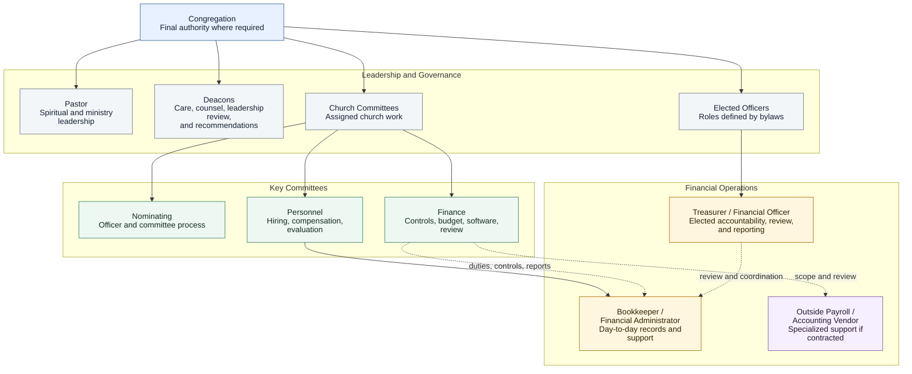

# KBC Organization Chart

Status: Needs Bylaw Review

## Purpose

This document provides a working organization chart for Kingsville Baptist Church and shows how financial governance, ministry leadership, committees, elected officers, and operational support relate to one another.

It is intended to help leaders see the difference between:

- Congregational authority.
- Elected officers and committees.
- Ministry leadership.
- Financial operations support.
- Committee recommendations and coordination.

Needs Bylaw Review: This chart should be checked against the KBC Constitution and Bylaws, committee charters, and current church practice before being treated as authoritative.

!!! note "Congregation Final Authority"
    The congregation remains the final authority where KBC bylaws, budget, policy, officer election, major non-budgeted spending, or church practice require a vote.

## Simple Governance View

## Financial Operations View

The detailed financial reporting and coordination diagram now has its own navigation entry:

[Open the Financial Operations View](financial-operations-view.md)

## Practical Role Summary

| Body / Role | Primary Accountability | Ongoing Role |
| --- | --- | --- |
| Congregation | Final church authority where bylaws, budget, policy, officer election, or church practice require a vote. | Approves the annual budget and other matters reserved for congregational action; receives clear reports and recommendations. |
| Pastor | Spiritual and ministry leadership, communication, and counsel. | Helps church bodies coordinate their work while preserving the authority assigned to each body. |
| Deacons | Servant leadership, care, counsel, and leadership review where church practice requires. | May raise concerns, offer counsel, and recommend matters to the appropriate committee or congregation without becoming a unilateral financial authority. |
| Nominating Committee | Officer and committee nomination process where assigned by bylaws. | Recommends officers and committee members through the process assigned by the bylaws and church practice. |
| Finance Committee | Financial governance, controls, budget oversight, software, monthly review, and financial policies. | Defines financial controls, recommends policies and budgets, reviews financial activity, and brings matters to the congregation where approval is required. |
| Personnel Committee | Job descriptions, hiring, compensation recommendations, and evaluation process. | Manages personnel processes while receiving operational requirements from the committee responsible for the work. |
| Treasurer / Financial Officer | Elected financial accountability, reporting, review, and coordination with Finance Committee. | Reviews reports, helps present financial information, helps carry out approved Finance Committee direction, confirms policies are followed, and coordinates with the Bookkeeper and Finance Committee without becoming the sole point of financial control. |
| Bookkeeper / Financial Administrator | Day-to-day financial operations under assigned supervision and approved financial controls. | Maintains records, enters transactions, supports deposits, processes reimbursements after approval, prepares report packets, and supports monthly close. |
| Outside Payroll / Accounting Vendor | Professional processing and compliance support if contracted. | Handles payroll, tax forms, accounting setup, review, or other specialized services assigned by church-approved process. |

## Recommended Reporting And Coordination Lines

These lines should be confirmed through the Constitution and Bylaws, committee charters, adopted policies, and church practice:

- The Bookkeeper / Financial Administrator should have one clear day-to-day supervisor.
- The Finance Committee should define the Bookkeeper's financial duties, access, reports, and controls.
- The Treasurer should review and coordinate with the Bookkeeper but should not become the sole source of operational knowledge.
- The Treasurer should help carry out approved Finance Committee direction, but financial controls should not depend on one person's knowledge or approval alone.
- Deacons may counsel, raise concerns, and recommend items back to committees or the congregation through proper process, but should not become a unilateral financial authority.
- Personnel Committee should manage hiring, personnel records, evaluation process, and compensation recommendations.
- Finance Committee should not run the hiring process.
- Personnel Committee should not decide financial controls, software, reimbursement rules, card policy, or spending authority.
- Other committees, including Benevolence, may need a later governance review, but that should be treated as future expansion unless an urgent issue requires action now.

## Open Questions

- Who is the day-to-day supervisor for the Bookkeeper / Financial Administrator?
- Do bylaws assign Treasurer nomination to the Nominating Committee, Deacons, or another process?
- Which financial decisions require Finance Committee recommendation only, and which require church vote?
- Which recommendations should go to Deacons or broader leadership before coming to the congregation?
- What reports should go monthly to Finance Committee, Deacons, church leadership, and the congregation?
- What later governance review is needed for Benevolence or other committees with spending authority?

Final approval path to be confirmed by church leadership, bylaws, and church practice.
