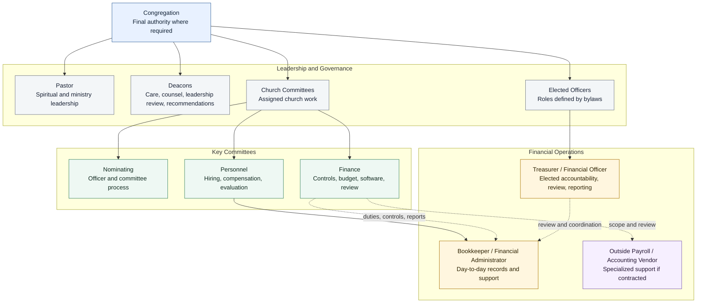

# KBC Organization Chart

Status: Draft

## Purpose

This document provides a working organization chart for Kingsville Baptist Church based on the current financial operations modernization documents.

It is intended to help leaders see the difference between:

- Congregational authority.
- Elected officers and committees.
- Ministry leadership.
- Financial operations support.
- Committee recommendations and coordination.

Needs Bylaw Review: This chart should be checked against the KBC Constitution and Bylaws, committee charters, and current church practice before being treated as authoritative.

!!! note "Congregation Final Authority"
    The congregation remains the final authority where KBC bylaws, budget, policy, officer election, major non-budgeted spending, or church practice require a vote.

## Simple Governance View

## Financial Operations View

```mermaid
%%{init: {"flowchart": {"curve": "basis", "nodeSpacing": 42, "rankSpacing": 55, "padding": 16}}}%%
flowchart LR
    Congregation["Congregation<br/>Final authority where vote required"]
    Nominating["Nominating Committee<br/>Officer recommendation"]
    Treasurer["Treasurer / Financial Officer<br/>Review and reporting"]
    Finance["Finance Committee<br/>Financial controls and review"]
    Personnel["Personnel Committee<br/>Authorized hiring process"]
    Bookkeeper["Bookkeeper / Financial Administrator<br/>Records and reports"]
    PastorDeacons["Pastor and Deacons<br/>Counsel, communication, recommendations"]
    Vendor["Outside Vendor<br/>Payroll, tax, accounting support"]

    Congregation --> Nominating
    Nominating --> Treasurer
    Congregation --> Finance
    Congregation --> Personnel
    Congregation --> PastorDeacons

    Finance <--> Treasurer
    Finance -. duties and controls .-> Bookkeeper
    Personnel --> Bookkeeper
    Bookkeeper -. records and reports .-> Treasurer
    Bookkeeper -. monthly packet .-> Finance
    Finance -. vendor scope .-> Vendor
    Treasurer -. coordinates if assigned .-> Vendor
    PastorDeacons -. counsel .-> Finance
    PastorDeacons -. counsel .-> Personnel

    classDef authority fill:#e8f1ff,stroke:#2f5f98,color:#102033,stroke-width:1px;
    classDef committee fill:#eef8f3,stroke:#2f7d5b,color:#10291f,stroke-width:1px;
    classDef operations fill:#fff6df,stroke:#a76f00,color:#2d2100,stroke-width:1px;
    classDef support fill:#f3f6f8,stroke:#6b7280,color:#172033,stroke-width:1px;
    classDef vendor fill:#f6efff,stroke:#7551a6,color:#241633,stroke-width:1px;
    class Congregation authority;
    class Nominating,Finance,Personnel committee;
    class Treasurer,Bookkeeper operations;
    class PastorDeacons support;
    class Vendor vendor;
```

## Practical Role Summary

| Body / Role | Primary Accountability | Main Responsibilities In This Project |
| --- | --- | --- |
| Congregation | Final church authority where bylaws, budget, policy, officer election, or church practice require a vote. | On June 28, 2026, authorized adding a paid, part-time Bookkeeper position not to exceed `$150` per week and gave Personnel Committee authority to hire the right candidate; votes later on items that require additional church approval. |
| Pastor | Spiritual and ministry leadership, communication, and counsel. | Helps keep the process calm, ministry-focused, and aligned with church leadership. |
| Deacons | Servant leadership, care, counsel, and leadership review where church practice requires. | May review major recommendations, raise concerns, recommend issues back to committees or the congregation through proper process, help preserve unity, and support communication with the church. |
| Nominating Committee | Officer and committee nomination process where assigned by bylaws. | Works with Personnel Committee to add the paid Bookkeeper position under the June 28, 2026 motion; involved in Treasurer / Financial Officer recommendations if bylaws assign that role. |
| Finance Committee | Financial governance, controls, budget oversight, software, monthly review, and financial policies. | Defines financial duties, software requirements, reimbursement rules, spending authority, card/payment controls, annual budget and major non-budgeted spending recommendations, audit/review process, and budget impact; adjusts the budget to fund the Bookkeeper need under the June 28, 2026 motion. |
| Personnel Committee | Job descriptions, hiring, compensation recommendations, and evaluation process. | Leads the authorized hiring process for the paid Bookkeeper / Financial Administrator after Finance Committee confirms financial duties and controls. |
| Treasurer / Financial Officer | Elected financial accountability, reporting, review, and coordination with Finance Committee. | Reviews reports, helps present financial information, helps carry out approved Finance Committee direction, confirms policies are followed, and coordinates with the Bookkeeper and Finance Committee without becoming the sole point of financial control. |
| Bookkeeper / Financial Administrator | Day-to-day financial operations under assigned supervision and approved financial controls. | Maintains records, enters transactions, supports deposits, processes reimbursements after approval, prepares report packets, and supports monthly close. |
| Outside Payroll / Accounting Vendor | Professional processing and compliance support if contracted. | Handles payroll, tax forms, accounting setup, review, or other specialized services assigned by church-approved process. |

## Recommended Reporting And Coordination Lines

These lines should be confirmed before hiring or final implementation:

- The Bookkeeper / Financial Administrator should have one clear day-to-day supervisor.
- The Finance Committee should define the Bookkeeper's financial duties, access, reports, and controls.
- The Treasurer should review and coordinate with the Bookkeeper but should not become the sole source of operational knowledge.
- The Treasurer should help carry out approved Finance Committee direction, but financial controls should not depend on one person's knowledge or approval alone.
- Deacons may counsel, raise concerns, and recommend items back to committees or the congregation through proper process, but should not become a unilateral financial authority.
- Personnel Committee should manage hiring, personnel records, evaluation process, and compensation recommendations.
- Finance Committee should not run the hiring process.
- Personnel Committee should not decide financial controls, software, reimbursement rules, card policy, or spending authority.
- Other committees, including Benevolence, may need a later governance review, but that should be treated as future expansion unless an urgent issue requires action now.

## Open Questions

- Who is the day-to-day supervisor for the Bookkeeper / Financial Administrator?
- How should Personnel Committee and Nominating Committee coordinate under the June 28, 2026 motion?
- Do bylaws assign Treasurer nomination to the Nominating Committee, Deacons, or another process?
- Which financial decisions require Finance Committee recommendation only, and which require church vote?
- Which recommendations should go to Deacons or broader leadership before coming to the congregation?
- What reports should go monthly to Finance Committee, Deacons, church leadership, and the congregation?
- What later governance review is needed for Benevolence or other committees with spending authority?

Final approval path to be confirmed by church leadership, bylaws, church practice, and the June 28, 2026 congregational authorization.
