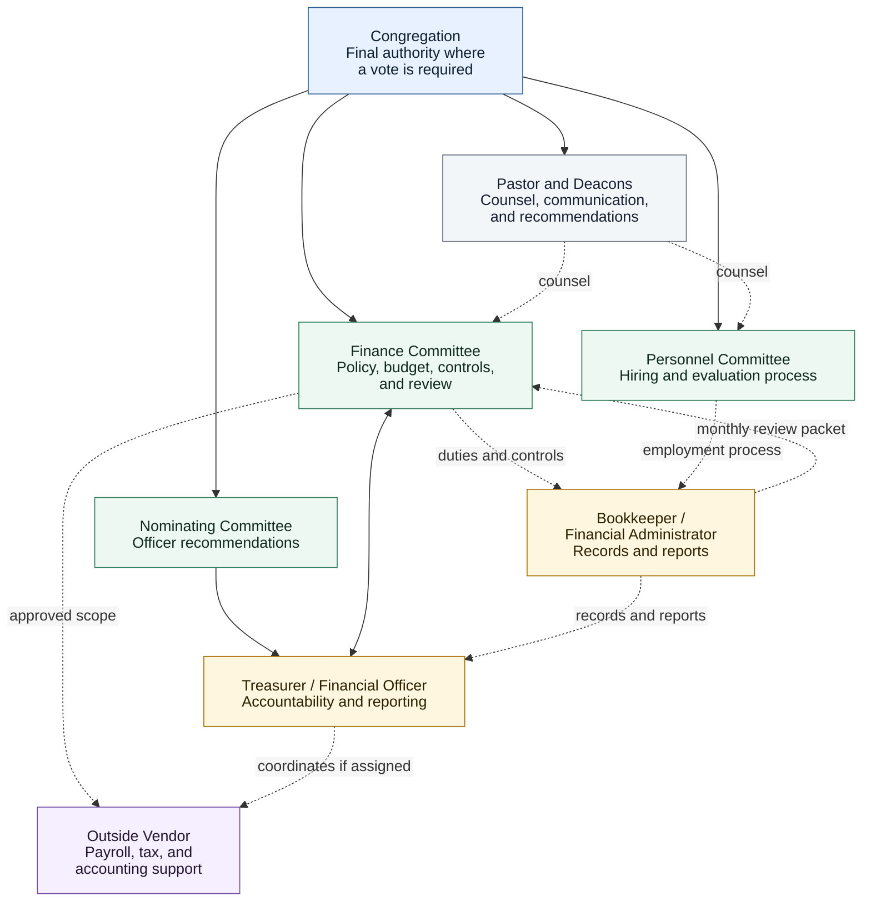

# Financial Operations View

Status: Draft - Needs Bylaw Review

## Purpose

This diagram gives a quick, durable view of how KBC financial accountability, day-to-day recordkeeping, committee oversight, personnel work, and congregational authority should relate to one another.

It describes functions rather than a particular person. Names, temporary assignments, and transition-specific decisions belong in project records rather than this governance view.

!!! note "Congregation Final Authority"
    The congregation remains the final authority where KBC bylaws, the annual budget, policy, officer election, major non-budgeted spending, or church practice require a vote.

## Financial Governance And Operations

## Control Principles

- No one person should prepare, approve, record, reconcile, and report the same financial activity without review.
- Finance Committee defines financial controls and reviews the results.
- The Treasurer coordinates accountability and reporting as an elected officer.
- The Bookkeeper maintains day-to-day records within approved duties and controls.
- Personnel Committee manages employment matters but does not set financial-control policy.
- Pastor and Deacons may counsel and raise concerns through the proper church process.
- Matters reserved for the congregation return to the congregation with a clear recommendation.

See the [Responsibility Matrix](responsibility-matrix.md) for the detailed division of responsibilities.

Needs review against the KBC Constitution and Bylaws before final approval.
